# 五线谱

## 线与间

- 线：五线谱中的五条线
- 间：线与线之间的间隔称为间

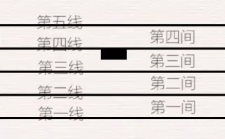

五根线不足以表示所有音符，所以在五线谱的上下均可增加线来表示指定的音符

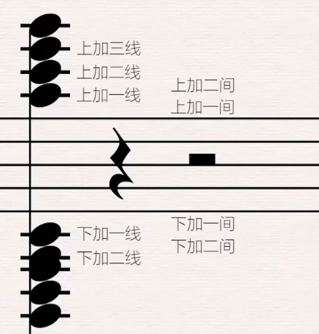

## 拍号与音符时值

### 拍号

- C: 4/4拍；
- 4/4: 4/4拍；
- 6/8: 以八分音符为一拍，每小节有六拍；

### 休止符

- 全休止符

  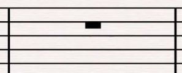
  
- 二分音符休止符

  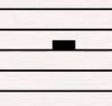

- 四分音符休止符

  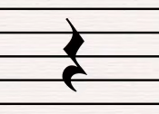

- 八分音符休止符

  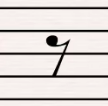

- 十六分音符休止符

  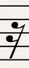

### 音符时值

- 二分音符: 二分音符有2拍，时值是全音符的1/2。在歌曲结尾处经常使用。

  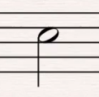

- 四分音符: 四分音符是全音符时值的四分之一拍，简称四分音符。

  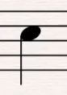

- 八分音符: 8分音符的时值为全音符的1/8。以4/4拍为例，由于全音符为四拍，所以八分音符为半拍。

  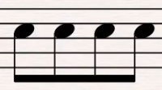

- 十六音符: 比八分音符还要小一半，等于全音符1/16的时值。

  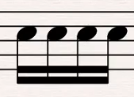

### 附点音符

附点X分音符 = X分音符 + X分音符的一半，写法: `X·`

- 附点4分音符 = 4分音符 + 4分音符的一半(8分音符)
- 附点8分音符 = 8分音符 + 8分音符的一半(16分音符)

### 三连音

把一个整体切分成三等分。

- 四分音符三连音: 把二分音符作为一个整体平等分成三份
- 八分音符三连音: 把四分音符作为一个整体平等分成三份

### 调性

- 半音: 紧挨在一起的两个音
- 全音: 两个音之间隔了一个音

## 音程

### 度

两个音之间的距离(包含自身)，单位用“度”来表示。

::: tip 提示
黑键之间需要还原后再数距离
:::

- C到A: 6度
- E到B: 5度

### 音程的属性

- 纯X度

  - 1度: 1个键(同一个音)
  - 4度: 6个键(C到F)
  - 5度: 8个键(C到G)
  - 8度: 13个键(C到高音C)

- 大X度

  - 2度: 3个键(C到D)
  - 3度: 5个键(C到E)
  - 6度: 10个键(C到A)
  - 7度: 12个键(C到B)

- 小X度: 大X度 - 1个键 

  - 2度: 2个键
  - 3度: 4个键
  - 6度: 9个键
  - 7度: 11个键

- 减X度: 比 纯X度/小X度 少一个键

  - C到降F
  - A到降C

- 倍减: 比 减X度 少一个键

- 增X度: 比 纯X度/大X度 多一个键

  - C到升F
  - C到升E

- 倍增: 比 增X度 多一个键

## 音名

| 乐名 | 主音 | 上主音 | 中音 | 下属音 | 属音 | 下中音 | 导音 |
|:---:|:---:|:---:|:---:|:---:|:---:|:---:|:---:|
| 音名 | C  | D   | E  | F   | G  | A   | B  |
| 简谱 | 1  | 2   | 3  | 4   | 5  | 6   | 7  |

## 调式

### 自然调式

- 自然大调式(大调): C D E F G A B

  无论是什么大调，调式内部排列规律都一致。音阶排列规律: **全全半全全全半**

- 自然小调式(小调): A B C D E F G

  无论是什么小调，调式内部排列规律都一致。音阶排列规律: **全半全全半全全**

### 中古调式

1. 伊奥尼亚
2. 多利亚
3. 弗里几亚
4. 利底亚
5. 混合利底亚
6. 爱奥尼亚
7. 洛克利亚

### 和弦

- 三和弦: 三个音按**三度关系**叠加的和弦

  - 大三和弦(C): 大三度 + 小三度
    - C E G
  - 小三和弦(Cm): 小三度 + 大三度
    - C bE G
  - 增三和弦(Caug): 大三度 + 大三度
    - C E #G
  - 减三和弦(缩写Cdim): 小三度 + 小三度
    - C bE bG

- 七和弦: 四个音(根音、三音、五音、七音)按**三度关系**叠加的和弦

  - **大七和弦(Cmaj7): 大三和弦 + 大三度**
    - C E G B
  - **小七和弦(Cmin7): 小三和弦 + 小三度**
    - C bE G bB
  - **大小七和弦(C7): 大三和弦 + 小三度**
    - C E G bB
  - 小大七和弦(CmM7): 小三和弦 + 大三度
    - C bE G B
  - 减七和弦(Cdim7): 减三和弦 + 小三度
    - C bE bG bbB
  - 半减七和弦(Cm7-5): 减三和弦+ 大三度
    - C bE bG bB

- 九和弦: 五个音(根音、三音、五音、七音、九音)按**三度关系**叠加的和弦
  - 大九和弦(Cmaj9): 大七和弦 + 小三度
    - C E G B D
  - 小九和弦(Cm9): 大七和弦 + 大三度
    - C bE G bB D
  - 属九和弦(C9): 属七和弦 + 大三度
    - C E G bB D
  - 属七降九和弦(C7b9): 属九和弦九音降半音
    - C E G bB dD
  - ADD9和弦(Cadd9): 三和弦 + 九音
    - C E G D

- 挂留和弦

  挂留和弦一般用于调式的1级和弦、5级和弦

  - 挂二和弦(Csus2): 用二度音替换掉原本的三度音所形成的和弦。
    - C D G

  - 挂四和弦(Csus4): 用四度音替换掉原本的三度音所形成的和弦。
    - C F G

- 转位和弦: 根音不在最低音的和弦称为转位和弦，根音为最低音的和弦称为原位和弦

  ::: tip 提示
  无论是什么转位，根音永远不会改变
  :::

  - 第一转位(G/B): 以三音为最低音
  - 第二转位(G/D): 以五音为最低音
  - 第三转位: 以七音为最低的和弦

## 识谱

### 高音谱号

**记住C所在位置：下加一线、第三间、上加二线**

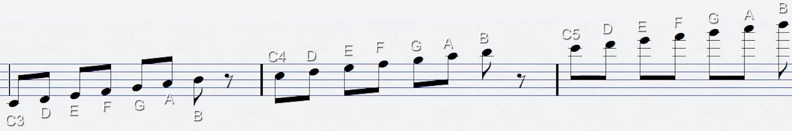

### 低音谱号

**记住C所在位置：下加二线、第二间**

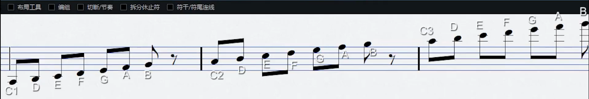

## 符干与连音线

### 符干朝向

- 三音线以下：符干向下
- 三音线以上：符干向上
- 位于三音线: 符干可向上/向下

### 延音线

多个相同音高的音连一起，**变为一个音**。

### 连音线

当使用连音线将两个音符连接后，两个音符时值相累加。

## 变音记号

::: tip 提示
升/降音符名: 7个音名要按顺序依次出现
:::

- 升音符: 升一次半音

  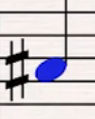

- 重升音符: 升两次半音

  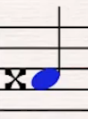

- 降音符: 降一次半音

  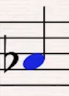

- 重降音符: 降两次半音

  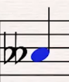

## 调号

高音符号/低音符号后：
  - #中间的音为升半音（顺序：**FCGDAEB**）
  - b中间的音为降半音（顺序：**BEADGCF**）

## 重音、渐强、渐弱

- 重音（声音更大）

  

- 渐强（越来越有力）

  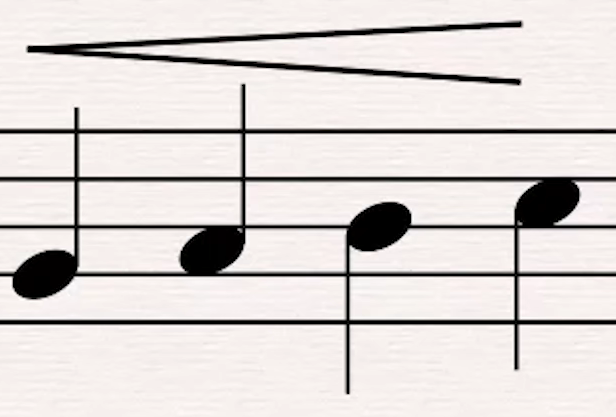

- 渐弱（越来越弱）
  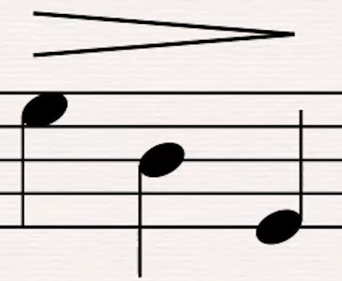

## 琶音