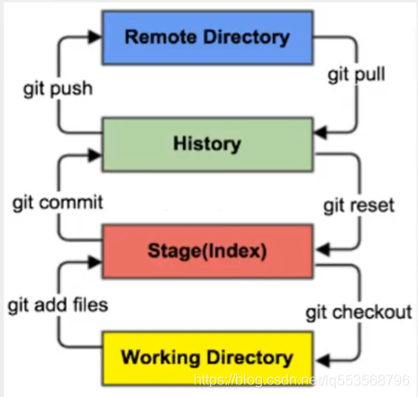
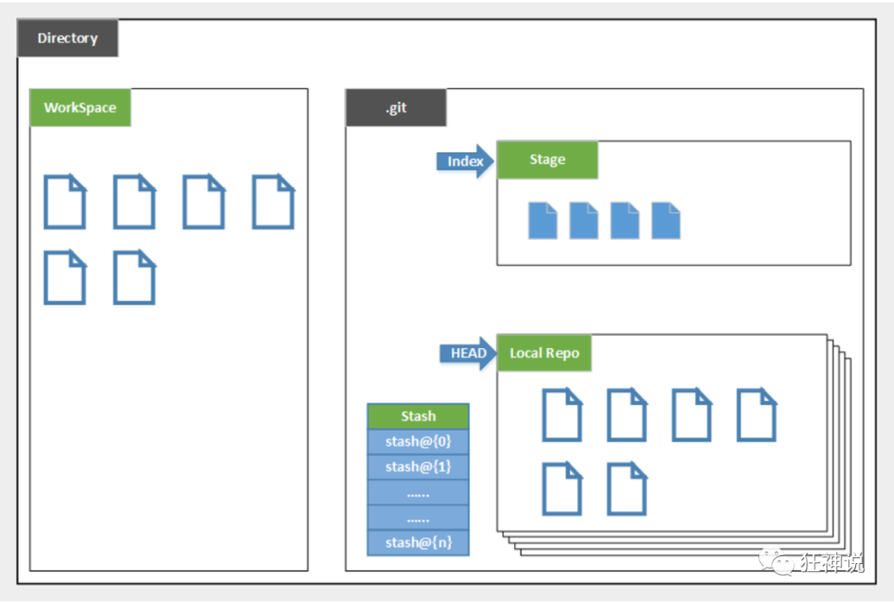

# Git 笔记

## 基本概念

### 什么是版本控制

版本控制（Revision control）是一种在开发的过程中用于管理我们对文件、目录或工程等内容的修改历史，方便查看更改历史记录，备份以便恢复以前的版本的软件工程技术。

- 实现跨区域多人协同开发
- 追踪和记载一个或者多个文件的历史记录
- 组织和保护你的源代码和文档
- 统计工作量
- 并行开发、提高开发效率
- 跟踪记录整个软件的开发过程
- 减轻开发人员的负担，节省时间，同时降低人为错误

没有进行版本控制或者版本控制本身缺乏正确的流程管理，在软件开发过程中将会引入很多问题，如软件代码的一致性、软件内容的冗余、软件过程的事物性、软件开发过程中的并发性、软件源代码的安全性，以及软件的整合等问题。

### 常见的版本控制工具

主流的版本控制器有如下这些：

- Git
- SVN（Subversion）
- CVS（Concurrent Versions System）
- VSS（Micorosoft Visual SourceSafe）
- TFS（Team Foundation Server）
- Visual Studio Online

版本控制产品非常的多，现在影响力最大且使用最广泛的是 Git 与 SVN。

### Git 与 SVN 的主要区别

- SVN 是集中式版本控制系统，版本库集中放在中央服务器。
  - 工作时用的都是自己的电脑，所以首先要从中央服务器得到最新的版本，然后工作，完成工作后，需要把自己做完的活推送到中央服务器。集中式版本控制系统是必须联网才能工作，对网络带宽要求较高。
- Git 是分布式版本控制系统，没有中央服务器。
  - 每个人的电脑就是一个完整的版本库，工作时不需要联网，因为版本都在自己电脑上。
  - 例如自己在电脑上改了文件 A，其他人也在电脑上改了文件 A，这时，两人之间只需把各自的修改推送给对方，就可以互相看到对方的修改。Git 可以直接看到更新了哪些代码和文件。

Git 是目前世界上最先进的分布式版本控制系统。

## 环境搭建

### 安装

::: tip 提示
Git 官网 在国内下载有难度，建议使用阿里云镜像下载
:::

[Git 官网](https://git-scm.com/)  
[Git 阿里云镜像下载](https://npm.taobao.org/mirrors/git-for-windows)

### 配置环境变量

`\PortableGit\cmd`

### 配置用户名和邮箱

- 设置用户名: `git config --global user.name "用户名"`
- 设置邮箱: `git config --global user.email 邮箱`

### 记住用户名和密码

`git config --global credential.helper store`

## Git 基本理论

### 工作区域

Git 本地有三个工作区域，远程有一个 git 仓库：

- **工作目录（Working Directory）**: 工作区，平时存放项目代码的地方；
- **暂存区 (Stage/Index)**: 暂存区，用于临时存放你的改动，事实上它只是一个文件，保存即将提交到文件列表信息；
- **资源库(Repository 或 Git Directory)**: 仓库区（或本地仓库），安全存放数据的位置，这里面有提交到所有版本的数据。其中 HEAD 指向最新放入仓库的版本；
- **git 仓库(Remote Directory)**：远程仓库，托管代码的服务器，可以简单的认为是项目组中的一台电脑用于远程数据交换；

文件在这四个区域之间的转换关系如下：



本地的三个区域确切的说是 git 仓库中 HEAD 指向的版本：



- Directory：使用 Git 管理的一个目录，也就是一个仓库，包含工作空间和 Git 的管理空间。
- WorkSpace：需要通过 Git 进行版本控制的目录和文件，这些目录和文件组成了工作空间。
- .git：存放 Git 管理信息的目录，初始化仓库的时候自动创建。
- Index/Stage：暂存区(待提交更新区)，在提交进入 repo 之前，可以把所有的更新放在暂存区。
- Local Repo：本地仓库，一个存放在本地的版本库；HEAD 会只是当前的开发分支（branch）。
- Stash：隐藏，是一个工作状态保存栈，用于保存 / 恢复 WorkSpace 中的临时状态。

### 工作流程

Git 的工作流程一般是这样的：

1. 在工作目录中添加、修改文件；
2. 将需要进行版本管理的文件放入暂存区域；
3. 将暂存区域的文件提交到 git 仓库。

因此，Git 管理的文件有三种状态：已修改（modified）, 已暂存（staged）, 已提交 (committed)


## Git 项目搭建

### 本地仓库搭建

创建全新的仓库，需要进入 Git 管理的项目的根目录执行：

```
git init
```

执行后仅仅在项目目录多出了一个. git 目录，关于版本等的所有信息都在这个目录里面。

### 克隆远程仓库

将远程服务器上的仓库完全镜像一份至本地。

```
git clone Git远程地址
```

### 增加远程仓库

```
git remote add origin Git远程地址
```

## Git 文件操作

### 文件四种状态

版本控制就是对文件的版本控制，要对文件进行修改、提交等操作，首先要知道文件当前在什么状态，不然可能会提交了现在还不想提交的文件，或者要提交的文件没提交上。

- **Untracked**: 未跟踪, 此文件在文件夹中, 但并没有加入到 git 库, 不参与版本控制.
  - 通过 `git add` 状态变为 `Staged`。
- **Unmodify**: 文件已经入库, 未修改, 即版本库中的文件快照内容与文件夹中完全一致.
  - 这种类型的文件有两种去处, 如果它被修改, 而变为 `Modified`. 如果使用 `git rm` 移出版本库, 则成为 `Untracked` 文件。
- **Modified**: 文件已修改, 仅仅是修改, 并没有进行其他的操作.
  - 这个文件有两个去处, 通过 `git add` 可进入暂存 `staged` 状态, 使用 `git checkout` 则丢弃修改过, 返回到 `unmodify` 状态, 这个 `git checkout` 即从库中取出文件, 覆盖当前修改。
- **Staged**: 暂存状态. 执行 git commit 则将修改同步到库中, 这时库中的文件和本地文件又变为一致, 文件为 `Unmodify` 状态.
  - 执行 `git reset HEAD filename` 取消暂存, 文件状态为 `Modified。`

### 查看文件状态

- 查看指定文件状态: `git status 文件名`
- 查看所有文件状态: `git status`

### 增加文件

- 增加所有文件到暂存区: `git add .`
- 增加指定文件到暂存区: `git add 文件路径`
- 增加指定目录到暂存区: `git add 目录路径`

### 提交到本地仓库

```
git commit -m "提交信息"
```

### 提交到远程仓库

```
git push
```

### 拉取文件

```
git pull
```

### 忽略文件

有些时候不想把某些文件纳入版本控制中，比如数据库文件，临时文件，设计文件等。

在主目录下建立 ".gitignore" 文件，此文件有如下规则：

1. 忽略文件中的空行或以井号（#）开始的行将会被忽略。
2. 可以使用 Linux 通配符。例如：星号（\*）代表任意多个字符，问号（？）代表一个字符，方括号（[abc]）代表可选字符范围，大括号（{string1,string2,...}）代表可选的字符串等。
3. 如果名称的最前面有一个感叹号（!），表示例外规则，将不被忽略。
4. 如果名称的最前面是一个路径分隔符（/），表示要忽略的文件在此目录下，而子目录中的文件不忽略。
5. 如果名称的最后面是一个路径分隔符（/），表示要忽略的是此目录下该名称的子目录，而非文件（默认文件或目录都忽略）。

```gitignore
#为注释
​
*.txt        # 忽略所有 .txt结尾的文件，上传就不会被选中
!lib.txt     # 但lib.txt除外
/temp        # 仅忽略项目根目录下的TODO文件,不包括其它目录temp
build/       # 忽略build/目录下的所有文件
doc/*.txt    # 会忽略 doc/notes.txt 但不包括 doc/server/arch.txt
```

### 暂存文件

如果当前有部分代码未提交，但需要编写其他部分代码时，则需要将当前部分代码保存至暂存区。

- 存储文件: `git stash`
- 取出文件: `git stash pop`

### 撤销修改

- 撤销未提交修改: `git checkout 路径`
- 撤销已提交修改:

  ```
  git reset HEAD 路径
  git checkout 路径
  ```

## Git 分支操作

### 列出分支

- 列出所有本地分支: `git branch`
- 列出所有远程分支: `git branch -r`

### 新建分支

- 新建分支停留当前分支: `git branch 分支名`
- 新建一个分支并切换: `git checkout -b 分支名`

### 合并分支

- 合并指定分支到当前分支: `git merge 分支名`

### 删除分支

- 删除本地分支: `git branch -d 分支名`
- 删除远程分支: `git push origin --delete 分支名`

## 常用技巧

### 配置 SSH 公钥

1. 生成公钥
   进入`C:\Users\用户名`，执行 `ssh-keygen -t rsa`（输入内容一律回车）
2. 增加公钥
   将`C:\Users\用户名\.ssh\id_rsa.pub`文件中的内容填入远程仓库账户

### 修复 push 失败

```
git merge --abort
git reset --merge
git pull
```

### 删除排除目录

```
git rm -rf .idea
git commit -m "删除排除目录"
git push origin master
```
