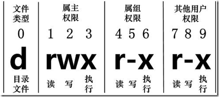
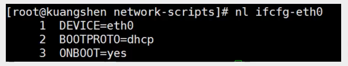

#  1.走进Linux系统

> 开机

开机会启动很多程序。在Windows中叫做服务（services），在Linux中叫做守护进程（daemon）。

开机成功后，他会显示一个文本登录界面，这个界面就是我们经常看到的登陆界面，在这个界面中会提示用户输入用户名，而用户输入的用户名作为参数传给login程序来验证用户的身份，密码是不显示的，输入回车即可，

一般来说，用户登录的方式有三种：

- 命令行登陆
- ssh登录
- 图形界面登录

最高权限账户为root，可以操作一切。

> 关机

关机指令：stutdown ;

```bash
sync #将数据由内存同步到硬盘
stutdown#关机 
stutdown -h 10 #10分钟后关机
stutdown -h now #立马关机
stutdown -h 20:45 #今天20:45关机
stutdown -h +10 #10分钟后关机
stutdown -r now #立马重启
stutdown -r +10 #10分钟后重启
reboot    #就是重启
halt #关闭系统
```

> 系统目录结构

1. 一切皆文件

2. 根目录/，所有的文件都挂载在这个节点下

登录系统后，在当前命令窗口下输入命令：ls,可以看到目录。

  以下是对这些目录的解释：

- /bin：bin是Binary的缩写, 这个目录存放着最经常使用的命令。
- /boot： 这里存放的是启动Linux时使用的一些核心文件，包括一些连接文件以及镜像文件。
- /dev ： dev是Device(设备)的缩写, 存放的是Linux的外部设备，在Linux中访问设备的方式和访问文件的方式是相同的。
- ==/etc： 这个目录用来存放所有的系统管理所需要的配置文件和子目录。==
- ==/home：用户的主目录，在Linux中，每个用户都有一个自己的目录，一般该目录名是以用户的账号命名的。==
- /lib：这个目录里存放着系统最基本的动态连接共享库，其作用类似于Windows里的DLL文件。
- /lost+found：这个目录一般情况下是空的，当系统非法关机后，这里就存放了一些文件。
- /media：linux系统会自动识别一些设备，例如U盘、光驱等等，当识别后，linux会把识别的设备挂载到这个目录下。
- /mnt：系统提供该目录是为了让用户临时挂载别的文件系统的，我们可以将光驱挂载在/mnt/上，然后进入该目录就可以查看光驱里的内容了。
- ==/opt：这是给主机额外安装软件所摆放的目录。比如你安装一个ORACLE数据库则就可以放到这个目录下。默认是空的。==
- /proc：这个目录是一个虚拟的目录，它是系统内存的映射，我们可以通过直接访问这个目录来获取系统信息。
- ==/root：该目录为系统管理员，也称作超级权限者的用户主目录。==
- /sbin：s就是Super User的意思，这里存放的是系统管理员使用的系统管理程序。
- /srv：该目录存放一些服务启动之后需要提取的数据。
- /sys：这是linux2.6内核的一个很大的变化。该目录下安装了2.6内核中新出现的一个文件系统 sysfs 。
- ==/tmp：这个目录是用来存放一些临时文件的。==
- ==/usr：这是一个非常重要的目录，用户的很多应用程序和文件都放在这个目录下，类似于windows下的program files目录。==
- /usr/bin： 系统用户使用的应用程序。
- /usr/sbin： 超级用户使用的比较高级的管理程序和系统守护程序。
- /usr/src： 内核源代码默认的放置目录。
- /var：这个目录中存放着在不断扩充着的东西，我们习惯将那些经常被修改的目录放在这个目录下。包括各种日志文件。
- ==/run：是一个临时文件系统，存储系统启动以来的信息。当系统重启时，这个目录下的文件应该被删掉或清除。==
- /www ：存放服务器网站相关的资源，环境，网站的项目

# 2.常用的基本命令

## 1.目录管理

> ls : 列出目录

- -a ：全部文件包括隐藏文件
- -l ：查看文件信息,列出所有的文件，包括文件的属性和权限，没有隐藏文件

> cd ：切换目录 （绝对路径以  /  开头）

- cd ..：返回上级目录
-  cd ~: 回到当前用户目录

> pwd ：显示目前的目录

- 暂无后缀

> mkdir ：创建一个新的目录

- -p：递归创建目录

```bash
[root@localhost home]# mkdir test1 #创建目录
[root@localhost home]# ls
test1  yuyezhao  yyzlow
[root@localhost home]# cd test1
[root@localhost test1]# cd ..
[root@localhost home]# mkdir -p test2/test3 # 创建多级目录
[root@localhost home]# ls
test1  test2  yuyezhao  yyzlow
[root@localhost home]# cd test2
[root@localhost test2]# ls
test3

```


> rmdir ：删除一个空的目录

- -p：递归删除

```bash
[root@localhost home]# rmdir test1
[root@localhost home]# ls
test2  yuyezhao  yyzlow
[root@localhost home]# rmdir -p test2/test3
[root@localhost home]# ls
yuyezhao  yyzlow

```


> cp : 复制文件或目录

- cp 原文件 新目录名

```bash
[root@localhost home]# ls
test.txt  yuyezhao  yyzlow
[root@localhost home]# cp test.txt yuyezhao
[root@localhost home]# cd yuyezhao/
[root@localhost yuyezhao]# ls
apache-tomcat-9.0.13.tar.gz  jdk-8u281-linux-aarch64.rpm  test.txt

```


> rm : 移除文件或目录

- -f ：就是 force 的意思，忽略不存在的文件，不会出现警告信息；
- -i ：互动模式，在删除前会询问使用者是否动作
- -r ：递归删除啊！最常用在目录的删除了！这是非常危险的选项！！！
- -rf : 删除系统中所有文件

> mv : 移动文件与目录，或修改文件与目录的名称

- -f ：force 强制的意思，如果目标文件已经存在，不会询问而直接覆盖；
- -i ：若目标文件 (destination) 已经存在时，就会询问是否覆盖！
- -u ：若目标文件已经存在，且 source 比较新，才会升级 (update)
- 移动是 ：mv 文件名 新地址
- 重命名是 ：mv 原文件名 新文件名

## 2.基本属性

> 看懂文件属性

Linux系统是一种典型的多用户系统，不同的用户处于不同的地位，拥有不同的权限。为了保护系统的安全性，Linux系统对不同的用户访问同一文件（包括目录文件）的权限做了不同的规定。
在Linux中我们可以使用ll或者ls –l命令来显示一个文件的属性以及文件所属的用户和组，如：

```bash
lrwxrwxrwx.   1 root root    7 4月   9 18:28 bin -> usr/bin
dr-xr-xr-x.   5 root root 4096 4月   9 18:33 boot
drwxr-xr-x.  20 root root 3240 4月  12 20:06 dev
drwxr-xr-x.  75 root root 8192 4月  14 09:15 etc
drwxr-xr-x.   4 root root   36 4月  12 20:38 home
lrwxrwxrwx.   1 root root    7 4月   9 18:28 lib -> usr/lib
lrwxrwxrwx.   1 root root    9 4月   9 18:28 lib64 -> usr/lib64
drwxr-xr-x.   2 root root    6 4月  11 2018 media
drwxr-xr-x.   3 root root   19 4月  10 16:10 mnt
drwxr-xr-x.   2 root root    6 4月  11 2018 opt
dr-xr-xr-x. 140 root root    0 4月  12 20:06 proc
dr-xr-x---.   2 root root  135 4月  10 15:54 root
drwxr-xr-x.  25 root root  740 4月  14 09:15 run
lrwxrwxrwx.   1 root root    8 4月   9 18:28 sbin -> usr/sbin
drwxr-xr-x.   2 root root    6 4月  11 2018 srv
dr-xr-xr-x.  13 root root    0 4月  12 20:06 sys
drwxrwxrwt.  13 root root 4096 4月  12 20:06 tmp
drwxr-xr-x.  13 root root  155 4月   9 18:28 usr
drwxr-xr-x.  19 root root  267 4月   9 18:33 var

```

实例中，boot文件的第一个属性用”d”表示。”d”在Linux中代表该文件是一个目录文件。
在Linux中第一个字符代表这个文件是目录、文件或链接文件等等：

- **当为[ d ]则是目录**
- **当为[ - ]则是文件**
- **若是[ l ]则表示为链接文档 ( link file )**
- 若是[ b ]则表示为装置文件里面的可供储存的接口设备 ( 可随机存取装置 )；
- 若是[ c ]则表示为装置文件里面的串行端口设备，例如键盘、鼠标 ( 一次性读取装置 )。

接下来的字符中，以三个为一组，且均为『rwx』 的三个参数的组合。
其中，[ r ]代表可读(read)、[ w ]代表可写(write)、[ x ]代表可执行(execute)。要注意的是，这三个权限的位置不会改变，如果没有权限，就会出现减号[ - ]而已。每个文件的属性由左边第一部分的10个字符来确定（如下图）：

从左至右用0-9这些数字来表示。

==第0位==确定文件类型，==第1-3位==确定属主（该文件的所有者）拥有该文件的权限。==第4-6位==确定属组（所有者的同组用户）拥有该文件的权限，==第7-9位==确定其他用户拥有该文件的权限。

其中：

第1、4、7位表示读权限，如果用”r”字符表示，则有读权限，如果用”-“字符表示，则没有读权限；

第2、5、8位表示写权限，如果用”w”字符表示，则有写权限，如果用”-“字符表示没有写权限；

第3、6、9位表示可执行权限，如果用”x”字符表示，则有执行权限，如果用”-“字符表示，则没有执行权限。

对于文件来说，它都有一个特定的所有者，也就是对该文件具有所有权的用户。

同时，在Linux系统中，用户是按组分类的，一个用户属于一个或多个组。

文件所有者以外的用户又可以分为文件所有者的同组用户和其他用户。

因此，Linux系统按文件所有者、文件所有者同组用户和其他用户来规定了不同的文件访问权限。

在以上实例中，boot 文件是一个目录文件，属主和属组都为 root

> 修改文件属性

**1、chgrp：更改文件属组**

```bash
chgrp [-R] 属组名 文件名
```

-R：递归更改文件属组，就是在更改某个目录文件的属组时，如果加上-R的参数，那么该目录下的所有文件的属组都会更改。
**2、chown：更改文件属主，也可以同时更改文件属组**

```bash
chown [–R] 属主名 文件名chown [-R] 属主名：属组名 文件名
```

**3、chmod：更改文件9个属性**

```bash
chmod [-R] xyz 文件或目录
```

Linux文件属性有两种设置方法，一种是数字，一种是符号。

Linux文件的基本权限就有九个，分别是owner/group/others三种身份各有自己的read/write/execute权限。

先复习一下刚刚上面提到的数据：文件的权限字符为：『-rwxrwxrwx』， 这九个权限是三个三个一组的！其中，我们可以使用数字来代表各个权限，各权限的分数对照表如下：

```
r:4     w:2         x:1

可读可写不可执行 rw-      6
可读可写可执行   rwx      7
```

每种身份(owner/group/others)各自的三个权限(r/w/x)分数是需要累加的，例如当权限为：[-rwxrwx—-] 分数则是：

- owner = rwx = 4+2+1 = 7
- group = rwx = 4+2+1 = 7
- others= —- = 0+0+0 = 0

```bash
chmod 770 filename
```

## 3.文件内容查看

- Linux系统中使用以下命令来查看文件的内容：
- 例：网络配置目录：cd /etc/sysconfig/network-scripts
- cat: 由第一行开始显示文件内容
- tac: 从最后一行开始显示，可以看出 tac 是 cat 的倒着写！
- nl: 显示的时候，顺道输出行号！



- more: 一页一页的显示文件内容(空格代表翻页，enter 代表向下看一行，:f 行号)

- less: 与 more 类似，但是比 more 更好的是，他可以往前翻页！（空格翻页，上下键翻动页面！退出 q 命令，查找字符串   ==/+要查询的字符==  (向下查询)          ==?+要查询的字符==  (向上查询)   ，==n==继续搜寻下一个，==N==向上搜寻 ）
  - /set : 可以通过/+字符串查询文件里面的字符串（从上往下）
  - ?set : 通过?+字符串查询文件的字符串（从下到上）
  - 使用q命令退出操作
  
- head 只看头几行 通过 -n 数字 来控制显示多少行

  ```bash
  head -n 数字
  ```

- tail 只看尾巴几行

## 4.Linux链接

Linux 链接分两种，一种被称为硬链接（Hard Link），另一种被称为符号链接（软链接）（Symbolic Link）。
`ln`命令产生硬链接
`ln -s`命令产生软连接

**硬连接：**

硬连接指通过索引节点来进行连接。在 Linux  的文件系统中，保存在磁盘分区中的文件不管是什么类型都给它分配一个编号，称为索引节点号(Inode Index)。在 Linux  中，多个文件名指向同一索引节点是存在的。比如：A 是 B 的硬链接（A 和 B 都是文件名），则 A 的目录项中的 inode 节点号与 B  的目录项中的 inode 节点号相同，即一个 inode 节点对应两个不同的文件名，两个文件名指向同一个文件，A 和 B  对文件系统来说是完全平等的。删除其中任何一个都不会影响另外一个的访问。

硬连接的作用是允许一个文件拥有多个有效路径名，这样用户就可以建立硬连接到重要文件，以防止“误删”的功能。其原因如上所述，因为对应该目录的索引节点有一个以上的连接。只删除一个连接并不影响索引节点本身和其它的连接，只有当最后一个连接被删除后，文件的数据块及目录的连接才会被释放。也就是说，文件真正删除的条件是与之相关的所有硬连接文件均被删除。

**软连接**

另外一种连接称之为符号连接（Symbolic Link），也叫软连接。软链接文件有类似于 Windows  的快捷方式。它实际上是一个特殊的文件。在符号连接中，文件实际上是一个文本文件，其中包含的有另一文件的位置信息。比如：A 是 B 的软链接（A 和 B 都是文件名），A 的目录项中的 inode 节点号与 B 的目录项中的 inode 节点号不相同，A 和 B 指向的是两个不同的  inode，继而指向两块不同的数据块。但是 A 的数据块中存放的只是 B 的路径名（可以根据这个找到 B 的目录项）。A 和 B  之间是“主从”关系，如果 B 被删除了，A 仍然存在（因为两个是不同的文件），但指向的是一个无效的链接。

`touch 文件名`：创建文件
`echo`：输入字符串,也可以输入到文件中

创建文件：

```bash
# cd /home
# touch f1 # 创建一个测试文件f1
# ls
f1
# ln f1 f2 # 创建f1的一个硬连接文件f2
# ln -s f1 f3  # 创建f1的一个符号连接文件f3
```

删除文件：

```bash
# echo "字符串输出" >> f1	 # 输出到 f1文件
# echo "I am f1 file" >>f1
# cat f1
I am f1 file
# cat f2
I am f1 file
# cat f3
I am f1 file
# rm -f f1
# cat f2
I am f1 file
# cat f3
cat: f3: No such file or directory
```

通过上面的测试可以看出：当删除原始文件 f1 后，硬连接 f2 不受影响，但是符号连接 f1 文件无效；

## 5.Vim编辑器

> 什么是Vim编辑器

Vim是从 vi 发展出来的一个文本编辑器。代码补完、编译及错误跳转等方便编程的功能特别丰富，在程序员中被广泛使用。
简单的来说， vi 是老式的字处理器，不过功能已经很齐全了，但是还是有可以进步的地方。
vim 则可以说是程序开发者的一项很好用的工具。
所有的 Unix Like 系统都会内建 vi 文书编辑器，其他的文书编辑器则不一定会存在。
连 vim 的官方网站 (http://www.vim.org) 自己也说 vim 是一个程序开发工具而不是文字处理软件。


> 三种使用模式

基本上 vi/vim 共分为三种模式，分别是**命令模式（Command mode）**，**输入模式（Insert mode）**和**底线命令模式（Last line mode）**。这三种模式的作用分别是：

**命令模式：**
用户刚刚启动 vi/vim，便进入了命令模式。

此状态下敲击键盘动作会被Vim识别为命令，而非输入字符。比如我们此时按下i，并不会输入一个字符，i被当作了一个命令。

以下是常用的几个命令：

i 切换到输入模式，以输入字符。
x 删除当前光标所在处的字符。
: 切换到底线命令模式，以在最底一行输入命令。
若想要编辑文本：启动Vim，进入了命令模式，按下i，切换到输入模式。

命令模式只有一些最基本的命令，因此仍要依靠底线命令模式输入更多命令。

**输入模式：**
在命令模式下按下i就进入了输入模式。

在输入模式中，可以使用以下按键：

- 字符按键以及Shift组合，输入字符
- ENTER，回车键，换行
- BACK SPACE，退格键，删除光标前一个字符
- DEL，删除键，删除光标后一个字符
- 方向键，在文本中移动光标
- HOME/END，移动光标到行首/行尾
- Page Up/Page Down，上/下翻页
- Insert，切换光标为输入/替换模式，光标将变成竖线/下划线
- ESC，退出输入模式，切换到命令模式

**底线命令模式:**
在命令模式下按下:（英文冒号）就进入了底线命令模式。

底线命令模式可以输入单个或多个字符的命令，可用的命令非常多。

在底线命令模式中，基本的命令有（已经省略了冒号）：

- q 退出程序
- w 保存文件

按==ESC==键可随时退出底线命令模式。

> Vim 按键说明

第一部分：一般模式可用的光标移动、复制粘贴、搜索替换等

| 移动光标的方法     |                                                              |
| :----------------- | ------------------------------------------------------------ |
| h 或 向左箭头键(←) | 光标向左移动一个字符                                         |
| j 或 向下箭头键(↓) | 光标向下移动一个字符                                         |
| k 或 向上箭头键(↑) | 光标向上移动一个字符                                         |
| l 或 向右箭头键(→) | 光标向右移动一个字符                                         |
| [Ctrl] + [f]       | 屏幕『向下』移动一页，相当于 [Page Down]按键 (常用)          |
| [Ctrl] + [b]       | 屏幕『向上』移动一页，相当于 [Page Up] 按键 (常用)           |
| [Ctrl] + [d]       | 屏幕『向下』移动半页                                         |
| [Ctrl] + [u]       | 屏幕『向上』移动半页                                         |
| +                  | 光标移动到非空格符的下一行                                   |
| -                  | 光标移动到非空格符的上一行                                   |
| 数字< space>       | 那个 n 表示『数字』，例如 20 。快捷切换光标                  |
| 0 或功能键[Home]   | 这是数字『 0 』：移动到这一行的最前面字符处 (常用)           |
| $ 或功能键[End]    | 移动到这一行的最后面字符处(常用)                             |
| H                  | 光标移动到这个屏幕的最上方那一行的第一个字符                 |
| M                  | 光标移动到这个屏幕的中央那一行的第一个字符                   |
| L                  | 光标移动到这个屏幕的最下方那一行的第一个字符                 |
| G                  | 移动到这个档案的最后一行(常用)                               |
| nG                 | n 为数字。移动到这个档案的第 n 行。例如 20G 则会移动到这个档案的第 20 行(可配合 :set nu) |
| gg                 | 移动到这个档案的第一行，相当于 1G 啊！(常用)                 |
| n< Enter>          | n 为数字。光标向下移动 n 行(常用)                            |

| 搜索替换 |                                                              |
| :------- | ------------------------------------------------------------ |
| /word    | 向光标之下寻找一个名称为 word 的字符串。例如要在档案内搜寻 vbird 这个字符串，就输入 /vbird 即可！(常用) |
| ?word    | 向光标之上寻找一个字符串名称为 word 的字符串。               |
| n        | 这个 n 是英文按键。代表重复前一个搜寻的动作。举例来说， 如果刚刚我们执行 /vbird 去向下搜寻 vbird 这个字符串，则按下 n 后，会向下继续搜寻下一个名称为 vbird 的字符串。如果是执行 ?vbird 的话，那么按下 n 则会向上继续搜寻名称为 vbird  的字符串！ |
| N        | 这个 N 是英文按键。与 n 刚好相反，为『反向』进行前一个搜寻动作。例如 /vbird 后，按下 N 则表示『向上』搜寻 vbird 。 |

| 删除、复制与粘贴 |                                                              |
| :--------------- | ------------------------------------------------------------ |
| x, X             | 在一行字当中，x 为向后删除一个字符 (相当于 [del] 按键)， X 为向前删除一个字符(相当于 [backspace] 亦即是退格键) (常用) |
| nx               | n 为数字，连续向后删除 n 个字符。举例来说，我要连续删除 10 个字符， 『10x』。 |
| dd               | 删除游标所在的那一整行(常用)                                 |
| ndd              | n 为数字。删除光标所在的向下 n 行，例如 20dd 则是删除 20 行 (常用) |
| d1G              | 删除光标所在到第一行的所有数据                               |
| dG               | 删除光标所在到最后一行的所有数据                             |
| d$               | 删除游标所在处，到该行的最后一个字符                         |
| d0               | 那个是数字的 0 ，删除游标所在处，到该行的最前面一个字符      |
| yy               | 复制游标所在的那一行(常用)                                   |
| nyy              | n 为数字。复制光标所在的向下 n 行，例如 20yy 则是复制 20 行(常用) |
| y1G              | 复制游标所在行到第一行的所有数据                             |
| yG               | 复制游标所在行到最后一行的所有数据                           |
| y0               | 复制光标所在的那个字符到该行行首的所有数据                   |
| y$               | 复制光标所在的那个字符到该行行尾的所有数据                   |
| p, P             | p 为将已复制的数据在光标下一行贴上，P 则为贴在游标上一行！举例来说，我目前光标在第 20 行，且已经复制了 10 行数据。则按下 p 后， 那 10 行数据会贴在原本的 20 行之后，亦即由 21 行开始贴。但如果是按下 P 呢？那么原本的第 20 行会被推到变成 30  行。(常用) |
| J                | 将光标所在行与下一行的数据结合成同一行                       |
| c                | 重复删除多个数据，例如向下删除 10 行，[ 10cj ]               |
| u                | 复原前一个动作。(常用)                                       |
| [Ctrl]+r         | 重做上一个动作。(常用)                                       |

第二部分：一般模式切换到编辑模式的可用的按钮说明

| 进入输入或取代的编辑模式 |                                                              |
| :----------------------- | ------------------------------------------------------------ |
| i, I                     | 进入输入模式(Insert mode)：i 为『从目前光标所在处输入』， I 为『在目前所在行的第一个非空格符处开始输入』。(常用) |
| a, A                     | 进入输入模式(Insert mode)：a 为『从目前光标所在的下一个字符处开始输入』， A 为『从光标所在行的最后一个字符处开始输入』。(常用) |
| o, O                     | 进入输入模式(Insert mode)：这是英文字母 o 的大小写。o 为『在目前光标所在的下一行处输入新的一行』；O 为在目前光标所在处的上一行输入新的一行！(常用) |
| r, R                     | 进入取代模式(Replace mode)：r 只会取代光标所在的那一个字符一次；R会一直取代光标所在的文字，直到按下 ESC 为止；(常用) |
| [Esc]                    | 退出编辑模式，回到一般模式中(常用)                           |

第三部分：一般模式切换到指令行模式的可用的按钮说明

| 指令行的储存、离开等指令                                     |                                                              |
| :----------------------------------------------------------- | ------------------------------------------------------------ |
| :w                                                           | 将编辑的数据写入硬盘档案中(常用)                             |
| :w!                                                          | 若文件属性为『只读』时，强制写入该档案。不过，到底能不能写入， 还是跟你对该档案的档案权限有关啊！ |
| :q                                                           | 离开 vi (常用)                                               |
| :q!                                                          | 若曾修改过档案，又不想储存，使用 ! 为强制离开不储存档案。    |
| 注意一下啊，那个惊叹号 (!) 在 vi 当中，常常具有『强制』的意思～ |                                                              |
| ==:wq==                                                      | 储存后离开，若为 :wq! 则为强制储存后离开 (常用)              |
| ZZ                                                           | 这是大写的 Z 喔！若档案没有更动，则不储存离开，若档案已经被更动过，则储存后离开！ |
| :w [filename]                                                | 将编辑的数据储存成另一个档案（类似另存新档）                 |
| :r [filename]                                                | 在编辑的数据中，读入另一个档案的数据。亦即将 『filename』 这个档案内容加到游标所在行后面 |
| :n1,n2 w [filename]                                          | 将 n1 到 n2 的内容储存成 filename 这个档案。                 |
| :! command                                                   | 暂时离开 vi 到指令行模式下执行 command 的显示结果！例如 『:! ls /home』即可在 vi 当中看 /home 底下以 ls 输出的档案信息！ |
| ==:set nu==                                                  | 显示行号，设定之后，会在每一行的前缀显示该行的行号           |
| :set nonu                                                    | 与 set nu 相反，为取消行号！                                 |

## 6.Linux账号管理

> 简介

Linux系统是一个多用户多任务的分时操作系统，任何一个要使用系统资源的用户，都必须首先向系统管理员申请一个账号，然后以这个账号的身份进入系统。

用户的账号一方面可以帮助系统管理员对使用系统的用户进行跟踪，并控制他们对系统资源的访问；另一方面也可以帮助用户组织文件，并为用户提供安全性保护。

每个用户账号都拥有一个唯一的用户名和各自的口令。

用户在登录时键入正确的用户名和口令后，就能够进入系统和自己的主目录。

实现用户账号的管理，要完成的工作主要有如下几个方面：

- 用户账号的添加、删除与修改。
- 用户口令的管理。
- 用户组的管理。

> 用户账号的管理

用户账号的管理工作主要涉及到用户账号的添加、修改和删除。

添加用户账号就是在系统中创建一个新账号，然后为新账号分配用户号、用户组、主目录和登录Shell等资源。

### 添加用户

```
useradd 选项 用户名
```

参数说明：
选项 :

- -c comment 指定一段注释性描述。
- -d 目录 指定用户主目录，如果此目录不存在，则同时使用-m选项，可以创建主目录。
- -g 用户组 指定用户所属的用户组。
- -G 用户组，用户组 指定用户所属的附加组。
- -m 使用者目录如不存在则自动建立。
- -s Shell文件 指定用户的登录Shell。
- -u 用户号 指定用户的用户号，如果同时有-o选项，则可以重复使用其他用户的标识号。

用户名 :

- 指定新账号的登录名。

测试：

```bash
[root@izbp19arhry3qe1i25xrl9z home] useradd -m 
dragon[root@izbp19arhry3qe1i25xrl9z home] ls 
admin dragon test.txt
```

增加用户账号就是在/etc/passwd文件中为新用户增加一条记录，同时更新其他系统文件如/etc/shadow, /etc/group等

### 删除用户

如果一个用户的账号不再使用，可以从系统中删除。

删除用户账号就是要将/etc/passwd等系统文件中的该用户记录删除，必要时还删除用户的主目录。

删除一个已有的用户账号使用userdel命令，其格式如下：

```
userdel 选项 用户名
```

常用的选项是 -r，。它的作用是把用户的主目录一起删除。

```bash
[root@izbp19arhry3qe1i25xrl9z home] uesrfel -r dragon
```

此命令删除用户dragon在系统文件中（主要是/etc/passwd, /etc/shadow, /etc/group等）的记录，同时删除用户的主目录。

### 修改用户

修改用户账号就是根据实际情况更改用户的有关属性，如用户号、主目录、用户组、登录Shell等。

修改已有用户的信息使用usermod命令，其格式如下：

```
usermod 选项 用户名
```

常用的选项包括-c, -d, -m, -g, -G, -s, -u以及-o等，这些选项的意义与useradd命令中的选项一样，可以为用户指定新的资源值。

### 切换用户

1.切换用户的命令为：su username 【username是你的用户名哦】

2.从普通用户切换到root用户，还可以使用命令：sudo su

3.在终端输入exit或logout或使用快捷方式ctrl+d，可以退回到原来用户，其实ctrl+d也是执行的exit命令

4.在切换用户时，如果想在切换用户之后使用新用户的工作环境，可以在su和username之间加-，例如：【su - root】
$表示普通用户 #表示超级用户，也就是root用户

> 用户口令的管理

### 更改密码

用户管理的一项重要内容是用户口令的管理。用户账号刚创建时没有口令，但是被系统锁定，无法使用，必须为其指定口令后才可以使用，即使是指定空口令。

指定和修改用户口令的Shell命令是passwd。超级用户可以为自己和其他用户指定口令，普通用户只能用它修改自己的口令。

命令的格式为：

```
passwd 选项 用户名
```

可使用的选项：

- -l 锁定口令，即禁用账号。
- -u 口令解锁。
- -d 使账号无口令。
- -f 强迫用户下次登录时修改口令。

如果默认用户名，则修改当前用户的口令。
例如，假设当前用户是自己，则下面的命令修改该用户自己的口令：

```bash
$ passwdOld password:******
New password:*******
Re-enter new password:*******
```

如果是超级用户，可以用下列形式指定任何用户的口令：

```bash
passwd kuangshen
New password:*******
Re-enter new password:*******
```

普通用户修改自己的口令时，passwd命令会先询问原口令，验证后再要求用户输入两遍新口令，如果两次输入的口令一致，则将这个口令指定给用户；而超级用户为用户指定口令时，就不需要知道原口令。

为了系统安全起见，用户应该选择比较复杂的口令，例如最好使用8位长的口令，口令中包含有大写、小写字母和数字，并且应该与姓名、生日等不相同。

### 锁定用户

为用户指定空口令时，执行下列形式的命令：

```
# passwd -d dragon
```

此命令将用户dragon，这样用户dragon下一次登录时，系统就不再允许该用户登录了。

passwd 命令还可以用 -l(lock) 选项锁定某一用户，使其不能登录，例如：

```
# passwd -l dragon
```

## 7.Linux用户组管理

每个用户都有一个用户组，系统可以对一个用户组中的所有用户进行集中管理。不同Linux 系统对用户组的规定有所不同，如Linux下的用户属于与它同名的用户组，这个用户组在创建用户时同时创建。

用户组的管理涉及用户组的添加、删除和修改。==组的增加、删除和修改实际上就是对/etc/group文件的更新。==

> 使用groupadd命令

```bash
groupadd dragon       //创建dragon用户,默认是从以前的标识累加
groupadd -g 520 dragonfor   //创建dragonfor用户并且指定 组标识号为 520
```

可以使用的选项有：

- -g GID 指定新用户组的组标识号（GID)
- -o 一般与-g选项同时使用，表示新用户组的GID可以与系统已有用户组的GID相同

> 使用groupdel命令

```
groupdel 用户组
```

例如：

```
# groupdel dragonfor
```

常用的选项有：

- -g GID 为用户组指定新的组标识号
- -o 与-g选项同时使用，用户组的新GID可以与系统已有用户组的GID相同
- -n新用户组 将用户组的名字改为新名字

```
# 此命令将组dragon的组标识号修改为666 并且把名字修改为 newdragongroupmod -g 666 -n newdragon dragon
```

> 切换组

如果一个用户同时属于多个用户组，那么用户可以在用户组之间切换，以便具有其他用户组的权限。

用户可以在登录后，使用命令newgrp切换到其他用户组，这个命令的参数就是目的用户组。例如：

```
$ newgrp root
```

这条命令将当前用户切换到root用户组，前提条件是root用户组确实是该用户的主组或附加组。

> 扩展：文件查看

### /etc/passwd

与用户和用户组相关的信息都存放在一些系统文件中，这些文件包括/etc/passwd, /etc/shadow, /etc/group等。

下面分别介绍这些文件的内容。
**/etc/passwd文件是用户管理工作涉及的最重要的一个文件。**
Linux系统中的每个用户都在/etc/passwd文件中有一个对应的记录行，它记录了这个用户的一些基本属性。

这个文件对所有用户都是可读的。它的内容类似下面的例子：

```bash
＃ cat /etc/passwdroot:x:0:0:Superuser:/:daemon:x:1:1:System daemons:/etc:bin:x:2:2:Owner of system commands:/bin:sys:x:3:3:Owner of system files:/usr/sys:adm:x:4:4:System accounting:/usr/adm:uucp:x:5:5:UUCP administrator:/usr/lib/uucp:auth:x:7:21:Authentication administrator:/tcb/files/auth:cron:x:9:16:Cron daemon:/usr/spool/cron:listen:x:37:4:Network daemon:/usr/net/nls:lp:x:71:18:Printer administrator:/usr/spool/lp:
```

从上面的例子我们可以看到，/etc/passwd中一行记录对应着一个用户，每行记录又被冒号(:)分隔为7个字段，其格式和具体含义如下：

```
用户名:口令:用户标识号:组标识号:注释性描述:主目录:登录Shell
```

1）”用户名”是代表用户账号的字符串。

通常长度不超过8个字符，并且由大小写字母和/或数字组成。登录名中不能有冒号(:)，因为冒号在这里是分隔符。

为了兼容起见，登录名中最好不要包含点字符(.)，并且不使用连字符(-)和加号(+)打头。

2）“口令”一些系统中，存放着加密后的用户口令字。

虽然这个字段存放的只是用户口令的加密串，不是明文，但是由于/etc/passwd文件对所有用户都可读，所以这仍是一个安全隐患。因此，现在许多Linux  系统（如SVR4）都使用了shadow技术，把真正的加密后的用户口令字存放到/etc/shadow文件中，而在/etc/passwd文件的口令字段中只存放一个特殊的字符，例如“x”或者“*”。

3）“用户标识号”是一个整数，系统内部用它来标识用户。

一般情况下它与用户名是一一对应的。如果几个用户名对应的用户标识号是一样的，系统内部将把它们视为同一个用户，但是它们可以有不同的口令、不同的主目录以及不同的登录Shell等。

通常用户标识号的取值范围是0～65 535。0是超级用户root的标识号，1～99由系统保留，作为管理账号，普通用户的标识号从100开始。在Linux系统中，这个界限是500。

4）“组标识号”字段记录的是用户所属的用户组。

它对应着/etc/group文件中的一条记录。

5)“注释性描述”字段记录着用户的一些个人情况。

例如用户的真实姓名、电话、地址等，这个字段并没有什么实际的用途。在不同的Linux 系统中，这个字段的格式并没有统一。在许多Linux系统中，这个字段存放的是一段任意的注释性描述文字，用作finger命令的输出。

6)“主目录”，也就是用户的起始工作目录。

它是用户在登录到系统之后所处的目录。在大多数系统中，各用户的主目录都被组织在同一个特定的目录下，而用户主目录的名称就是该用户的登录名。各用户对自己的主目录有读、写、执行（搜索）权限，其他用户对此目录的访问权限则根据具体情况设置。

7)用户登录后，要启动一个进程，负责将用户的操作传给内核，这个进程是用户登录到系统后运行的命令解释器或某个特定的程序，即Shell。

Shell是用户与Linux系统之间的接口。Linux的Shell有许多种，每种都有不同的特点。常用的有sh(Bourne Shell), csh(C Shell), ksh(Korn Shell), tcsh(TENEX/TOPS-20 type C Shell),  bash(Bourne Again Shell)等。

系统管理员可以根据系统情况和用户习惯为用户指定某个Shell。如果不指定Shell，那么系统使用sh为默认的登录Shell，即这个字段的值为/bin/sh。

用户的登录Shell也可以指定为某个特定的程序（此程序不是一个命令解释器）。

利用这一特点，我们可以限制用户只能运行指定的应用程序，在该应用程序运行结束后，用户就自动退出了系统。有些Linux 系统要求只有那些在系统中登记了的程序才能出现在这个字段中。

8)系统中有一类用户称为伪用户（pseudo users）。

这些用户在/etc/passwd文件中也占有一条记录，但是不能登录，因为它们的登录Shell为空。它们的存在主要是方便系统管理，满足相应的系统进程对文件属主的要求。

常见的伪用户如下所示：

```
伪 用 户 含 义bin 拥有可执行的用户命令文件sys 拥有系统文件adm 拥有帐户文件uucp UUCP使用lp lp或lpd子系统使用nobody NFS使
```

### /etc/shadow

1、除了上面列出的伪用户外，还有许多标准的伪用户，例如：audit, cron, mail, usenet等，它们也都各自为相关的进程和文件所需要。

由于/etc/passwd文件是所有用户都可读的，如果用户的密码太简单或规律比较明显的话，一台普通的计算机就能够很容易地将它破解，因此对安全性要求较高的Linux系统都把加密后的口令字分离出来，单独存放在一个文件中，这个文件是/etc/shadow文件。有超级用户才拥有该文件读权限，这就保证了用户密码的安全性。

2、/etc/shadow中的记录行与/etc/passwd中的一一对应，它由pwconv命令根据/etc/passwd中的数据自动产生

它的文件格式与/etc/passwd类似，由若干个字段组成，字段之间用”:”隔开。这些字段是：

```
登录名:加密口令:最后一次修改时间:最小时间间隔:最大时间间隔:警告时间:不活动时间:失效时间:标志
```

- “登录名”是与/etc/passwd文件中的登录名相一致的用户账号
- “口令”字段存放的是加密后的用户口令字，长度为13个字符。如果为空，则对应用户没有口令，登录时不需要口令；如果含有不属于集合 { ./0-9A-Za-z }中的字符，则对应的用户不能登录。
- “最后一次修改时间”表示的是从某个时刻起，到用户最后一次修改口令时的天数。时间起点对不同的系统可能不一样。例如在SCO Linux 中，这个时间起点是1970年1月1日。
- “最小时间间隔”指的是两次修改口令之间所需的最小天数。
- “最大时间间隔”指的是口令保持有效的最大天数。
- “警告时间”字段表示的是从系统开始警告用户到用户密码正式失效之间的天数。
- “不活动时间”表示的是用户没有登录活动但账号仍能保持有效的最大天数。
- “失效时间”字段给出的是一个绝对的天数，如果使用了这个字段，那么就给出相应账号的生存期。期满后，该账号就不再是一个合法的账号，也就不能再用来登录了。

### /etc/group

用户组的所有信息都存放在/etc/group文件中。

将用户分组是Linux 系统中对用户进行管理及控制访问权限的一种手段。

每个用户都属于某个用户组；一个组中可以有多个用户，一个用户也可以属于不同的组。

当一个用户同时是多个组中的成员时，在/etc/passwd文件中记录的是用户所属的主组，也就是登录时所属的默认组，而其他组称为附加组。

用户要访问属于附加组的文件时，必须首先使用newgrp命令使自己成为所要访问的组中的成员。

用户组的所有信息都存放在/etc/group文件中。此文件的格式也类似于/etc/passwd文件，由冒号(:)隔开若干个字段，这些字段有：

```
组名:口令:组标识号:组内用户列表
```

- “组名”是用户组的名称，由字母或数字构成。与/etc/passwd中的登录名一样，组名不应重复。
- “口令”字段存放的是用户组加密后的口令字。一般Linux 系统的用户组都没有口令，即这个字段一般为空，或者是*。
- “组标识号”与用户标识号类似，也是一个整数，被系统内部用来标识组。
- “组内用户列表”是属于这个组的所有用户的列表/b]，不同用户之间用逗号(,)分隔。这个用户组可能是用户的主组，也可能是附加组。

## 8.Linux磁盘管理

Linux磁盘管理好坏直接关系到整个系统的性能问题。

Linux磁盘管理常用命令为 df、du。

df ：列出文件系统的整体磁盘使用量
du：检查磁盘空间使用量

> df

df命令参数功能：检查文件系统的磁盘空间占用情况。可以利用该命令来获取硬盘被占用了多少空间，目前还剩下多少空间等信息。

语法：

```
df [-ahikHTm] [目录或文件名]
```

选项与参数：

- -a ：列出所有的文件系统，包括系统特有的 /proc 等文件系统；
- -k ：以 KBytes 的容量显示各文件系统；
- -m ：以 MBytes 的容量显示各文件系统；
- -h ：以人们较易阅读的 GBytes, MBytes, KBytes 等格式自行显示；
- -H ：以 M=1000K 取代 M=1024K 的进位方式；
- -T ：显示文件系统类型, 连同该 partition 的 filesystem 名称 (例如 ext3) 也列出；
- -i ：不用硬盘容量，而以 inode 的数量来显示

```bash
# 将系统内所有的文件系统列出来！# 在 Linux 底下如果 df 没有加任何选项# 那么默认会将系统内所有的 (不含特殊内存内的文件系统与 swap) 都以 1 Kbytes 的容量来列出来！
[root@localhost ~]# df
文件系统                   1K-块    已用     可用 已用% 挂载点
devtmpfs                  919456       0   919456    0% /dev
tmpfs                     931516       0   931516    0% /dev/shm
tmpfs                     931516    9760   921756    2% /run
tmpfs                     931516       0   931516    0% /sys/fs/cgroup
/dev/mapper/centos-root 23049220 1544636 21504584    7% /
/dev/sda1                1038336  153864   884472   15% /boot
tmpfs                     186304       0   186304    0% /run/user/0
				
[root@localhost ~]# df -h
文件系统                 容量  已用  可用 已用% 挂载点
devtmpfs                 898M     0  898M    0% /dev
tmpfs                    910M     0  910M    0% /dev/shm
tmpfs                    910M  9.6M  901M    2% /run
tmpfs                    910M     0  910M    0% /sys/fs/cgroup
/dev/mapper/centos-root   22G  1.5G   21G    7% /
/dev/sda1               1014M  151M  864M   15% /boot
tmpfs                    182M     0  182M    0% /run/user/0

[root@localhost ~]# df -a
文件系统                   1K-块    已用     可用 已用% 挂载点
sysfs                          0       0        0     - /sys
proc                           0       0        0     - /proc
devtmpfs                  919456       0   919456    0% /dev
securityfs                     0       0        0     - /sys/kernel/security
tmpfs                     931516       0   931516    0% /dev/shm
devpts                         0       0        0     - /dev/pts
tmpfs                     931516    9760   921756    2% /run
tmpfs                     931516       0   931516    0% /sys/fs/cgroup
cgroup                         0       0        0     - /sys/fs/cgroup/systemd
pstore                         0       0        0     - /sys/fs/pstore
cgroup                         0       0        0     - /sys/fs/cgroup/pids
cgroup                         0       0        0     - /sys/fs/cgroup/cpu,cpuacct
cgroup                         0       0        0     - /sys/fs/cgroup/net_cls,net_prio
cgroup                         0       0        0     - /sys/fs/cgroup/devices
cgroup                         0       0        0     - /sys/fs/cgroup/memory
cgroup                         0       0        0     - /sys/fs/cgroup/blkio
cgroup                         0       0        0     - /sys/fs/cgroup/cpuset
cgroup                         0       0        0     - /sys/fs/cgroup/hugetlb
cgroup                         0       0        0     - /sys/fs/cgroup/perf_event
cgroup                         0       0        0     - /sys/fs/cgroup/freezer
configfs                       0       0        0     - /sys/kernel/config
/dev/mapper/centos-root 23049220 1544640 21504580    7% /
selinuxfs                      0       0        0     - /sys/fs/selinux
systemd-1                      0       0        0     - /proc/sys/fs/binfmt_misc
debugfs                        0       0        0     - /sys/kernel/debug
mqueue                         0       0        0     - /dev/mqueue
hugetlbfs                      0       0        0     - /dev/hugepages
fusectl                        0       0        0     - /sys/fs/fuse/connections
/dev/sda1                1038336  153864   884472   15% /boot
tmpfs                     186304       0   186304    0% /run/user/0

```

> du

Linux du命令也是查看使用空间的，但是与df命令不同的是Linux du命令是对文件和目录磁盘使用的空间的查看，还是和df命令有一些区别的，这里介绍Linux du命令。

语法：

```
du [-ahskm] 文件或目录名称
```

选项与参数：

- -a ：列出所有的文件与目录容量，因为默认仅统计目录底下的文件量而已。
- -h ：以人们较易读的容量格式 (G/M) 显示；
- -s ：列出总量而已，而不列出每个各别的目录占用容量；
- -S ：不包括子目录下的总计，与 -s 有点差别。
- -k ：以 KBytes 列出容量显示；
- -m ：以 MBytes 列出容量显示；

```bash
# 只列出当前目录下的所有文件夹容量（包括隐藏文件夹）:# 直接输入 du 没有加任何选项时，则 du 会分析当前所在目录的文件与目录所占用的硬盘空间。
[root@localhost ~]# du -a
4	./.bash_logout
4	./.bash_profile
4	./.bashrc
4	./.cshrc
4	./.tcshrc
4	./anaconda-ks.cfg
4	./.bash_history
4	./.viminfo
32	.
[root@localhost ~]# du -am
1	./.bash_logout
1	./.bash_profile
1	./.bashrc
1	./.cshrc
1	./.tcshrc
1	./anaconda-ks.cfg
1	./.bash_history
1	./.viminfo
1	.

```

通配符 * 来代表每个目录

与 df 不一样的是，du 这个命令其实会直接到文件系统内去搜寻所有的文件数据。

> 磁盘挂载与卸除

根文件系统之外的其他文件要想能够被访问，都必须通过“关联”至根文件系统上的某个目录来实现，此关联操作即为“挂载”，此目录即为“挂载点”,解除此关联关系的过程称之为“卸载”

Linux 的磁盘挂载使用mount命令，卸载使用umount命令。

磁盘挂载语法：

```
mount [-t 文件系统] [-L Label名] [-o 额外选项] [-n] 装置文件名 挂载点
```

磁盘卸载命令 umount 语法：

```
umount [-fn] 装置文件名或挂载点
```

选项与参数：

- -f ：强制卸除！可用在类似网络文件系统 (NFS) 无法读取到的情况下；
- -n ：不升级 /etc/mtab 情况下卸除。

## 9.Linux进程管理

Liunx中一切皆文件
（文件：读写执行、权限（用户、用户组）。系统：(磁盘、进程)）

> 基本概念

- 在Linuk中，每一个程序都是自己的一个进程，每一个进程都有一个id号
- 每一个进程呢，都会是一个父进程
- 进程可以有两种存在方式：前台！后台！
- 一般的话服务器都是后台运行、基本的程序都是前台运行

> 命令

**ps** ：查看当前系统中正在执行的各种进程信息！

ps -help 查看帮助文档

- -a 显示终端运行的所有的进程信息
- -u 以用户的信息显示进程
- -x 显示后台运行进程的参数

```bash
ps -aux 查看所有进程
# | 在linux这个叫管道符
ps -aux|grep java
# grep 查看文件中符合条件的字符
```

ps -ef : 可以查看到父进程的信息

```bash
pstree -pu 
-p  显示父id 
-u  显示用户组
```

结束进程：杀掉进程

kill -9 进程id (一般不会去结束进程)


## 环境安装

### JDK安装

安装Java环境

```bash
# 检测当前系统是否存在Java环境
java -version
# 如果有的话就需要卸载
rpm -pa|grep jdk # 检测jdk版本
rpm -e --nodeps jdk_ # _:版本  强制删除

# 卸载完毕后即可安装jdk
rpm -ivh rpm包
```


配置环境变量：`/etc/profile` 在文件的最后增加Java的配置

```bash
# JDK 环境变量
export JAVA_HOME=/usr/javak1.8.0_291-amd64
export PATH=$JAVA_HOME/bin:$PATH
export CLASSPATH=.:$JAVA_HOMEb/dt.jar:$JAVA_HOMEb/tools.jar
```

让这个文件生效！ `source /etc/profile`

尝试发布一个项目！

```
# 开启防火墙端口
firewall-cmd --zone=public --add-port=9005/tcp --permanent
# 重启防火墙
systemctl restart firewalld.service
# 查看防火墙端口
firewall-cmd --list-ports


```


### Tomcat安装

war 包 就需要放到tomcat中运行

解压

```bash
tar -zxvf apache-tomcat-9.0.13.tar.gz 
```

启动tomcat测试！./xxx.sh 脚本即可运行

```bash
# 执行 ./startup.sh
# 停止 ./shutdown.sh
```


```bash
# 查看firewall服务状态
systemctl status firewalld

# 开启、重启、关闭 firewalld.service服务
# 开启
service firewalld start
# 重启
service firewalld restart
# 关闭
service firewalld stop

# 查看防火墙规则
firewall-cmd --list-all # 查看全部信息
firewall-cmd --list-ports  # 只查看端口信息

# 开启端口
开启端口命令：firewall-cmd --zone=public --add-port=8080/tcp --permanent
重启防火墙：systemctl restart firewalld.service

命令含义：
--zone # 作用域
--add-port=80/tcp # 添加端口，格式为：端口/通讯协议
--permanent # 永久生效，没有此参数重启后失效
```


### Docker(yum安装)

官网参考手册：https://docs.docker.com/install/linux/docker-ce/centos

> 安装

1、检测CentOS 7

```bash
[root@localhost bin]# cat /etc/redhat-release
CentOS Linux release 7.9.2009 (Core)
```

2、安装我们的准备环境

```bash
yum -y install 包名 # yum install 安装命令 -y 所有的提示都为y

```

3、卸载以前的版本

```bash
yum-config-manager --add-repo http://mirrors.aliyun.com/docker-ce/linux/centos/docker-ce.repo  # 阿里云的源
```

更新yum软件包索引

```
yum makecache fast
```


启动Docker

```bash
systemctl start docker
```
