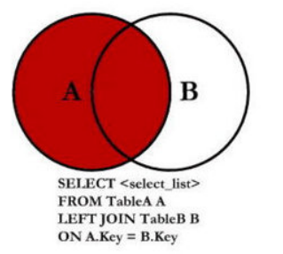
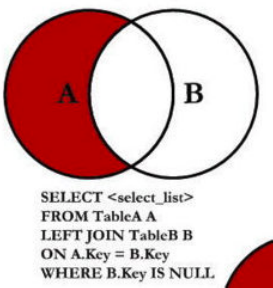
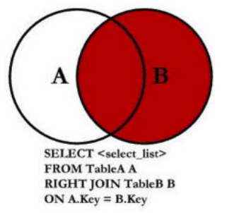
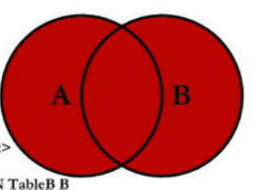
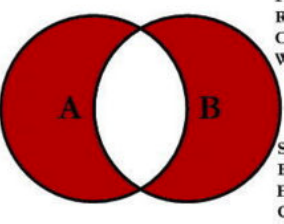

# MySQL 数据库

## 基本概念

### 为什么需要数据库？

- 任何的软件系统都需要存放大量的数据，这些数据通常是非常复杂和庞大的：
  - 比如用户信息包括姓名、年龄、性别、地址、身份证号、出生日期等等；
  - 比如商品信息包括商品的名称、描述、价格（原价）、分类标签、商品图片等等；
  - 比如歌曲信息包括歌曲的名称、歌手、专辑、歌曲时长、歌词信息、封面图片等等；
- 那么这些信息不能直接存储到文件中吗？可以，但是文件系统有很多的缺点：
  - 很难以合适的方式组织数据（多张表之前的关系合理组织）；
  - 并且对数据进行增删改查中的复杂操作（虽然一些简单确实可以），并且保证单操作的原子性；
  - 很难进行数据共享，比如一个数据库需要为多个程序服务，如何进行很好的数据共享；
  - 需要考虑如何进行数据的高效备份、迁移、恢复；
  - 等等...
- 数据库通俗来讲就是一个存储数据的仓库，数据库本质上就是一个软件、一个程序。

### 常见的数据库有哪些？

- 关系型数据库：MySQL、Oracle、DB2、SQL Server、Postgre SQL 等；
  - 关系型数据库通常我们会创建很多个二维数据表；
  - 数据表之间相互关联起来，形成一对一、一对多、多对对等关系；
  - 之后可以利用 SQL 语句在多张表中查询我们所需的数据；
  - 支持事务，对数据的访问更加的安全；
- 非关系型数据库：MongoDB、Redis、Memcached、HBse 等；
  - 非关系型数据库的英文其实是 Not only SQL，也简称为 NoSQL；
  - 相当而已非关系型数据库比较简单一些，存储数据也会更加自由（甚至我们可以直接将一个复杂的 json 对象直入到数据库中）；
  - NoSQL 是基于 Key-Value 的对应关系，并且查询的过程中不需要经过 SQL 解析，所以性能更高；
  - NoSQL 通常不支持事务，需要在自己的程序中来保证一些原子性的操作；
- 如何在开发中选择他们呢？具体的选择会根据不同的项目进行综合的分析，我这里给一点点建议：
  - 目前在公司进行后端开发（Node、Java、Go 等），还是以关系型数据库为主；
  - 比较常用的用到非关系型数据库的，在爬取大量的数据进行存储时，会比较常见；

### 认识 MySQL

- MySQL 的介绍：
  - MySQL 原本是一个开源的数据库，原开发者为瑞典的 MySQL AB 公司；
  - 在 2008 年被 Sun 公司收购；在 2009 年，Sun 被 Oracle 收购；
  - 所以目前 MySQL 归属于 Oracle；
- MySQL 是一个关系型数据库，其实本质上就是一款软件、一个程序：
  - 这个程序中管理着多个数据库；
  - 每个数据库中可以有多张表；
  - 每个表中可以有多条数据；

### MySQL 默认的数据库

- infomation_schema：信息数据库，其中包括 MySQL 在维护的其他数据库、表、 - 、访问权限等信息；
- performance_schema：性能数据库，记录着 MySQL Server 数据库引擎在运行 - 程中的一些资源消耗相关的信息；
- mysql：用于存储数据库管理者的用户信息、权限信息以及一些日志信息等；
- sys：相当于是一个简易版的 performance_schema，将性能数据库中的数据汇总成更容易理解的形式；

## 环境搭建

[MySQL 下载](https://dev.mysql.com/downloads/mysql/)

## 终端操作数据库

### 登录

`mysql -u用户名 -p密码`

### 数据库操作

- 显示数据库：`show databases;`
- 创建数据库：`create database 数据库名;`
- 选择数据库：`use 数据库名;`

### 数据表操作

- 创建表：`create table 表名(字段名 数据类型,字段名 数据类型);`
- 插入数据：`insert into 表名(字段名,字段名) values (值,值);`

## SQL 的数据类型

### 数字类型

- 整数数字类型：INTEGER，INT，SMALLINT，TINYINT，MEDIUMINT，BIGINT；

| 类型      | 储存空间（Bytes） | 最小值有符号 | 最小值无符号 | 最大值有符号 | 最大值无符号 |
| --------- | ----------------- | ------------ | ------------ | ------------ | ------------ |
| TINYINT   | 1                 | \-128        | 0            | 127          | 255          |
| SMALLINT  | 2                 | \-32768      | 0            | 32767        | 65535        |
| MEDIUMINT | 3                 | \-8388608    | 0            | 8388607      | 16777215     |
| **INT**   | 4                 | \-2147483648 | 0            | 2147483647   | 4294967295   |
| BIGINT    | 8                 | \-2^63       | 0            | 2^63\-1      | 2^64\-1      |

- 精确数字类型：DECIMAL，NUMERIC（DECIMAL 是 NUMERIC 的实现形式）；
- 浮点数字类型：FLOAT，DOUBLE（FLOAT 是 4 个字节，DOUBLE 是 8 个字节）；

### 日期类型

::: tip 提示
DATETIME 或 TIMESTAMP 值可以包括在高达微秒（6 位）精度的后小数秒一部分。比如 DATETIME 表示的范围可以是'1000-01-01 00:00:00.000000'到'9999-12-31 23:59:59.999999';
:::

- YEAR 以 YYYY 格式显示值
  - 范围 1901 到 2155，和 0000。
- DATE 类型用于**具有日期部分但没有时间部分**的值：
  - DATE 以格式 YYYY-MM-DD 显示值 ；
  - 支持的范围是 '1000-01-01' 到 '9999-12-31'；
- DATETIME 类型用于**包含日期和时间**部分的值：
  - DATETIME 以格式'YYYY-MM-DD hh:mm:ss'显示值；
  - 支持的范围是 1000-01-01 00:00:00 到 9999-12-31 23:59:59;
- **TIMESTAMP** 数据类型被用于**同时包含日期和时间**部分的值：
  - TIMESTAMP 以格式'YYYY-MM-DD hh:mm:ss'显示值；
  - 但是它的范围是 UTC 的时间范围：'1970-01-01 00:00:01'到'2038-01-19 03:14:07';

### 字符串类型

- CHAR 类型在创建表时为固定长度，长度可以是 0 到 255 之间的任何值；
  - 在被查询时，会删除后面的空格；
- **VARCHAR** 类型的值是可变长度的字符串，长度可以指定为 0 到 65535 之间的值；
  - 在被查询时，不会删除后面的空格；
- BINARY 和 VARBINARY 类型用于存储二进制字符串，存储的是字节字符串；
- BLOB 用于存储大的二进制类型；
- TEXT 用于存储大的字符串类型；

## 表约束

### 主键 PRIMARY KEY

::: tip 提示
开发中主键字段应该是和业务无关的，尽量不要使用业务字段来作为主键
:::

一张表中，我们为了区分每一条记录的唯一性，必须有一个字段是永远不会重复，并且不会为空的，这个字段我们通常会
将它设置为主键：

- 主键是表中唯一的索引；
- 并且必须是 **NOT NULL** 的，如果没有设置 NOT NULL，那么 MySQL 也会隐式的设置为 NOT NULL；
- 主键也可以是多列索引，PRIMARY KEY( key_part, ...)，我们一般称之为联合主键；

### 唯一 UNIQUE

某些字段在开发中我们希望是唯一的，不会重复的，比如手机号码、身份证号码等，这个字段我们可以使用 UNIQUE 来约束 ：

- 使用 UNIQUE 约束的字段在表中必须是不同的；
- 对于所有引擎，UNIQUE 索引允许 NULL 包含的列具有多个值 NULL。

### 不能为空：NOT NULL

某些字段我们要求用户必须插入值，不可以为空，这个时候我们可以使用 NOT NULL 来约束；

### 默认值：DEFAULT

某些字段我们希望在没有设置值时给予一个默认值，这个时候我们可以使用 DEFAULT 来完成；

### 自动递增：AUTO_INCREMENT

某些字段我们希望不设置值时可以进行递增，比如用户的 id，这个时候可以使用 AUTO_INCREMENT 来完成；

## SQL 语句

我们希望操作数据库（特别是在程序中），就需要有和数据库沟通的语言，这个语言就是 SQL：

- SQL 是 Structured Query Language，称之为结构化查询语言，简称 SQL；
- 使用 SQL 编写出来的语句，就称之为 SQL 语句；
- SQL 语句可以用于对数据库进行操作；

### SQL 语句的分类

- DDL（Data Definition Language）：数据定义语言；
  - 可以通过 DDL 语句对数据库或者表进行：创建、删除、修改等操作；
- DML（Data Manipulation Language）：数据操作语言；
  - 可以通过 DML 语句对表进行：添加、删除、修改等操作；
- DQL（Data Query Language）：数据查询语言；
  - 可以通过 DQL 从数据库中查询记录；（重点）
- DCL（Data Control Language）：数据控制语言；
  - 对数据库、表格的权限进行相关访问控制操作；

### SQL 语句的常用规范

- 通常关键字是大写的，比如 CREATE、TABLE、SHOW 等等；
- 一条语句结束后，需要以 ; 结尾；
- 如果遇到关键字作为表明或者字段名称，可以使用``包裹;

## 数据库操作

### 创建数据库

- 直接创建：`CREATE DATABASE 数据库名`
- 如果表不存在时则创建：`CREATE DATABASE IF NOT EXISTS 数据库名`

### 删除数据库

```sql
DROP DATABASE IF EXISTS 数据库名;
```

### 修改数据库编码

```sql
ALTER DATABASE 数据库名 CHARACTER SET = utf8 COLLATE = utf8_unicode_ci
```

## 数据表的操作

### 创建表

```sql
CREATE TABLE IF NOT EXISTS`表名`(`字段名` 数据类型,`字段名`数据类型);
```

### 删除表

```sql
DROP TABLE IF EXISTS`表名`;
```

### 修改表

- 修改表名

  ```sql
  ALTER TABLE `表名` RENAME TO `新表名`;
  ```

- 添加一个新的列

  ```sql
  ALTER TABLE `表名` ADD `列名` 数据类型;
  ```

- 修改字段的名称

  ```sql
  ALTER TABLE `表名` CHANGE `字段名` `新字段名` 数据类型;
  ```

- 修改字段类型

  ```sql
  ALTER TABLE `表名` MODIFY `字段名` 数据类型;
  ```

- 删除某一个字段

  ```sql
  ALTER TABLE `表名` DROP `字段名`;
  ```

### 根据一个表结构创建另外一张表

```sql
CREATE TABLE `新表名` LIKE `表名`;
```

### 根据一个表中的所有内容，创建另外一张表

```sql
CREATE TABLE `新表名` (SELECT * FROM 表名);
```

### 查看表结构

```sql
DESC 表名;
```

### 查看创建表的 SQL 语句

```sql
SHOW CREATE TABLE `表名`;
```

## 数据库的增删改

### 增加数据

```sql
INSERT INTO `表名` VALUES (值,值);
```

```sql
INSERT INTO `表名` (`字段名`,`字段名`) VALUES (值,值);
```

### 删除数据

- 删除所有数据

  ```sql
  DELETE FROM `表名`;
  ```

- 删除符合条件的数据

  ```sql
  DELETE FROM `表名` WHERE 字段名 = 值;
  ```

### 修改数据

- 更新符合条件的数据

  ```sql
  UPDATE `表名` SET 字段名 = 值,字段名 = 值;
  ```

- 修改所有数据

  ```sql
  UPDATE `表名` SET 字段名 = 值,字段名 = 值 WHERE 字段名 = 值;
  ```

## 查询数据

### 基本查询

- 查询所有数据

  ```sql
  SELECT * FROM `表名`;
  ```

- 查询指定的字段

  ```sql
  SELECT 字段名,字段名 FROM `表名`;
  ```

- 对字段结果起别名
  ```sql
  SELECT 字段名 别名,字段名 别名 FROM `表名`;
  SELECT 字段名 as 别名,字段名 as 别名 FROM `表名`;
  ```

### where 查询条件

- 条件判断

  ```sql
  SELECT * from `表名` WHERE `字段名` < 值;
  SELECT * from `表名` WHERE `字段名` = 值;
  SELECT * from `表名` WHERE `字段名` != 值;
  ```

- 逻辑运算

  ```sql
  -- 与
  SELECT * FROM `表名` WHERE `字段名` >值 AND `字段名` <值;
  SELECT * FROM `表名` WHERE `字段名` >值 && `字段名` <值;
  -- 或
  SELECT * FROM `表名` WHERE `字段名` >值 || `字段名` = 值;
  -- [值1,值2]
  SELECT * FROM `表名` WHERE `字段名` BETWEEN 值1 AND 值2;
  ```

- NULL

  ```sql
  -- 将某些值设置为NULL
  UPDATE `表名` SET url = NULL WHERE `字段名` >= 值 AND `字段名` <=值;
  -- 查询某一个值为NULL
  SELECT * FROM `表名` WHERE `字段名` IS NULL;
  -- 查询某一个值为非NULL
  SELECT * FROM `表名` WHERE `字段名` IS NOT NULL;
  ```

- 模糊查询

  | 通配符                     |            描述            |
  | -------------------------- | :------------------------: |
  | %                          |    匹配任意个的任意字符    |
  | \_                         |     匹配一个的任意字符     |
  | [charlist]                 |   字符列中的任何单一字符   |
  | [^charlist] 或 [!charlist] | 不在字符列中的任何单一字符 |

  ```sql
  SELECT * FROM `表名` WHERE 字段名 LIKE '%字符%';
  ```

- IN

  IN 表示取多个值中的其中一个

  ```sql
  SELECT * FROM `表名` WHERE 字段名 IN (值,值);
  ```
### 排序查询

- 顺序排序

  ```sql
  SELECT * FROM `表名` ORDER BY `排序字段`;
  ```
- 逆向排序

  ```sql
  SELECT * FROM `表名` ORDER BY `排序字段` desc;
  ``` 

### 分页查询

::: tip 提示
LIMIT 内不支持计算符，需要程序去计算
:::

```sql
SELECT * FROM `表名` LIMIT 分页大小 OFFSET (当前页数-1)*分页大小;
```

```sql
SELECT * FROM `表名` LIMIT (当前页数-1)*分页大小,分页大小
```

### 聚合函数

聚合函数表示对值集合进行操作的组（集合）函数

::: tip 提示
使用聚合函数前后不能再跟字段名
:::

- 求和

  ```sql
  SELECT SUM(`字段名`) FROM `表名`;
  ```

- 求平均

  ```sql
  SELECT AVG(`字段名`) FROM `表名` WHERE `字段名` = 值;
  ```

- 求最大值

  ```sql
  SELECT MAX(`字段名`) FROM `表名`;
  ```

- 求最小值

  ```sql
  SELECT MIN(`字段名`) FROM `表名`;
  ```

- 计数

  ```sql
  SELECT COUNT(*) FROM `表名` WHERE `字段名` = 值;
  -- 去重复
  SELECT COUNT(DISTINCT `字段名`) FROM `表名`;
  ```

### GROUP BY

GROUP BY 通常和聚合函数一起使用，表示我们先对数据进行分组，再对每一组数据，进行聚合函数的计算；

::: tip 提示
除聚合函数外，GROUP BY 前后只能增加**分组字段名**
:::

```sql
SELECT 分组字段名,AVG(`字段名`),COUNT(`字段名`) FROM `表名` GROUP BY `分组字段名`;
```

- 条件约束

HAVING 是给 Group By 查询到的结果添加约束

```sql
SELECT 分组字段名,AVG(`字段名`) 别名,COUNT(`字段名`) FROM `表名` GROUP BY `分组字段名` HAVING 别名 > 值;
```

### 外键

::: tip 提示
使用外键需要父子表都为 InnoDB 引擎，MyISAM 引擎不支持外键
:::

- 创建表时增加外键

  ```sql
  CREATE TABLE IF NOT EXISTS `表名` (
    字段名 数据类型 PRIMARY KEY,
    字段名 数据类型,
    FOREIGN KEY (外键字段名) REFERENCES `参考表`(参考字段)
  );
  ```

- 已有字段增加外键

  ```sql
  ALTER TABLE `表名` ADD FOREIGN KEY(外键字段名) REFERENCES 参考表(参考字段);
  ```

**外键 Action：**

- RESTRICT（默认属性）：当更新或删除某个记录时，会检查该记录是否有关联的外键记录，有的话会报错的，不允许更新或删除；
- NO ACTION：和 RESTRICT 是一致的，是在 SQL 标准中定义的；
- CASCADE：当更新或删除某个记录时，会检查该记录是否有关联的外键记录，有的话：
  - 更新：那么会更新对应的记录；
  - 删除：那么关联的记录会被一起删除掉；
- SET NULL：当更新或删除某个记录时，会检查该记录是否有关联的外键记录，有的话，将对应的值设置为 NULL；

修改外键 Action：

```sql
-- 查看外键名称
SHOW CREATE TABLE `表名`;
-- 删除外键
ALTER TABLE `表名` DROP FOREIGN KEY 外键名称;
-- 重新增加外键
ALTER TABLE `表名` ADD FOREIGN KEY (外键字段名) REFERENCES 参考表(参考字段) ON UPDATE CASCADE ON DELETE RESTRICT;
```

### 多表查询

- 左连接

  如果我们希望获取到的是左边所有的数据（以左表为主）。这个时候就表示无论左边的表是否有对应的 **右表名.字段名** 的值对应右边表的 **字段名**，左边的数据都会被查询出来；

  

  ```sql
  SELECT * FROM `左表名` LEFT JOIN `右表名` ON 左表名.字段名 = 右表名.右表名;
  ```

  

  ```sql
  SELECT * FROM `左表名` LEFT JOIN `右表名` ON 左表名.字段名 = 右表名.右表名 WHERE 右表名.字段名 IS NULL;
  ```

- 右连接

  

  ```sql
  SELECT * FROM `右表名` RIGHT JOIN `左表名` ON 右表名.字段名 = 左表名.字段名;
  ```

  

  ```sql
  SELECT * FROM `右表名` RIGHT JOIN `左表名` ON 右表名.字段名 = 左表名.id WHERE 右表名.字段名 IS NULL;
  ```

- 内连接

  内连接是表示左边的表和右边的表都有对应的数据关联

  

  ```sql
  SELECT * FROM `左表名` JOIN `右表名` ON 左表名.字段名 = 右表名.字段名;
  ```

  和的下面写法是一样的效果，但是他们代表的含义并不相同：

  - 内连接，代表的是在两张表连接时就会约束数据之间的关系，来决定之后查询的结果；
  - where 条件，代表的是先计算出笛卡尔乘积，在笛卡尔乘积的数据基础之上进行 where 条件的筛选；

  ```sql
  SELECT * FROM `左表名`,`右表名` WHERE 左表名.字段名 = 右表名.字段名;
  ```

- 全连接

  SQL 规范中全连接是使用 FULL JOIN，但是 MySQL 中并没有对它的支持，需要使用 UNION 来实现

  

  ```sql
  (SELECT * FROM `左表名` LEFT JOIN `右表名` ON 左表名.字段名 = 右表名.右表名)
  UNION
  (SELECT * FROM `右表名` RIGHT JOIN `左表名` ON 右表名.字段名 = 左表名.字段名);
  ```

  

  ```sql
  (SELECT * FROM `左表名` LEFT JOIN `右表名` ON 左表名.字段名 = 右表名.右表名 WHERE 右表名.字段名 IS NULL)
  UNION
  (SELECT * FROM `右表名` RIGHT JOIN `左表名` ON 右表名.字段名 = 左表名.id WHERE 右表名.字段名 IS NULL);
  ```

## 对象和数据类型

### 将查询到的数据转成数组

```sql
SELECT JSON_ARRAYAGG(表名.字段名) FROM `表名`;
```

### 将查询到的数据转成对象

```sql
SELECT JSON_OBJECT('键名',表名.字段名,'键名',表名.字段名) FROM `表名`;
```

### 将联合查询到的数据转成对象

```sql
SELECT
	左表名.字段名 别名, 左表名.字段名 别名,
	JSON_OBJECT('别名', 右表名.字段名, '别名', 右表名.字段名) 别名
FROM `左表名`
LEFT JOIN `右表名` ON 左表名.字段名 = 右表名.右表名;
```

### 将查询到的多条数据，组织成对象，放入到一个数组中(多对多)

```sql
SELECT
	stu.id, stu.name, stu.age,
	JSON_ARRAYAGG(JSON_OBJECT('id', cs.id, 'name', cs.name, 'price', cs.price))
FROM `students` stu
JOIN `students_select_courses` ssc ON stu.id = ssc.student_id
JOIN `courses` cs ON ssc.course_id = cs.id
GROUP BY stu.id;
```
