# 为什么要用 NoSQL

> 单机 MySQL 的年代

1. 数据量太大

2. 数据的索引(B+Tree)
3. 访问量(读写混合)

> Memcached(缓存) +MySQL + 垂直拆分

网站 80%的情况都是在读，每次都要去查询数据库的话就十分的麻烦！所以说我们希望减轻数据的压力，我们可以使用缓存来保证效率!

发展过程: 优化数据结构和索引-->文件缓存(IO)-->Memcached(当时的热门技术!)

> 3.分库分表 + 水平拆分 + MySQL 集群

# 什么是 NoSQL

> NoSQL

NoSQL = Not only SQL

关系型数据库: 表格,行,列 (POI)

泛指非关系型数据库的,随着 web2.0 互联网的诞生!传统的关系型数据库很难对付 web2.0 时代!尤其是超大规模的社区!

NOSQL 在当今大数据环境下发展的十分迅速,Redis 是发展最快的,必须掌握

> NoSQL 特点

1. 方便扩展(数据之间没有关系,很好扩展!)
2. 大数据量,高性能(Redis 一秒写八万次,读取 11 万 NoSQL 的缓存记录,是一种细粒度的缓存,性能高)
3. 数据是多样型的(不需要事先设计数据库! 随取随用! 如果时数据库是数据量十分大的表,很多人就无法设计)
4. 传统的 RDBMS 和 NOSQL

```
传统的RDBMS
- 结构化组织
- SQL
- 数据和关系都存在单独的表中
- 操作,定义语言
- 严格的一致性
- 基础的事务

```

```
NOSQL
- 不仅仅是数据
- 没有固定的查询语言
- 键值对存储,列存储,文档存储,图形数据库(社交关系)
- 最终一致性
- CAP定理 和 BASE (异地多话)
- 高性能,高可用,高可扩展
```

# NoSQL 的四大分类

KV 键值对

- 新浪: Redis
- 美团: Redis + Tair
- 阿里. 百度: Redis + memecache

文档型数据库(bson 格式和 json 一样)

- Mong0DB (必会)
  - 基于分布式文件存储的数据库, C++编写,处理大量的文档
  - 是一个介于关系型数据库和非关系型数据库中的中间的产品 MongoDB 是非关系型数据库中功能最丰富,最像关系型数据库的!
  - ConthDB

列存储数据库

- HBase
- 分布式文件系统

图形关系数据库

- 不是存图形的,放的是关系
- Neo4j InfoGrid

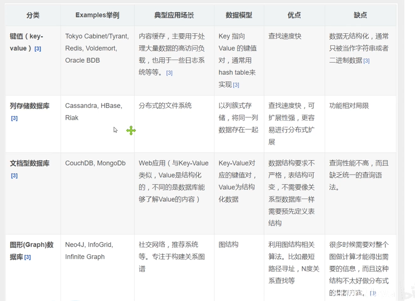

# Redis 入门

## 概述

> 什么是 Redis

Redis(Remote Dictionary Server) 即远程字典服务

是一个开源的使用 ANSI [C 语言](https://baike.baidu.com/item/C语言)编写、支持网络、可基于内存亦可持久化的日志型、Key-Value[数据库](https://baike.baidu.com/item/数据库/103728)，并提供多种语言的 API

redis 会周期性的把更新的数据写入磁盘或者把修改操作写入追加的记录文件，并且在此基础上实现了 master-slave(主从)同步。

也被人们称为结构化数据库

> Redis 能干嘛

1. 内存存储 持久化 内存中数断电即失, 所以持久化很重要(rdb,aof)

2. 效率高,可以用于高速缓存
3. 发布订阅系统
4. 地图信息分析
5. 计时器 计数器 (访客量)

> 特性

1. 多样的数据类型

2. 持久化

3. 集群

4. 事务

> 学习中需要用到的东西

1. 官网: https://redis.io/
2. 中文网:http://www.redis.cn/

## Windows 安装

1. 下载压缩包
2. 解压
3. 运行
4. 使用 redis 客户端连接 redis

## 测试性能

**redis-benchmark**是一个压力测试工具!

官方自带的性能测试工具

## 基础的知识

默认使用的是第 0 个

一共有 16 个数据库

可以使用 select 进行切换数据库

```bash
select 3  # 切换数据库

DBSIZE # 查看数据库大小

keys * # 查看所有的数据

flushall  #清除所有的数据库

flushdb # 清除当前数据库

```

> Redis 是单线程的!

Redis 是基于内存操作,CPU 不是性能瓶颈,Redis 的瓶颈是根据机器的内存和网络带宽

既然可以使用单线程来实现,就使用单线程了!所以就使用单线程了

Redis 是 c 语言写的

**Redis 为什么单线程还这么快?**

1. 误区 1:高性能的服务器 一定是多线程的? 不一定

2. 误区 2:多线程(CPU 上下文会切换的)一定比单线程效率高? 不一定

   cpu>内存>硬盘

   核心: redis 是将所有的数据全部放在内存中的,所以说使用单线程去操作效率就是最高的 多线程(CPU 上下文切换:耗时的操作!!!)

   对于内存系统来说,如果没有上下文切换效率就是最高的!

   多次读写都是在一个 CPU 上的,在内存情况下,这个就是最佳方案!

# 五大数据类型

Redis 是一个开源（BSD 许可）的，内存中的数据结构存储系统，它可以用作**数据库**、**缓存**和**消息中间件 MQ**。 它支持多种类型的数据结构，如 **字符串**（strings）， **散列**（hashes）， **列表**（lists）， **集合**（sets）， **有序集合**（sorted sets） 与范围查询， bitmaps， hyperloglogs 和 地理空间（geospatial） 索引半径查询。 Redis 内置了 复制（replication），LUA 脚本（Lua scripting）， LRU 驱动事件（LRU eviction），事务（transactions） 和不同级别的 磁盘持久化（persistence）， 并通过 Redis 哨兵（Sentinel）和自动 分区（Cluster）提供高可用性（high availability）。

## Redis - key

```bash
set key value  #设置一个键值对

get key   #通过key 获取值

exists key  # 判断该键是否存在

move key 1  # 移除当前数据库的键 移除该键

expire key time # 给该键设置过期时间 time为过期时间 单位是秒 过期后自动被清除

ttl key #查看该键的有效时间

type key  #查看该键的数据类型
```

## String(字符串)

```bash
append key value #在该键后面追加字符串,如果该键不存在就创建,相当于set key value

strlen key #获取该键对应值的长度

incr key #该键的值 +1

decr key #该键的值 -1

incrby key num #该键的值 +num

decrby key num #该键的值 -num

getrange key start end #获取该键[start,end]范围的值 [0,-1]就是全部

setrange key offset value #value从offset位置开始替换原值

#setex 相当于 set with expire
setex key time value #创建键值对 并且只能存在time秒

#setnx 相当于 set if not expire (在分布式锁中常常使用)
setnx key value #如果该键不存在就设置,存在就不设置

mset k1 v1 k2 v2 k3 v3 #设置多个键值对

mget k1 k2 k3 #获取多个值

msetnx k1 v1 k2 v2 #创建多个键值对,如果这些键值对都不存在就创建成功,如果有一个键值对存在就创建失败(一个都不创建) 可见 该操作是原子性操作

getset key vlaue #如果该键不存在,返回nil 并且创建该键;存在,返回对应的值,并设置新的值
```

应用场景:

- 计数器
- 对象缓存存储
- 粉丝数
- 统计多单位的数量

## List(列表)

基本的数据类型,列表

在 redis 里面,list 相当于 栈 队列 阻塞队列

所有的 list 命令都是 l 开头的

```bash
#l 表示头部  r 表示尾部
lpush list value #将一个值或多个值,插入到列表头部 左

rpush list value #将一个值或多个值,插入到列表尾部 右

lrange list start end #获取该列表[start,end]范围的值 [0,-1]就是全部

lpop list #将头部的第一个值从列表中移除

rpop lsit #将尾部的第一个值从列表中移除

lindex list index #通过index下标获取列表中对应的值

llen list #返回列表的长度

lrem list count value  #移除列表中指定个数(count)的value

ltrim list start end #返回 截取[start,end]的列表

lpoplpush oldlist newlist #将源列表中头部的值移除并将该值加入到目标列表的头部

exists list #检测该列表是否存在

lset list index value #将列表中指定下标的值替换为另一个值 如果列表不存在报错,如果下标中不存在值报错

linsert list affter|before 原值 目标值 # 将目标值插入到原值的前面或者后面
```

应用:

- 消息队列
- 栈

> 小结

- 实际上是一个链表
- 如果这个列表不存在,可以创建新的列表
- 如果列表存在,则是新增内容
- 如果移除了所有的值 ->空列表->也代表不存在
- 在两边进行操作效率最高! 操作中间元素 效率低

## Set(集合)

set 中的值是**不可重复**的且**无序**

```bash
sadd set名 value #往集合中添加一个值

smembers set名  #查看指定集合中所有的值

sismember set名 value #查看集合中是否存在该值 1->存在  0->不存在

scard set名 #获取集合中值的个数

srem set名 value #将该值从集合中移除

srandmember set名 count #从该集合中随机抽选出count个值 默认1个

spop set名 #从该集合中随机弹出一个值

smove oldset newset value #将oldset中指定的value移除,并添加到到newset中去

sdiff set1 set2 #以set1集合为标准查看两个集合的差集

sinter set1 set2 #查看2个集合的交集

sunion set1 set2 #查看2个集合的并集
```

应用场景:

- 共同关注
- 推荐好友

## Hash(哈希)

Map 集合 -> key,Map 集合->(key,(key,vlaue))

本质和 String 没有太大区别

```bash
hset hash名 字段 值 #set一个具体的key=value

hget hash名 字段 #得到一个具体的值

hmset hash名 字段1 值1 字段2 值2  #set多个值

hmgey hash名 字段1 字段2 #获取多个值

hgetall hash名 #获取所有的字段和值

hdel hash名 字段  #删除该字段

hlen hash名 #查看该Hsah有多少个键值对

hexists hash名 字段 #判断该字段支付存在

hkeys hash名  #获取所有的字段

hvals hash名 #获取所有的值

hincrby hash名 字段 num #该字段的值+num

hdecrby hash名 字段 num #该字段的值-num

hsetnx hash名 字段 值 #若该字段不存在,创建;若存在,则失败

```

应用场景:

- hash 变更的数据 user name age,尤其是用户信息之类的,经常变动的信息,更适合对象的存储

## Zset(有序集合)

在 set 的基础上,增加了一个值

```bash
zadd zset名 序号 value  #按序号把值加入到有序集合中 一次可以加入多个值

zrange zset名 start end #查询[start,end]之间的值 [0,-1] 就是查询全部

zrangebyscore zset名 -inf +inf withscores #查询出来值按从小到大排序 并且把score也输出

zrem zset名 vlaue #把该值从集合中移除

zcard zset名 #获取有序集合中的个数

zrevrange zset名 0 -1 #从大到小排序

zcount zset名 min max #获取[min,max]之间的值的数量
```

# 三种特殊数据类型

## geospatial(地理位置)

朋友的定位,附近的人,打车的位置

Redis 的 GEO

```bash
# geoadd 添加地地理位置
# 经度范围 -180到180
# 维度范围 -85.05112878 到85.05112878
geoadd key 经度 维度 城市名

geopos key 城市名 #获取该城市名的经纬度

#距离单位 m->米 km->千米 mi->英里 ft->英尺
geodist key 城市名 城市名 距离单位 #计算2个城市之间的直线距离

#方式 withdist->元素名+距离 withcoord->经纬度
# count 指定查询的数量
georadius key 经度 维度 半径 单位 方式 #查找半径范围内的所有元素

georadiusbymember key 城市名 半径 单位 #查询该城市半径范围内的其他城市(包括自己)

geohash key 城市名 #返回11个字符的Geohash的字符串
```

> **Geo 底层的实现原理就是 Zset! 可以使用 Zset 命令来操作 geo**

## Hyperloglog

> 什么是基数

不重复的元素的个数

> 简介

Redis 2.8.9 更新了 Hyperloglog 数据结构

Redis Hyperloglog 拘束统计的算法!

优点:

- 占用内存是固定的,2^64 不同的元素的技术,只需要 12kb 内存

```bash
pfadd key 值1 值2 值3 #创建第一组元素

pfcount key #统计该组中基数的数量

pfmerge key3 key1 key2 #合并key1 key2 =>key3 并集
```

如果允许容错 ,那么一定可以使用 Hyperloglog

如果不允许,就使用 set 或者自己的数据类型即可

应用场景:

网页的 UV (独立访问数,一个人访问一个网站多次,还是算一个人)

## Bitmaps

> 位存储

```bash
setbit key index 0|1 #记录状态

getbit key index #获取状态

bitcount sign start end #统计[start,end]的状态为1的记录个数 不写start end 表示全部统计
```

应用场景:

- 打卡
- 记录用户状态

# Redis 的事务

Mysql: ACID

Redis 事务本质: 一组命令的集合!一个事务的所有命令都会被序列化,在事务执行过程中,会按照顺序执行!

**一次性 顺序性 排他性**

**Redis:单条命令保证原子性的,但是事务不保证原子性**

**Redis 事务没有隔离级别的概念!**

所有的命令在事务中,并没有被直接执行!,只有发起执行命令的时候才会执行!

Redis 的事务:

- 开启事务(multi)
- 命令入队()
- 执行事务(exec)

> 正常执行事务

```bash
multi #开启事务
###
.....  #命令入队
##
exec #执行事务
#结果: 输出每条命令的执行结果
```

> 放弃事务

```bash
multi #开启事务
###
.....  #命令入队
##
discard #取消事务
```

> 编译型异常(代码有问题!命令有错!),事务中的所有的命令都不会被执行

```bash
multi #开启事务
###
.....  #命令入队
错误的命令
(error)..... #报错
##
exec #执行事务
(error) EXECABORT Transaction discarded because of previous errors.
#结果所有命令都不会被执行
```

> 运行时异常,如果事务队列中存在语法性错误,那么执行命令的时候,其他命令时可以正常执行的,错误的命令抛出异常

```bash
multi #开启事务
###
.....  #命令入队
存在语法性错误的命令 #如 带字母的字符串进行+1操作
##
exec #执行事务
#结果: 存在语法性错误的命令报错 (error)...
其他命令输出正常结果
```

> 监控 Watch

悲观锁:

- 认为什么时候都会出问题,无论什么时候都回加锁!

乐观锁:

- 认为什么时候都不会出现问题,所以不会上锁! 更新数据的时候去判断一下,在此期间是否有人修改过这个数据 version!
- 获取 version
- 更新的时候比较 version

> Redis 监视测试

```bash
watch key #监视该key

###################
第一个线程:
127.0.0.1:6379> set money 100
OK
127.0.0.1:6379> set out 0
OK
127.0.0.1:6379> watch money #监视该key
OK
127.0.0.1:6379> multi #开启事务
OK
127.0.0.1:6379> decrby money 10
QUEUED
127.0.0.1:6379> incrby out 10
QUEUED
##############

################
在没有提交事务时第二个线程插入:
127.0.0.1:6379> get money
"100"
127.0.0.1:6379> set money 1000
OK
###########

##########
此时第一个线程才执行事务
127.0.0.1:6379> exec
(nil)
127.0.0.1:6379> get money
"1000"
127.0.0.1:6379> get out
"0"
##########
结果: 事务没有正常执行
```

# Jedis

> 什么是 Jedis 是 Redis 官方推荐的 Java 连接开发工具! 使用 java 操作 Redis 中间件! 如果你要使用 Java 操作 redis,那么一个要对 jedis 十分熟悉

> 测试

1. 导入依赖

```xml
		<!-- https://mvnrepository.com/artifact/redis.clients/jedis -->
        <dependency>
            <groupId>redis.clients</groupId>
            <artifactId>jedis</artifactId>
            <version>3.4.0</version>
        </dependency>
        <!-- https://mvnrepository.com/artifact/com.alibaba/fastjson -->
        <dependency>
            <groupId>com.alibaba</groupId>
            <artifactId>fastjson</artifactId>
            <version>1.2.75</version>
        </dependency>
```

2. 编码测试
   - 连接数据库
   - 操作命令
   - 断开连接

```java
public class TestPing {
    public static void main(String[] args) {
        //1.new Jedis 对象即可
        Jedis jedis = new Jedis("127.0.0.1",6379);
        System.out.println(jedis.ping());

    }
}
```

## 常用的 API

### 1. jedis 中对键通用的操作

| 方法                                      | 描述                                 | 返回值 /补充说明               |
| :---------------------------------------- | :----------------------------------- | :----------------------------- |
| jedis.flush                               |                                      |                                |
| jedis.flushDB                             | 清空数据                             |                                |
| boolean jedis.exists(String key)          | 判断某个键是否存在                   | true = 存在，false= 不存在     |
| jedis.set(String key,String value)        | 新增键值对（key,value）              | 返回 String 类型的 OK 代表成功 |
| `Set<String> jedis.keys(*)`               | 获取所有 key                         | 返回 set 无序集合              |
| jedis.del(String key)                     | 删除键为 key 的数据项                |                                |
| jedis.expire(String key,int i)            | 设置键为 key 的过期时间为 i 秒       |                                |
| int jedis.ttl(String key)                 | 获取建委 key 数据项的剩余时间（秒）  |                                |
| jedis.persist(String key)                 | 移除键为 key 属性项的生存时间限制    |                                |
| jedis.type(String key)                    | 查看键为 key 所对应 value 的数据类型 |                                |
| jedis.rename(String oldkey,String newkey) | 重命名 key                           |                                |
| jedis.select(int index)                   | 按索引查询                           |                                |
| jedis.flushDB()                           | 清空当前数据库的 key                 |                                |
| jedis.randomKey()                         | 随机返回 key 空间的一个              |                                |
| jedis.dbSize()                            | 返回当前数据库 key 的个数            |                                |
| jedis.flushAll()                          | 删除所有数据库中的 key               |                                |

### 2. jedis 中 字符串的操作

字符串类型是 Redis 中最为基础的数据存储类型，它在 Redis 中是二进制安全的，这 便意味着该类型可以接受任何格式的数据，如 JPEG 图像数据或 Json 对象描述信息等。 在 Redis 中字符串类型的 Value 最多可以容纳的数据长度是 512M。

| 语法                                                  | 描述                                                     |
| :---------------------------------------------------- | :------------------------------------------------------- |
| jedis.set(String key,String value)                    | 增加（或覆盖）数据项                                     |
| jedis.setnx(String key,String value)                  | 不覆盖增加数据项（重复的不插入）                         |
| jedis.setex(String ,int t,String value)               | 增加数据项并设置有效时间 秒                              |
| jedis.del(String key)                                 | 删除键为 key 的数据项                                    |
| jedis.get(String key)                                 | 获取键为 key 对应的 value                                |
| jedis.append(String key, String s)                    | 在 key 对应 value 后边扩展字符串 s                       |
| jedis.mset(String k1,String V1,String K2,String V2,…) | 增加多个键值对                                           |
| String[] jedis.mget(String K1,String K2,…)            | 获取多个 key 对应的 value                                |
| `jedis.del(new String[](String K1,String K2,.... ))`  | 删除多个 key 对应的数据项                                |
| String jedis.getSet(String key,String value)          | 获取 key 对应 value 并更新 value                         |
| String jedis.getrang(String key , int i, int j)       | 获取 key 对应 value 第 i 到 j 字符 ，从 0 开始，包头包尾 |

### 3. jedis 中对整数和浮点数操作

| 语法                             | 描述                     |
| :------------------------------- | :----------------------- |
| jedis.incr(String key)           | 将 key 对应的 value 加 1 |
| jedis.incrBy(String key,int n)   | 将 key 对应的 value 加 n |
| jedis.decr(String key)           | 将 key 对应的 value 减 1 |
| jedis.decrBy(String key , int n) | 将 key 对应的 value 减 n |

### 4. jedis 中对列表（list）操作

在 Redis 中，List 类型是按照插入顺序排序的字符串链表。和数据结构中的普通链表 一样，我们可以在其头部(left)和尾部(right)添加新的元素。在插入时，如果该键并不存在，Redis 将为该键创建一个新的链表。如果链表中所有的元素均被移除，那么该键也将会被从数据库中删除。List 中可以包含的最大元素数量是 4294967295。
从元素插入和删除的效率视角来看，如果我们是在链表的两头插入或删除元素，这将 会是非常高效的操作，即使链表中已经存储了百万条记录，该操作也可以在常量时间内完成。然而需要说明的是，如果元素插入或删除操作是作用于链表中间，那将会是非常低效的。


> list 元素的下表从 0 开始

| 语法                                                 | 描述                                                                              |
| :--------------------------------------------------- | :-------------------------------------------------------------------------------- |
| `jedis.lpush(String key, String v1, String v2,....)` | 添加一个 List , 注意：如果已经有该 List 对应的 key, 则按顺序在左边追加 一个或多个 |
| jedis.rpush(String key , String vn)                  | key 对应 list 右边插入元素                                                        |
| jedis.lrange(String key,int i,int j)                 | 获取 key 对应 list 区间[i,j]的元素，注：从左边 0 开始，包头包尾                   |
| jedis.lrem(String key,int n , String val)            | 删除 list 中 n 个元素 val                                                         |
| jedis.ltrim(String key,int i,int j)                  | 删除 list 区间[i,j] 之外的元素                                                    |
| jedis.lpop(String key)                               | key 对应 list ,左弹出栈一个元素                                                   |
| jedis.rpop(String key)                               | key 对应 list ,右弹出栈一个元素                                                   |
| jedis.lset(String key,int index,String val)          | 修改 key 对应的 list 指定下标 index 的元素                                        |
| jedis.llen(String key)                               | 获取 key 对应 list 的长度                                                         |
| jedis.lindex(String key,int index)                   | 获取 key 对应 list 下标为 index 的元素                                            |
| jedis.sort(String key)                               | 把 key 对应 list 里边的元素从小到大排序 （后边详细介绍）                          |

### 5. jedis 集合 set 操作

在 Redis 中，我们可以将 Set 类型看作为**没有排序的字符集合**，和 List 类型一样，也可以在该类型的数据值上执行添加、删除或判断某一元素是否存在等操作。需要 说明的是，这些操作的时间是常量时间。Set 可包含的最大元素数是 4294967295。
和 List 类型不同的是，**Set 集合中不允许出现重复的元素**。和 List 类型相比，Set 类型在功能上还存在着一个非常重要的特性，即在服务器端完成多个 Sets 之间的聚合计 算操作，如 unions、intersections 和 differences（就是交集并集那些了）。由于这些操作均在服务端完成， 因此效率极高，而且也节省了大量的网络 IO 开销

> set 的方法都以 s 开头

| 语法                                              | 操作                                  |
| :------------------------------------------------ | :------------------------------------ |
| jedis.sadd(String key,String v1,String v2,…)      | 添加一个 set                          |
| jedis.smenbers(String key)                        | 获取 key 对应 set 的所有元素          |
| jedis.srem(String key,String val)                 | 删除集合 key 中值为 val 的元素        |
| jedis.srem(String key, Sting v1, String v2,…)     | 删除值为 v1, v2 , …的元素             |
| jedis.spop(String key)                            | 随机弹出栈 set 里的一个元素           |
| jedis.scared(String key)                          | 获取 set 元素个数                     |
| jedis.smove(String key1, String key2, String val) | 将元素 val 从集合 key1 中移到 key2 中 |
| jedis.sinter(String key1, String key2)            | 获取集合 key1 和集合 key2 的交集      |
| jedis.sunion(String key1, String key2)            | 获取集合 key1 和集合 key2 的并集      |
| jedis.sdiff(String key1, String key2)             | 获取集合 key1 和集合 key2 的差集      |

### 6. jedis 中 有序集合 Zset

Sorted-Sets 和 Sets 类型极为相似，它们都是字符串的集合，都**不允许重复的成员出现在一个 Set 中**。它们之间的**主要差别是 Sorted-Sets 中的每一个成员都会有一个分数(score)与之关联**，Redis 正是通过分数来为集合中的成员进行从小到大的排序。然 而需要额外指出的是，尽管 Sorted-Sets 中的成员必须是唯一的，但是分数(score) 却是可以重复的。
在 Sorted-Set 中添加、删除或更新一个成员都是非常快速的操作，其时间复杂度为集合中成员数量的对数。由于 Sorted-Sets 中的成员在集合中的位置是有序的，因此，即便是访问位于集合中部的成员也仍然是非常高效的。事实上，Redis 所具有的这一特征在很多其它类型的数据库中是很难实现的，换句话说，在该点上要想达到和 Redis 同样的高效，在其它数据库中进行建模是非常困难的。
例如：游戏排名、微博热点话题等使用场景。

| 语法                                             | 描述                                               |
| :----------------------------------------------- | :------------------------------------------------- |
| jedis.zadd(String key,Map map)                   | 添加一个 ZSet                                      |
| jedis.hset(String key,int score , int val)       | 往 ZSet 插入一个元素（Score-Val）                  |
| jedis.zrange(String key, int i , int j)          | 获取 ZSet 里下表[i,j] 区间元素 Val                 |
| jedis. zrangeWithScore(String key,int i , int j) | 获取 ZSet 里下表[i,j] 区间元素 Score - Val         |
| jedis.zrangeByScore(String , int i , int j)      | 获取 ZSet 里 score[i,j]分数区间的元素（Score-Val） |
| jeids.zscore(String key,String value)            | 获取 ZSet 里 value 元素的 Score                    |
| jedis.zrank(String key,String value)             | 获取 ZSet 里 value 元素的 score 的排名             |
| jedis.zrem(String key,String value)              | 删除 ZSet 里的 value 元素                          |
| jedis.zcard(String key)                          | 获取 ZSet 的元素个数                               |
| jedis.zcount(String key , int i ,int j)          | 获取 ZSet 总 score 在[i,j]区间的元素个数           |
| jedis.zincrby(String key,int n , String value)   | 把 ZSet 中 value 元素的 score+=n                   |

### 7. jedis 中 哈希（Hash）操作

Redis 中的 Hashes 类型可以看成具有 String Key 和 String Value 的 map 容器。所以该类型非常适合于存储值对象的信息。如 Username、Password 和 Age 等。如果 Hash 中包含很少的字段，那么该类型的数据也将仅占用很少的磁盘空间。每一个 Hash 可以存储 4294967295 个键值对。


> 规律： 哈希的 方法 都以 h 开头，含有 m 字符的一般是多个的， （multiple： 多个的）

| 语法                                              | 描述                               |
| :------------------------------------------------ | :--------------------------------- |
| jedis.hmset(String key,Map map)                   | 添加一个 Hash                      |
| jedis.hset(String key , String key, String value) | 向 Hash 中插入一个元素（K-V）      |
| jedis.hgetAll(String key)                         | 获取 Hash 的所有（K-V） 元素       |
| jedis.hkeys（String key）                         | 获取 Hash 所有元素的 key           |
| jedis.hvals(String key)                           | 获取 Hash 所有元素 的 value        |
| jedis.hincrBy(String key , String k, int i)       | 把 Hash 中对应的 k 元素的值 val+=i |
| jedis.hdecrBy(String key,String k, int i)         | 把 Hash 中对应的 k 元素的值 val-=i |
| jedis.hdel(String key , String k1, String k2,…)   | 从 Hash 中删除一个或多个元素       |
| jedis.hlen(String key)                            | 获取 Hash 中元素的个数             |
| jedis.hexists(String key,String K1)               | 判断 Hash 中是否存在 K1 对应的元素 |
| jedis.hmget(String key,String K1,String K2)       | 获取 Hash 中一个或多个元素 value   |

### 8. 排序操作

使用排序， 首先需要生成一个排序对象

```java
SortingParams  sortingParams =  new SortingParams();
```

| 语法                                          | 描述                  |
| :-------------------------------------------- | :-------------------- |
| jedis.sort(String key,sortingParams.alpha())  | 队列按首字母 a-z 排序 |
| jedis.sort(String key, sortingParams.asc() )  | 队列按数字升序排列    |
| jedis.sort(String key , sortingParams.desc()) | 队列按数字降序排列    |

## 事务

```java
		Jedis jedis = new Jedis("127.0.0.1",6379);
        JSONObject jsonObject = new JSONObject();
        jsonObject.put("name","qzs");
        jsonObject.put("age",20);
        Transaction multi = jedis.multi(); //开启事务
        String s = jsonObject.toJSONString();
        System.out.println();
        try {
            multi.set("k1",s);
            multi.set("k2",s);
            multi.exec();//执行事务

        } catch (Exception e) {
            multi.discard(); //放弃事务
        }finally {
            System.out.println(jedis.get("k1"));
            System.out.println(jedis.get("k2"));
            jedis.close();
		}
```

# 整合 Springboot

注意: 在 springboot2.x 之后,原来使用的 jedis 被替换为了 lettuce

jedis :

- 采用的是直连,多个线程操作的话,是不安全的,如果想要避免不安全的,使用 jedis pool 连接池 更像 BIO 模式

lettuce :

- 采用 netty,实例可以在多个线程中进行共享,不存在线程不安全的情况!可以减少线程数据 更像 NIO 模式

1. 导入依赖

   ```xml
    <dependency>
        <groupId>org.springframework.boot</groupId>
        <artifactId>spring-boot-starter-data-redis</artifactId>
   </dependency>
   ```

2. 环境配置

   1. 配置分析(分析源码)

      ```java
       @Bean
          @ConditionalOnMissingBean(
              name = {"redisTemplate"}
          )//我们可以自己定义一个redisTemplate来替换这个默认的
          @ConditionalOnSingleCandidate(RedisConnectionFactory.class)
          public RedisTemplate<Object, Object> redisTemplate(RedisConnectionFactory redisConnectionFactory) {
              //默认的 RedisTemplate 没有过多的设置,redis 对象都是需要序列化!
              //两个泛型都是Object object的类型 我们后面使用需要强制转换<String,object>
              RedisTemplate<Object, Object> template = new RedisTemplate();
              template.setConnectionFactory(redisConnectionFactory);
              return template;
          }

          @Bean
          @ConditionalOnMissingBean //由于String是redis中最常使用的类型,所以说单独提出来了一个bean
          @ConditionalOnSingleCandidate(RedisConnectionFactory.class)
          public StringRedisTemplate stringRedisTemplate(RedisConnectionFactory redisConnectionFactory) {
              StringRedisTemplate template = new StringRedisTemplate();
              template.setConnectionFactory(redisConnectionFactory);
              return template;
      }
      ```

   2. 配置

      ```yaml
      # springboot 所有的配置类,都有一个自动配置类
      # 自动配置类都会绑定一个 properties 配置文件 RedisProperties
      spring:
        redis:
          host: 127.0.0.1
          port: 6379
      ```

3. 测试

   ```java
   @Resource
   private RedisTemplate redisTemplate;

       @Test
       void contextLoads() {
           //opsForValue 操作字符串 类似 String
           //opsForList  操作list 类似lsit
           //opsForset
           //opsForHash
           //opsForZSet
           //opsForGeo
           //opsForHyperLogLog

           //常用的方法 可以直接使用redisTemplate使用 比如事务 基本的CRUD
           //获取redis连接的对象
           // RedisConnection connection = redisTemplate.getConnectionFactory().getConnection();
           //connection.flushDb();
           redisTemplate.opsForValue().set("k1","123");
           System.out.println(redisTemplate.opsForValue().get("k1"));
       }

   输出: 123
   ```

序列化配置

```java
@SuppressWarnings("rawtypes") private @Nullable RedisSerializer keySerializer = null;
	@SuppressWarnings("rawtypes") private @Nullable RedisSerializer valueSerializer = null;
	@SuppressWarnings("rawtypes") private @Nullable RedisSerializer hashKeySerializer = null;
	@SuppressWarnings("rawtypes") private @Nullable RedisSerializer hashValueSerializer = null;
```

> 对象需要序列化才能存入

# Redis.conf 详解

启动的时候,就通过配置文件来启动

> 单位

```bash
# Note on units: when memory size is needed, it is possible to specify
# it in the usual form of 1k 5GB 4M and so forth:
#
# 1k => 1000 bytes
# 1kb => 1024 bytes
# 1m => 1000000 bytes
# 1mb => 1024*1024 bytes
# 1g => 1000000000 bytes
# 1gb => 1024*1024*1024 bytes
#
# units are case insensitive so 1GB 1Gb 1gB are all the same.
```

1.配置文件 unit 单位 对大小写不敏感

> 包含

```bash
# Include one or more other config files here.  This is useful if you
# have a standard template that goes to all Redis servers but also need
# to customize a few per-server settings.  Include files can include
# other files, so use this wisely.
#
# Notice option "include" won't be rewritten by command "CONFIG REWRITE"
# from admin or Redis Sentinel. Since Redis always uses the last processed
# line as value of a configuration directive, you'd better put includes
# at the beginning of this file to avoid overwriting config change at runtime.
#
# If instead you are interested in using includes to override configuration
# options, it is better to use include as the last line.
#
# include .\path\to\local.conf
# include c:\path\to\other.conf
```

> 网络

```bash
bind 127.0.0.1 #绑定的ip
protected-mode yes #是否受保护
port 6379  #端口设置
```

> 通用 GENERAL

```bash
daemonize yes  #以守护线程的方式运行,默认是no,需要自己开启为yes windows 不支持 守护线程

pidfile /var/run/redis.pid #如果以后台的方式运行,就需要指定一个pid文件

#日志
# Specify the server verbosity level.
# This can be one of:
# debug (a lot of information, useful for development/testing)
# verbose (many rarely useful info, but not a mess like the debug level)
# notice (moderately verbose, what you want in production probably)
# warning (only very important / critical messages are logged)
loglevel notice
logfile "server_log.txt" #日志的文件位置名
databases 16  #数据库的数量 默认 16个

```

> 快照

持久化,在规定的时间内,执行了多少次操作,则会持久化到文件.rdb.aof

redis 是内存数据库,如果没有持久化,那么数据断电即失

```bash
#如果900秒内,至少有一个key进行了修改,我们就进行持久化操作
save 900 1
#如果300秒内,至少有10个key进行了修改,我们就进行持久化操作
save 300 10
#如果60秒内,至少有10000个key进行了修改,我们就进行持久化操作
save 60 10000

stop-writes-on-bgsave-error yes #持久化出错,是否继续工作

rdbcompression yes #是否压缩rdb文件,需要消耗一些cpu资源

rdbchecksum yes  #保存rdb文件的时候,进行rdb文件的校验

dir ./  #rdb文件保存的目录

```

> REPLICATION 复制

> SECURITY 安全

```bash
config set requirepass 123456 # 设置redis密码
config get requirepass  # 查看redis密码
auth password #登陆
```

> 限制 CLIENTS

```bash
maxclients 10000 #限制能连接的最大客户端数量

maxmemory <bytes> #redis配置最大的内存常量

maxmemory-policy noeviction #内存达到上限之后的处理策略

```

**maxmemory-policy 六种方式**

1、volatile-lru：只对设置了过期时间的 key 进行 LRU（默认值）

2、allkeys-lru ： 删除 lru 算法的 key

3、volatile-random：随机删除即将过期 key

4、allkeys-random：随机删除

5、volatile-ttl ： 删除即将过期的

6、noeviction ： 永不过期，返回错误

> APPEND ONLY MODE 模式 AOF 配置

```bash
appendonly no  #默认不开启aof模式的,默认是使用rdb方式持久化的,在大部分所有的情况下,rdb完全够用!

appendfilename "appendonly.aof" #持久化的文件的名字

# appendfsync always  #每次修改都会 sync
appendfsync everysec #每秒执行一次 sync 可能会丢失这1s的数据(默认值)
# appendfsync no  #不执行 sync, 这个时候操作系统自己同步数据 速度最快!
```

# Redis 持久化

Redis 是内存数据库,如果不将内存中的数据库状态保存到磁盘,那么一旦服务器进程退出,服务器中的数据库状态也会消失,所以 Redis 提供了持久化功能!

## RDB(Redis DataBase)

> 什么是 RDB

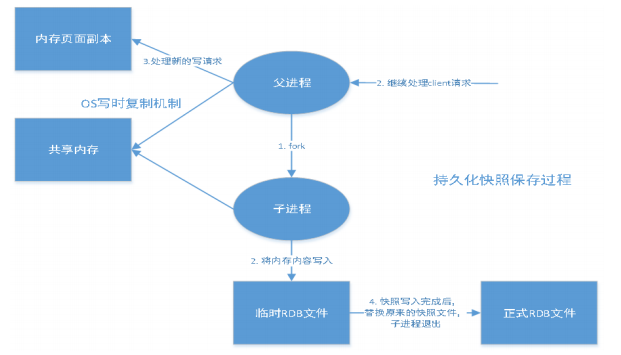

在指定的时间间隔内将内存中的数据集快照写入磁盘，也就是行话讲的 Snapshot 快照，它恢复时是将快 照文件直接读到内存里。

Redis 会单独创建（fork）一个子进程来进行持久化，会先将数据写入到一个临时文件中，待持久化过程 都结束了，再用这个临时文件替换上次持久化好的文件。整个过程中，主进程是不进行任何 IO 操作的。 这就确保了极高的性能。如果需要进行大规模数据的恢复，且对于数据恢复的完整性不是非常敏感，那 RDB 方式要比 AOF 方式更加的高效。RDB 的缺点是最后一次持久化后的数据可能丢失。我们默认的就是 RDB，一般情况下不需要修改这个配置！

有时候在生产环境我们会将这个文件进行备份!

rdb 保存的文件是 dump.rdb 都是在我们的配置文件中快照中进行配置的！

```bash
# The filename where to dump the DB
dbfilename dump.rdb  #文件名
```

> 触发机制

1. save 的规则满足的情况下，会自动触发 rdb 规则
2. 执行 flushall 命令，也会触发我们的 rdb 规则!
3. 退出 redis，也会产生 rdb 文件！

   备份就自动生成一个 dump.rdb

> 如果恢复 rdb 文件！

1. 只需要将 rdb 文件放在我们 redis 启动目录就可以，redis 启动的时候会自动检查 dump.rdb 恢复其中 的数据！

2. 查看需要存在的位置

   ```bash
    config get dir
   ```

> 几乎就他自己默认的配置就够用了，但是我们还是需要去学习！

- **优点:**
  1. 适合大规模的数据恢复！
  2. 对数据的完整性要不高！
- **缺点:**
  1. 需要一定的时间间隔进程操作！如果 redis 意外宕机了，这个最后一次修改数据就没有的了！
  2. fork 进程的时候，会占用一定的内存空间 ! !

## AOF(Append Only File)

将我们的所有命令都记录下来, history,回复的时候就把这个文件全部执行一遍

> 是什么

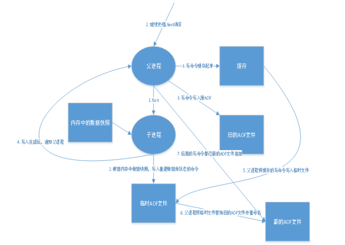

以日志的形式来记录每个写操作，将 Redis 执行过的所有指令记录下来（读操作不记录），只许追加文件 但不可以改写文件，redis 启动之初会读取该文件重新构建数据，换言之，redis 重启的话就根据日志文件 的内容将写指令从前到后执行一次以完成数据的恢复工作

Aof 保存的是 appendonly.aof 文件

> append

```bash
############################## APPEND ONLY MODE ###############################

# By default Redis asynchronously dumps the dataset on disk. This mode is
# good enough in many applications, but an issue with the Redis process or
# a power outage may result into a few minutes of writes lost (depending on
# the configured save points).
#
# The Append Only File is an alternative persistence mode that provides
# much better durability. For instance using the default data fsync policy
# (see later in the config file) Redis can lose just one second of writes in a
# dramatic event like a server power outage, or a single write if something
# wrong with the Redis process itself happens, but the operating system is
# still running correctly.
#
# AOF and RDB persistence can be enabled at the same time without problems.
# If the AOF is enabled on startup Redis will load the AOF, that is the file
# with the better durability guarantees.
#
# Please check http://redis.io/topics/persistence for more information.

appendonly no  #默认是不开启的 要手动开启

# The name of the append only file (default: "appendonly.aof")
appendfilename "appendonly.aof" #生成的文件名字

# appendfsync always #每次都修改
appendfsync everysec #每一秒修改一次
# appendfsync no #不修改

no-appendfsync-on-rewrite no

auto-aof-rewrite-percentage 100
auto-aof-rewrite-min-size 64mb
```

aof 文件有错误，这时候 redis 是启动不起来

需要修复这个 aof 文件 redis 给我们提供了一个工具 redis-check-aof --fix

```bash
appendonly no # 默认是不开启aof模式的，默认是使用rdb方式持久化的，在大部分所有的情况下，rdb完全够用！
appendfilename "appendonly.aof" # 持久化的文件的名字
# appendfsync always # 每次修改都会 sync。消耗性能
appendfsync everysec # 每秒执行一次 sync，可能会丢失这1s的数据！
# appendfsync no # 不执行 sync，这个时候操作系统自己同步数据，速度最快！
# rewrite 重写，

```

**优点：**

1. 每一次修改都同步，文件的完整会更加好！
2. 每秒同步一次，可能会丢失一秒的数据
3. 从不同步，效率最高的！

**缺点：**

1. 相对于数据文件来说，aof 远远大于 rdb，修复的速度也比 rdb 慢！
2. Aof 运行效率也要比 rdb 慢，所以我们 redis 默认的配置就是 rdb 持久化

**扩展：**

1. RDB 持久化方式能够在指定的时间间隔内对你的数据进行快照存储
2. AOF 持久化方式记录每次对服务器写的操作，当服务器重启的时候会重新执行这些命令来恢复原始 的数据，AOF 命令以 Redis 协议追加保存每次写的操作到文件末尾，Redis 还能对 AOF 文件进行后台重 写，使得 AOF 文件的体积不至于过大。
3. 只做缓存，如果你只希望你的数据在服务器运行的时候存在，你也可以不使用任何持久化
4. 同时开启两种持久化方式

   - 在这种情况下，当 redis 重启的时候会优先载入 AOF 文件来恢复原始的数据，因为在通常情况下 AOF 文件保存的数据集要比 RDB 文件保存的数据集要完整。
   - RDB 的数据不实时，同时使用两者时服务器重启也只会找 AOF 文件，那要不要只使用 AOF 呢？作者 建议不要，因为 RDB 更适合用于备份数据库（AOF 在不断变化不好备份），快速重启，而且不会有 AOF 可能潜在的 Bug，留着作为一个万一的手段。

5. 性能建议
   - 因为 RDB 文件只用作后备用途，建议只在 Slave 上持久化 RDB 文件，而且只要 15 分钟备份一次就够 了，只保留 save 900 1 这条规则。
   - 如果 Enable AOF ，好处是在最恶劣情况下也只会丢失不超过两秒数据，启动脚本较简单只 load 自 己的 AOF 文件就可以了，代价一是带来了持续的 IO，二是 AOF rewrite 的最后将 rewrite 过程中产 生的新数据写到新文件造成的阻塞几乎是不可避免的。只要硬盘许可，应该尽量减少 AOF rewrite 的频率，AOF 重写的基础大小默认值 64M 太小了，可以设到 5G 以上，默认超过原大小 100%大小重 写可以改到适当的数值。
   - 如果不 Enable AOF ，仅靠 Master-Slave Repllcation 实现高可用性也可以，能省掉一大笔 IO，也 减少了 rewrite 时带来的系统波动。代价是如果 Master/Slave 同时倒掉，会丢失十几分钟的数据， 启动脚本也要比较两个 Master/Slave 中的 RDB 文件，载入较新的那个，微博就是这种架构。

# Redis 发布订阅

Redis 发布订阅(pub/sub)是一种消息通信模式：发送者(pub)发送消息，订阅者(sub)接收消息。微信、 微博、关注系统！

Redis 客户端可以订阅任意数量的频道。

订阅/发布消息图：

第一个：消息发送者， 第二个：频道 第三个：消息订阅者！

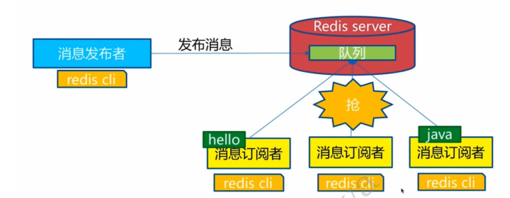

下图展示了频道 channel1 ， 以及订阅这个频道的三个客户端 —— client2 、 client5 和 client1 之间的 关系：

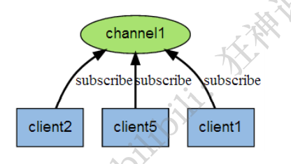

当有新消息通过 PUBLISH 命令发送给频道 channel1 时， 这个消息就会被发送给订阅它的三个客户端：

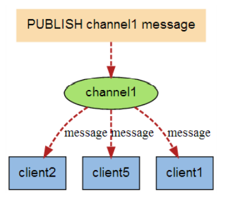

> 命令

这些命令被广泛用于构建即时通信应用，比如网络聊天室(chatroom)和实时广播、实时提醒等。

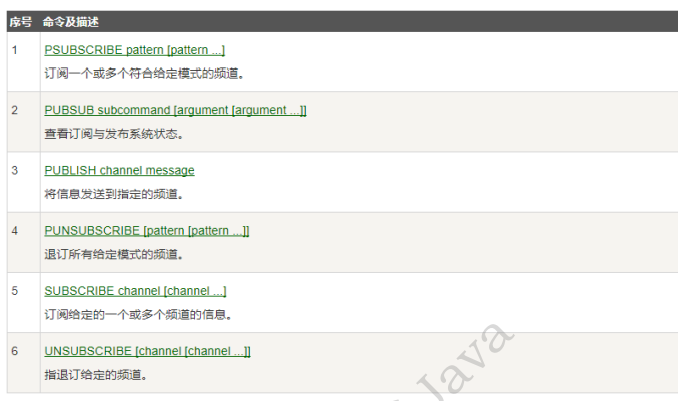

> 原理

Redis 是使用 C 实现的，通过分析 Redis 源码里的 pubsub.c 文件，了解发布和订阅机制的底层实现，籍 此加深对 Redis 的理解。

Redis 通过 PUBLISH 、SUBSCRIBE 和 PSUBSCRIBE 等命令实现发布和订阅功能。

微信：

通过 SUBSCRIBE 命令订阅某频道后，redis-server 里维护了一个字典，字典的键就是一个个 频道！， 而字典的值则是一个链表，链表中保存了所有订阅这个 channel 的客户端。SUBSCRIBE 命令的关键， 就是将客户端添加到给定 channel 的订阅链表中。

通过 PUBLISH 命令向订阅者发送消息，redis-server 会使用给定的频道作为键，在它所维护的 channel 字典中查找记录了订阅这个频道的所有客户端的链表，遍历这个链表，将消息发布给所有订阅者。

Pub/Sub 从字面上理解就是发布（Publish）与订阅（Subscribe），在 Redis 中，你可以设定对某一个 key 值进行消息发布及消息订阅，当一个 key 值上进行了消息发布后，所有订阅它的客户端都会收到相应 的消息。这一功能最明显的用法就是用作实时消息系统，比如普通的即时聊天，群聊等功能。

**使用场景：**

    1. 实时消息系统！

2. 实时聊天！（频道当做聊天室，将信息回显给所有人即可！） 3. 订阅，关注系统都是可以的！ 4. 稍微复杂的场景我们就会使用 消息中间件 MQ （）

# Redis 主从复制

## 概念

主从复制，是指将一台 Redis 服务器的数据，复制到其他的 Redis 服务器。前者称为主节点 (master/leader)，后者称为从节点(slave/follower)；**数据的复制是单向的，只能由主节点到从节点。** Master 以写为主，Slave 以读为主。

默认情况下，每台 Redis 服务器都是主节点；

且一个主节点可以有多个从节点(或没有从节点)，但一个从节点只能有一个主节点。（）

**主从复制的作用主要包括：**

1. 数据冗余：主从复制实现了数据的热备份，是持久化之外的一种数据冗余方式。
2. 故障恢复：当主节点出现问题时，可以由从节点提供服务，实现快速的故障恢复；实际上是一种服务 的冗余。
3. 负载均衡：在主从复制的基础上，配合读写分离，可以由主节点提供写服务，由从节点提供读服务 （即写 Redis 数据时应用连接主节点，读 Redis 数据时应用连接从节点），分担服务器负载；尤其是在写 少读多的场景下，通过多个从节点分担读负载，可以大大提高 Redis 服务器的并发量。
4. 高可用（集群）基石：除了上述作用以外，主从复制还是哨兵和集群能够实施的基础，因此说主从复 制是 Redis 高可用的基础。

   一般来说，要将 Redis 运用于工程项目中，只使用一台 Redis 是万万不能的（宕机），原因如 下：

5. 从结构上，单个 Redis 服务器会发生单点故障，并且一台服务器需要处理所有的请求负载，压力较 大；
6. 从容量上，单个 Redis 服务器内存容量有限，就算一台 Redis 服务器内存容量为 256G，也不能将所有 内存用作 Redis 存储内存，一般来说，单台 Redis 最大使用内存不应该超过 20G。

   电商网站上的商品，一般都是一次上传，无数次浏览的，说专业点也就是"多读少写"。

   对于这种场景，我们可以使如下这种架构：

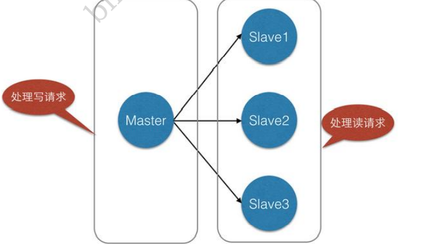

主从复制，读写分离！ 80% 的情况下都是在进行读操作！减缓服务器的压力！架构中经常使用！ 一主 二从！

只要在公司中，主从复制就是必须要使用的，因为在真实的项目中不可能单机使用 Redis！

## 环境配置

只配置从库，不用配置主库！

```bash
127.0.0.1:6379> info replication #查看当前库的信息
# Replication
role:master  #角色 master
connected_slaves:0 #没有从机
master_replid:cc24bbc8134f034cb2ca4b0ec3c40d5c60c6750e
master_replid2:0000000000000000000000000000000000000000
master_repl_offset:0
second_repl_offset:-1
repl_backlog_active:0
repl_backlog_size:1048576
repl_backlog_first_byte_offset:0
repl_backlog_histlen:0
```

复制 3 个配置文件，然后修改对应的信息:

1. 端口
2. pid 名字
3. log 文件名字
4. dump.rdb 名字

修改完毕之后，启动我们的 3 个 redis 服务器，可以通过进程信息查看！

## 一主二从

默认情况下，每台 Redis 服务器都是主节点； 我们一般情况下只用配置从机就好了！ 认老大！

```bash
slaveof host port #设置从机的主机 命令的方式
```

主机可以写，从机不能写只能读！主机中的所有信息和数据，都会自动被从机保存！

> 复制原理

Slave 启动成功连接到 master 后会发送一个 sync 同步命令

Master 接到命令，启动后台的存盘进程，同时收集所有接收到的用于修改数据集命令，在后台进程执行 完毕之后，master 将传送整个数据文件到 slave，并完成一次完全同步。

**全量复制：**而 slave 服务在接收到数据库文件数据后，将其存盘并加载到内存中。

**增量复制：**Master 继续将新的所有收集到的修改命令依次传给 slave，完成同步 但是只要是重新连接 master，一次完全同步（全量复制）将被自动执行！ 我们的数据一定可以在从机中 看到！

## 哨兵模式

（自动选举老大的模式）

> 概述

主从切换技术的方法是：当主服务器宕机后，需要手动把一台从服务器切换为主服务器，这就需要人工 干预，费事费力，还会造成一段时间内服务不可用。这不是一种推荐的方式，更多时候，我们优先考虑 哨兵模式。Redis 从 2.8 开始正式提供了 Sentinel（哨兵） 架构来解决这个问题。

谋朝篡位的自动版，能够后台监控主机是否故障，如果故障了根据投票数自动将从库转换为主库。

哨兵模式是一种特殊的模式，首先 Redis 提供了哨兵的命令，哨兵是一个独立的进程，作为进程，它会独 立运行。其原理是哨兵通过发送命令，等待 Redis 服务器响应，从而监控运行的多个 Redis 实例。

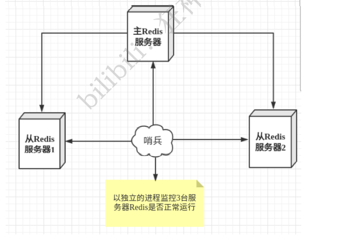

这里的哨兵有两个作用

- 通过发送命令，让 Redis 服务器返回监控其运行状态，包括主服务器和从服务器。
- 当哨兵监测到 master 宕机，会自动将 slave 切换成 master，然后通过发布订阅模式通知其他的从服 务器，修改配置文件，让它们切换主机。

然而一个哨兵进程对 Redis 服务器进行监控，可能会出现问题，为此，我们可以使用多个哨兵进行监控。 各个哨兵之间还会进行监控，这样就形成了多哨兵模式。

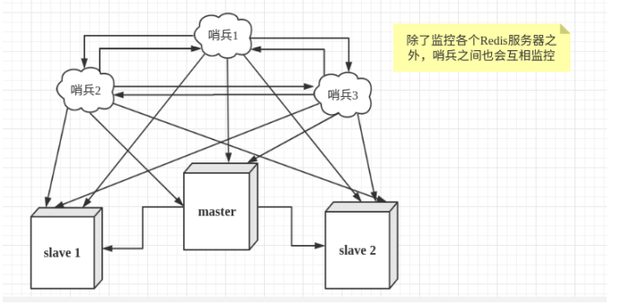

假设主服务器宕机，哨兵 1 先检测到这个结果，系统并不会马上进行 failover 过程，仅仅是哨兵 1 主观的认 为主服务器不可用，这个现象成为**主观下线**。当后面的哨兵也检测到主服务器不可用，并且数量达到一 定值时，那么哨兵之间就会进行一次投票，投票的结果由一个哨兵发起，进行 failover[故障转移]操作。 切换成功后，就会通过发布订阅模式，让各个哨兵把自己监控的从服务器实现切换主机，这个过程称为 **客观下线。**

> 测试

1. 配置哨兵配置文件 sentinel.conf

配置多个文件时端口号不一致 其他一致

```bash
port 26379
sentinel monitor mymaster 127.0.0.1 6379 2
daemonize yes
```

2: 指明当有多少个 sentinel 认为一个 master 失效时，master 才算真正失效！

2. 启动哨兵

windows:

```bash
redis-server.exe sentinel.conf --sentinel
```

**优点：**

    1. 哨兵集群，基于主从复制模式，所有的主从配置优点，它全有

2. 主从可以切换，故障可以转移，系统的可用性就会更好 3. 哨兵模式就是主从模式的升级，手动到自动，更加健壮！

**缺点：**

    1. Redis 不好啊在线扩容的，集群容量一旦到达上限，在线扩容就十分麻烦！

2. 实现哨兵模式的配置其实是很麻烦的，里面有很多选择！

> 哨兵模式的全部配置！

```bash
# Example sentinel.conf
# 哨兵sentinel实例运行的端口 默认26379
port 26379
# 哨兵sentinel的工作目录
dir /tmp
# 哨兵sentinel监控的redis主节点的 ip port
# master-name 可以自己命名的主节点名字 只能由字母A-z、数字0-9 、这三个字符".-_"组成。
# quorum 配置多少个sentinel哨兵统一认为master主节点失联 那么这时客观上认为主节点失联了
# sentinel monitor <master-name> <ip> <redis-port> <quorum>
sentinel monitor mymaster 127.0.0.1 6379 2

# 当在Redis实例中开启了requirepass foobared 授权密码 这样所有连接Redis实例的客户端都要提供密码
# 设置哨兵sentinel 连接主从的密码 注意必须为主从设置一样的验证密码
# sentinel auth-pass <master-name> <password>
sentinel auth-pass mymaster MySUPER--secret-0123passw0rd

# 指定多少毫秒之后 主节点没有应答哨兵sentinel 此时 哨兵主观上认为主节点下线 默认30秒
# sentinel down-after-milliseconds <master-name> <milliseconds>
sentinel down-after-milliseconds mymaster 30000
# 这个配置项指定了在发生failover主备切换时最多可以有多少个slave同时对新的master进行 同步，这个数字越小，完成failover所需的时间就越长，但是如果这个数字越大，就意味着越 多的slave因为replication而不可用。可以通过将这个值设为 1 来保证每次只有一个slave 处于不能处理命令请求的状态。
# sentinel parallel-syncs <master-name> <numslaves>
sentinel parallel-syncs mymaster 1

# 故障转移的超时时间 failover-timeout 可以用在以下这些方面：
#1. 同一个sentinel对同一个master两次failover之间的间隔时间。
#2. 当一个slave从一个错误的master那里同步数据开始计算时间。直到slave被纠正为向正确的master那里同步数据时。
#3.当想要取消一个正在进行的failover所需要的时间。
#4.当进行failover时，配置所有slaves指向新的master所需的最大时间。不过，即使过了这个超时，slaves依然会被正确配置为指向master，但是就不按parallel-syncs所配置的规则来了
# 默认三分钟
# sentinel failover-timeout <master-name> <milliseconds>

sentinel failover-timeout mymaster 180000
# SCRIPTS EXECUTION
#配置当某一事件发生时所需要执行的脚本，可以通过脚本来通知管理员，例如当系统运行不正常时发邮件通知相关人员。
#对于脚本的运行结果有以下规则：
#若脚本执行后返回1，那么该脚本稍后将会被再次执行，重复次数目前默认为10
#若脚本执行后返回2，或者比2更高的一个返回值，脚本将不会重复执行。
#如果脚本在执行过程中由于收到系统中断信号被终止了，则同返回值为1时的行为相同。
#一个脚本的最大执行时间为60s，如果超过这个时间，脚本将会被一个SIGKILL信号终止，之后重新执行。
#通知型脚本:当sentinel有任何警告级别的事件发生时（比如说redis实例的主观失效和客观失效等等），将会去调用这个脚本，这时这个脚本应该通过邮件，SMS等方式去通知系统管理员关于系统不正常运行的信息。调用该脚本时，将传给脚本两个参数，一个是事件的类型，一个是事件的描述。如果sentinel.conf配置文件中配置了这个脚本路径，那么必须保证这个脚本存在于这个路径，并且是可执行的，否则sentinel无法正常启动成功。
#通知脚本
# shell编程
# sentinel notification-script <master-name> <script-path>
sentinel notification-script mymaster /var/redis/notify.sh
# 客户端重新配置主节点参数脚本
# 当一个master由于failover而发生改变时，这个脚本将会被调用，通知相关的客户端关于master地址已经发生改变的信息。
# 以下参数将会在调用脚本时传给脚本:
# <master-name> <role> <state><from-ip> <from-port> <to-ip> <to-port>
# 目前<state>总是“failover”,
# <role>是“leader”或者“observer”中的一个。
# 参数 from-ip, from-port, to-ip, to-port是用来和旧的master和新的master(即旧的slave)通信的
# 这个脚本应该是通用的，能被多次调用，不是针对性的。
# sentinel client-reconfig-script <master-name> <script-path>
sentinel client-reconfig-script mymaster /var/redis/reconfig.sh # 一般都是由运维来配置！
```

# Redis 缓存穿透和雪崩

> 服务的高可用问题！

在这里我们不会详细的区分析解决方案的底层！

Redis 缓存的使用，极大的提升了应用程序的性能和效率，特别是数据查询方面。但同时，它也带来了一 些问题。其中，最要害的问题，就是数据的一致性问题，从严格意义上讲，这个问题无解。如果对数据 的一致性要求很高，那么就不能使用缓存。

另外的一些典型问题就是，缓存穿透、缓存雪崩和缓存击穿。目前，业界也都有比较流行的解决方案。

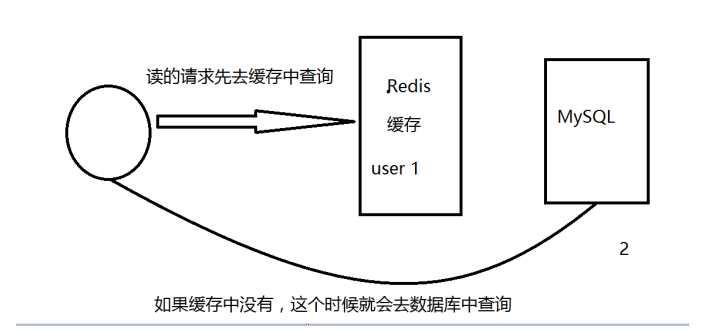

## 缓存穿透（查不到）

> 概念

缓存穿透的概念很简单，用户想要查询一个数据，发现 redis 内存数据库没有，也就是缓存没有命中，于 是向持久层数据库查询。发现也没有，于是本次查询失败。当用户很多的时候，缓存都没有命中（秒 杀！），于是都去请求了持久层数据库。这会给持久层数据库造成很大的压力，这时候就相当于出现了 缓存穿透。

> 解决方案

**布隆过滤器**

布隆过滤器是一种数据结构，对所有可能查询的参数以 hash 形式存储，在控制层先进行校验，不符合则 丢弃，从而避免了对底层存储系统的查询压力；

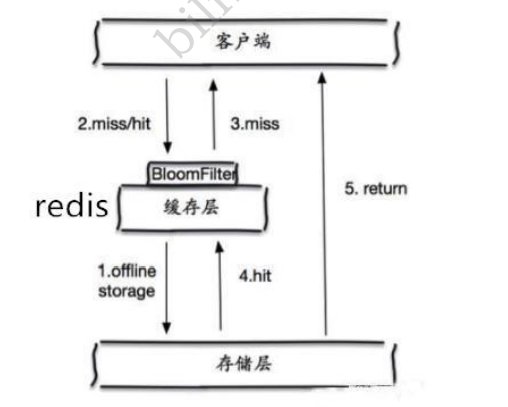

**缓存空对象**

当存储层不命中后，即使返回的空对象也将其缓存起来，同时会设置一个过期时间，之后再访问这个数 据将会从缓存中获取，保护了后端数据源；

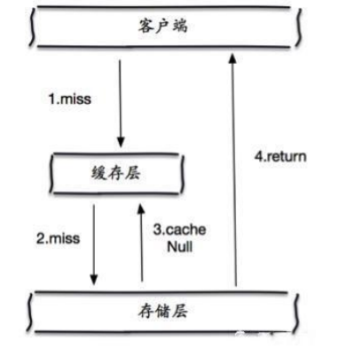

但是这种方法会存在两个问题：

1. 如果空值能够被缓存起来，这就意味着缓存需要更多的空间存储更多的键，因为这当中可能会有很多 的空值的键；
2. 即使对空值设置了过期时间，还是会存在缓存层和存储层的数据会有一段时间窗口的不一致，这对于 需要保持一致性的业务会有影响。

## 缓存击穿（量太大，缓存过期！）

> 概述

这里需要注意和缓存击穿的区别，缓存击穿，是指一个 key 非常热点，在不停的扛着大并发，大并发集中 对这一个点进行访问，当这个 key 在失效的瞬间，持续的大并发就穿破缓存，直接请求数据库，就像在一 个屏障上凿开了一个洞。

当某个 key 在过期的瞬间，有大量的请求并发访问，这类数据一般是热点数据，由于缓存过期，会同时访 问数据库来查询最新数据，并且回写缓存，会导使数据库瞬间压力过大。

> 解决方案

**设置热点数据永不过期**

从缓存层面来看，没有设置过期时间，所以不会出现热点 key 过期后产生的问题。

**加互斥锁**

分布式锁：使用分布式锁，保证对于每个 key 同时只有一个线程去查询后端服务，其他线程没有获得分布 式锁的权限，因此只需要等待即可。这种方式将高并发的压力转移到了分布式锁，因此对分布式锁的考 验很大。

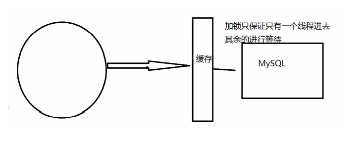

## 缓存雪崩

> 概念

缓存雪崩，是指在某一个时间段，缓存集中过期失效。Redis 宕机！

产生雪崩的原因之一，比如在写本文的时候，马上就要到双十二零点，很快就会迎来一波抢购，这波商 品时间比较集中的放入了缓存，假设缓存一个小时。那么到了凌晨一点钟的时候，这批商品的缓存就都 过期了。而对这批商品的访问查询，都落到了数据库上，对于数据库而言，就会产生周期性的压力波 峰。于是所有的请求都会达到存储层，存储层的调用量会暴增，造成存储层也会挂掉的情况。

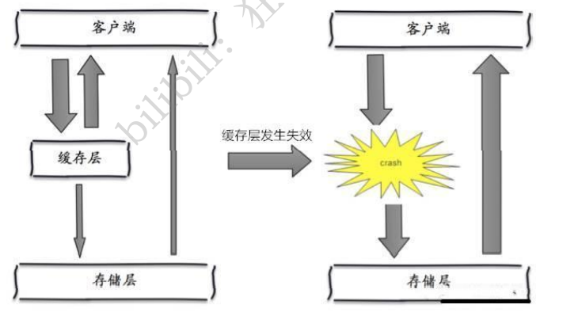

其实集中过期，倒不是非常致命，比较致命的缓存雪崩，是缓存服务器某个节点宕机或断网。因为自然 形成的缓存雪崩，一定是在某个时间段集中创建缓存，这个时候，数据库也是可以顶住压力的。无非就 是对数据库产生周期性的压力而已。而缓存服务节点的宕机，对数据库服务器造成的压力是不可预知 的，很有可能瞬间就把数据库压垮。

> 解决方案

**redis 高可用**

这个思想的含义是，既然 redis 有可能挂掉，那我多增设几台 redis，这样一台挂掉之后其他的还可以继续 工作，其实就是搭建的集群。（异地多活！）

**限流降级（在 SpringCloud 讲解过！）**

这个解决方案的思想是，在缓存失效后，通过加锁或者队列来控制读数据库写缓存的线程数量。比如对 某个 key 只允许一个线程查询数据和写缓存，其他线程等待。

**数据预热**

数据加热的含义就是在正式部署之前，我先把可能的数据先预先访问一遍，这样部分可能大量访问的数 据就会加载到缓存中。在即将发生大并发访问前手动触发加载缓存不同的 key，设置不同的过期时间，让 缓存失效的时间点尽量均匀。
