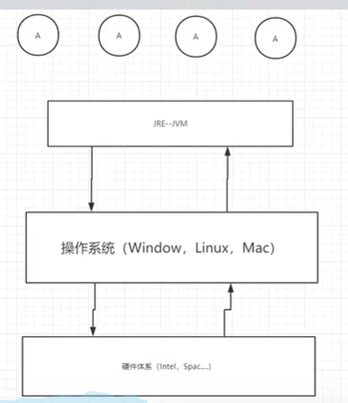
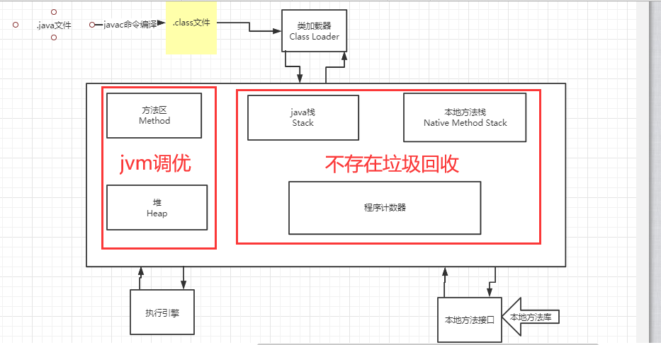
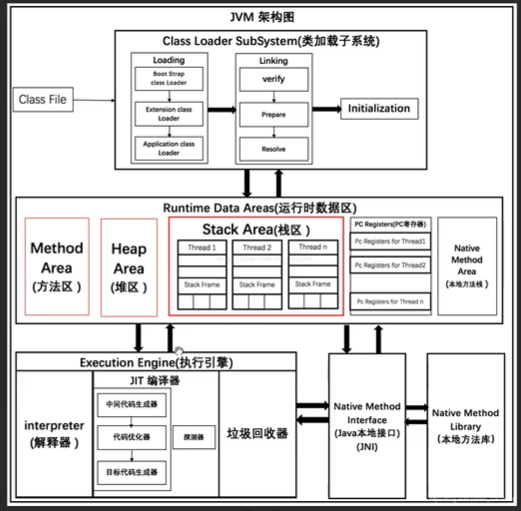
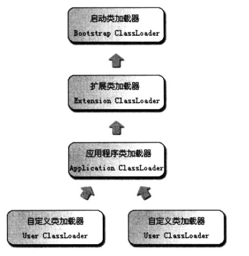
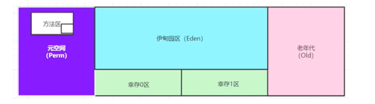
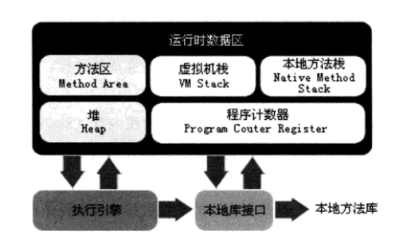
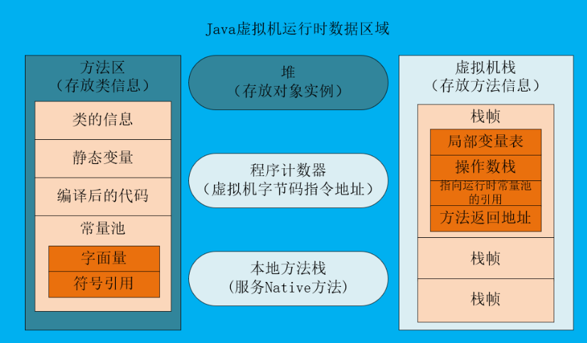

# JVM 的位置

​ 

# JVM 的体系结构

# 类加载器

- 作用: 加载 XXX.class 文件
- 

# 双亲委派机制

- 概念:

  双亲委派机制是指当一个类加载器收到一个类加载请求时，该类加载器首先会把请求委派给父类加载器。每个类加载器都是如此，只有在父类加载器在自己的搜索范围内找不到指定类时，子类加载器才会尝试自己去加载。

- 例子:

  当一个 Hello.class 这样的文件要被加载时。不考虑我们自定义类加载器，首先会在 AppClassLoader 中检查是否加载过，如果有那就无需再加载了。如果没有，那么会拿到父加载器，然后调用父加载器的 loadClass 方法。父类中同理会先检查自己是否已经加载过，如果没有再往上。注意这个过程，直到到达 Bootstrap classLoader 之前，都是没有哪个加载器自己选择加载的。如果父加载器无法加载，会下沉到子加载器去加载，一直到最底层，如果没有任何加载器能加载，就会抛出 ClassNotFoundException

# 沙箱安全机制

# Native

- **JNI** ----> **Java Native Interface** ---> **本地方法接口**
  - 作用: 扩展 Java 的使用,融合不同的编程语言为 java 所用

# PC 寄存器

- **程序计数器:** Program Counter Register
- 每个线程都有一个程序计数器，是线程私有的，就是一个指针，指向方法区中的方法字节码（用来存储指向像一条指令的地址，也即将要执行的指令代码)，在执行引擎读取下一条指令，是一个非常小的内存空间，几乎可以忽略不计

# 方法区

- Method Area 方法区
- 方法区是被所有线程共享，所有字段和方法字节码，以及一些特殊方法，如构造函数，接口代码也在此定义，简单说，所有定义的方法的信息都保存在该区域，**此区域属于共享区间**;
- **静态变量(static)、常量(final)、类信息(class)(构造方法、接口定义)、运行时的常量池存在方法区中，但是实例变量存在堆内存中，和方法区无关**

# 栈

- **栈: 先进后出 后进先出**
- **队列:(FIFO: First Input First Output) 先进先出 后进后出**
- 栈内存，主管程序的运行，生命周期和线程同步;
- 线程结束，栈内存也就是释放，对于栈来说，**不存在垃圾回收问题**
- 存储的数据:**局部变量表＋对象引用(=左边的)＋实例的方法**

# 三种 JVM

- Sun 公司 HotSpot
- BEA JRockit
- IBM J9VM

# 堆

- Heap 一个 JVM 只有一个堆内存,堆内存的大小是可以调节的
- 类加载器读取了类文件后,一般把 类的实例 存放在堆中
- 堆内存中细分为三个区

  - 新生区
    - 伊甸园
    - 幸存 0 区
    - 幸存 1 区
  - 养老区
  - 永久存储区

- GC 垃圾回收,主要是在伊甸园区和养老区

  内存满了,会报 **OOM** 错误 堆内存

- JDK8 以后,永久区改为(元空间)

# 新生区

- 类: 诞生 和成长的地方,甚至死亡;
- 伊甸园: 所有对象都是在伊甸园区 new 出来的!
- 幸存者区(0,1)或(form,to)

# 老年区

# 永久区

这个区域是常驻内存的,用来存放 JDK 自身携带的 Class 对象. Interface 元数据,存储的是 java 运行时的一些环境,这个区域不存垃圾回收! 关闭 vm 虚拟机就会释放这个区域的内存

一个启动类,加载了大量的第三方 jar 包。Tomcat 部署了太多的应用，大量动态生成的反射类，不断被加载，知道内存满，就会出现 OOM。

- jdk1.6 之前: 永久代,常量池在方法区

- jdk1.7: 永久代,但是慢慢的退化了,去永久代,常量池在堆中

- jdk1.8:无永久代,常量池在元空间

元空间:逻辑上存在: 物理上不存在

- OOM 报错
  - 能够看到代码第几行出错: 内存快照分析工具,MAT(Eclipse),Jprofiler
  - Dubug,分析代码
- MAT,Jprofiler 作用:
  - 命令:
    - -xms 设置初始化内存分配大小
    - -XMx 设置最大分配内存 默认 1/4
    - -XX:+HeapDumpOnOutOfMemoryError OOM 报错 DUMP
    - -XX:+PrintGCDetails 打印 GC 垃圾回收信息
  - 分析 Dump 内存文件,快速定位内存泄露;
  - 获得堆中的数据
  - 获得大的对象

# GC 垃圾回收

- 作用域: 方法区 堆

  jvm 在进行 GC 时,并不是对这三个区域统一回收。大部分的时候，回收都是新生代

  - 新生代
  - 幸存区(form,to)
  - 老年区

  GC 两种类：

  - 轻 GC（普通的 GC）
  - 重 GC （全局 GC）

  GC 题目:

  - JVM 内存模型和分区 详细到每个区放什么

    - 内存模型

      `

      

  - 堆里面的分区有哪些? 说说他们的特点

    - Eden
      - Eden 区位于 Java 堆的年轻代，是**新对象**分配内存的地方，由于堆是所有线程共享的，因此在堆上分配内存需要加锁。而 Sun JDK 为提升效率，会为每个新建的线程在 Eden 上分配一块独立的空间由该线程独享，这块空间称为 TLAB（Thread Local Allocation Buffer）。在 TLAB 上分配内存不需要加锁，因此 JVM 在给线程中的对象分配内存时会尽量在 TLAB 上分配。如果对象过大或 TLAB 用完，则仍然在堆上进行分配。如果 Eden 区内存也用完了，则会进行一次 Minor GC（young GC）。
    - form to
    - Survival 区与 Eden 区相同都在 Java 堆的年轻代。Survival 区有两块，一块称为 from 区，另一块为 to 区，这两个区是相对的，在发生一次 Minor GC 后，from 区就会和 to 区互换。在发生 Minor GC 时，Eden 区和 Survivalfrom 区会把一些仍然存活的对象复制进 Survival to 区，并清除内存。Survival to 区会把一些存活得足够旧的对象移至年老代。
    - 老年区
      - 年老代里存放的都是存活时间较久的，大小较大的对象，因此年老代使用标记整理算法。当年老代容量满的时候，会触发一次 Major GC（full GC），回收年老代和年轻代中不再被使用的对象资源。

  - GC 的算法有哪些?

    - 标记清除法
      - GC 分为两个阶段，标记和清除。首先标记所有可回收的对象，在标记完成后统一回收所有被标记的对象。同时会产生不连续的内存碎片。碎片过多会导致以后程序运行时需要分配较大对象时，无法找到足够的连续内存，而不得已再次触发 GC。
      - 优点: 不需要额外的空间
      - 缺点: 两次扫描,严重浪费时间,会产生内存碎片.
    - 标记压缩 (标记清除法的再优化)
      - 也分为两个阶段，首先标记可回收的对象，再将存活的对象都向一端移动，然后清理掉边界以外的内存。此方法避免标记-清除算法的碎片问题，同时也避免了复制算法的空间问题。
      -
    - 复制算法
      - 将内存按容量划分为两块，每次只使用其中一块。当这一块内存用完了，就将存活的对象复制到另一块上，然后再把已使用的内存空间一次清理掉。
      - 好处: 没有内存的碎片
      - 坏处: 浪费了内存空间:
      - 最佳使用场景: 对象存活度较低的时候; 新生区
    - 引用计数器
    - 轻 GC 和重 GC 分别在什么时候发生?

* 选择高效的 GC 算法，可有效减少停止应用线程时间。

* 频繁 Full GC 会增加暂停时间和 CPU 使用率，可以加大老年代空间大小降低 Full GC，但会增加回收时间，根据业务适当取舍

# 总结

- 内存效率: 复制算法 > 标记清除算法 > 标记压缩算法 (时间复杂度)
- 内存整齐度: 复制算法 = 标记清除算法 > 标记压缩算法
- 内存利用率: 标记压缩算法 = 标记清除算法 > 复制算法

# JMM

1. 什么是 JMM

   Java Memory Model java 内存模型

2. 干嘛的

   作用:缓存一致性协议，用于定义数据读写的规则(遵守）.

3. 如何学习
