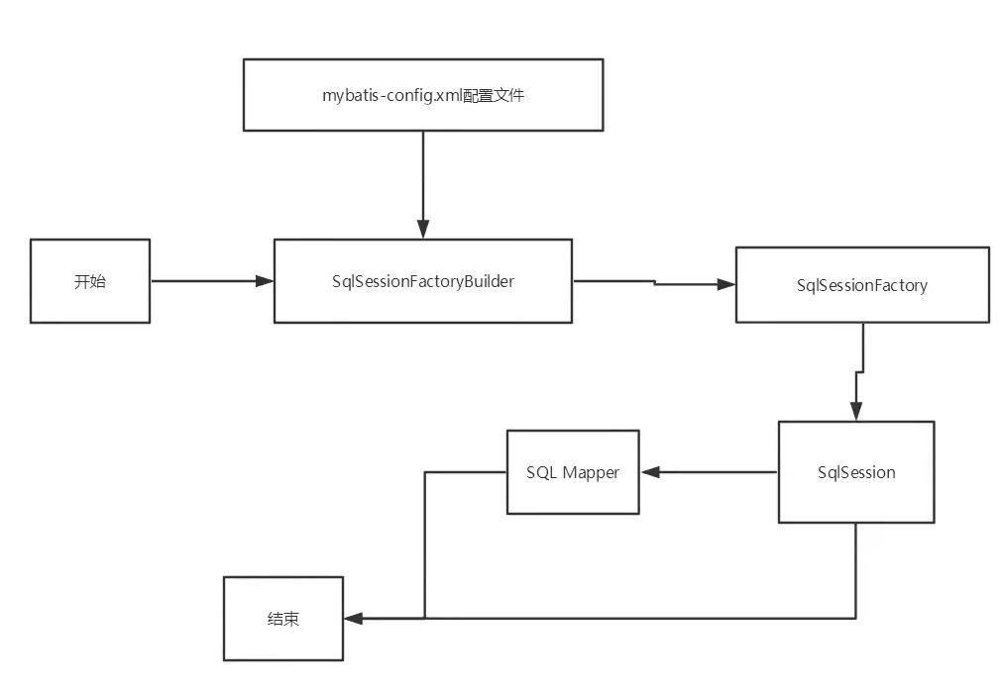
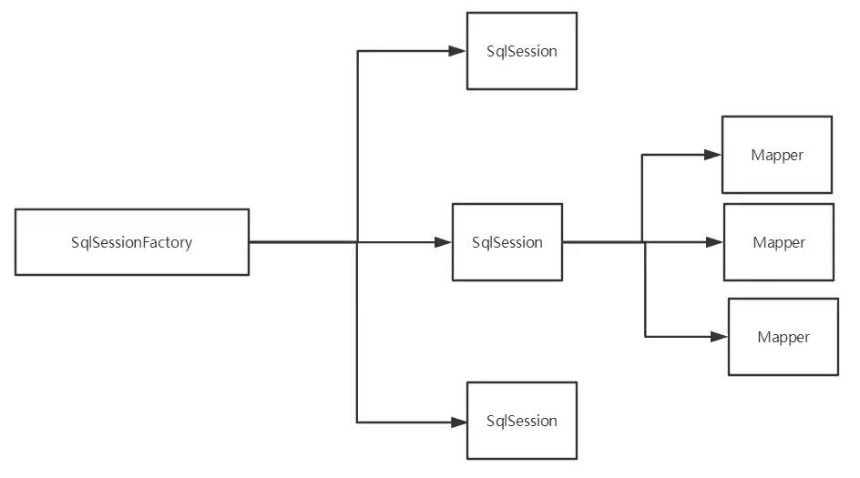
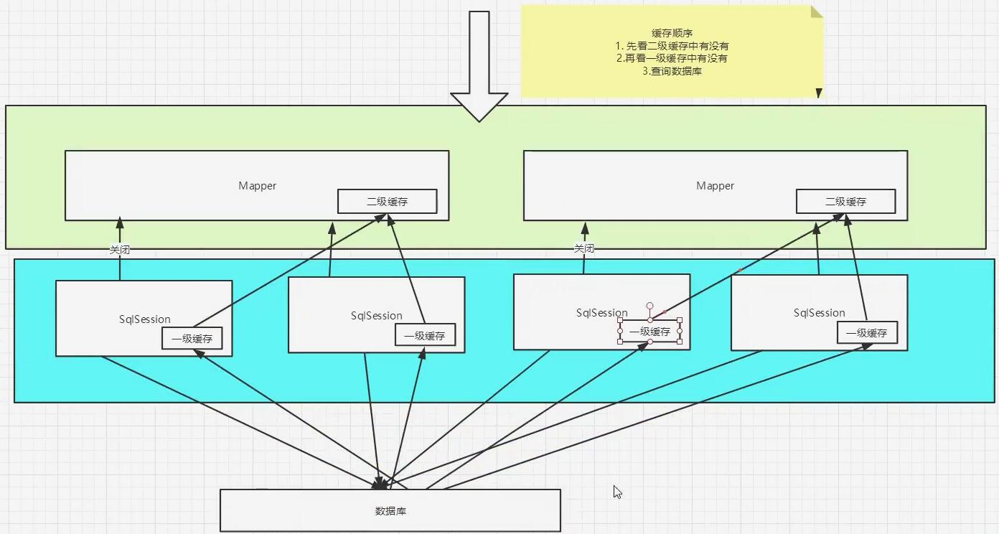

# Mybatis

[Mybatis 中文文档](https://mybatis.org/mybatis-3/zh/index.html)

## 简介

### 什么是Mybatis

* MyBatis 是一款优秀的**持久层框架**
* 它支持自定义 SQL、存储过程以及高级映射
* MyBatis 免除了几乎所有的 JDBC 代码以及设置参数和获取结果集的工作
* MyBatis 可以通过简单的 XML 或注解来配置和映射原始类型、接口和 Java POJO（Plain Old Java Objects，普通老式 Java 对象）为数据库中的记录
* MyBatis本是apache的一个开源项目Batis，2010年这个项目由apache software foundation迁移到了 google code，并且改名为MyBatis。2013年11月迁移到Github

### 持久化

持久（Persistence），即把数据（如内存中的对象）保存到可永久保存的存储设备中（如磁盘）。持久化的主要应用是将内存中的数据存储在关系型的数据库中，当然也可以存储在磁盘文件中、XML数据文件中等等。  

需要持久化的原因：

* 有一些对象，不能让他丢掉
* 内存贵

### 持久层

持久层（Persistence Layer），即专注于实现数据持久化应用领域的某个特定系统的一个逻辑层面，将数据使用者和数据实体相关联  

## 导入依赖

``` xml
<!--MySQL https://mvnrepository.com/artifact/mysql/mysql-connector-java -->
<dependency>
    <groupId>mysql</groupId>
    <artifactId>mysql-connector-java</artifactId>
    <version>8.0.12</version>
</dependency>

<!-- MyBatis https://mvnrepository.com/artifact/org.mybatis/mybatis -->
<dependency>
    <groupId>org.mybatis</groupId>
    <artifactId>mybatis</artifactId>
    <version>3.5.5</version>
</dependency>

<!--junit https://mvnrepository.com/artifact/junit/junit -->
<dependency>
    <groupId>junit</groupId>
    <artifactId>junit</artifactId>
    <version>4.13</version>
    <scope>test</scope>
</dependency>
```

## 使用

### 解决静态资源导出失败

\pom.xml

``` xml
<!--在build中配置resources，来防止我们资源导出失败的问题-->
<build>
    <resources>
        <resource>
            <directory>src/main/java</directory>
            <includes>
                <include>**/*.properties</include>
                <include>**/*.xml</include>
            </includes>
            <filtering>false</filtering>
        </resource>
        <resource>
            <directory>src/main/resources</directory>
            <includes>
                <include>**/*.properties</include>
                <include>**/*.xml</include>
            </includes>
            <filtering>false</filtering>
        </resource>
    </resources>
</build>
```

### 核心配置文件

* 内部配置

\src\main\resources\mybatis-config.xml

``` xml
<?xml version="1.0" encoding="UTF-8" ?>
<!DOCTYPE configuration
        PUBLIC "-//mybatis.org//DTD Config 3.0//EN"
        "http://mybatis.org/dtd/mybatis-3-config.dtd">
<configuration>
    <environments default="development">
        <environment id="development">
            <!-- Mybatis默认事务管理器为JDBC -->
            <transactionManager type="JDBC"/>
            <!-- Mybatis默认事务管理器为POOLED -->
            <dataSource type="POOLED">
                <property name="driver" value="com.mysql.cj.jdbc.Driver"/>
                <property name="url" value="jdbc:mysql://连接地址:3306/数据库名?serverTimezone=UTC&amp;useSSL=false&amp;useUnicode=true&amp;characterEncoding=utf8"/>
                <property name="username" value="数据库用户名"/>
                <property name="password" value="数据库密码"/>
            </dataSource>
        </environment>
    </environments> 
    
    <!-- 每一个Mapper.XML都需要在Mybatis核心配置文件中注册 -->
    <mappers>
        <mapper resource="com/example/dao/Mapper名称.xml"/>
    </mappers>

</configuration>
```

* 外部配置

\src\main\resources\db.properties

```
driver=com.mysql.cj.jdbc.Driver
url=jdbc:mysql://连接地址:3306/数据库名?serverTimezone=UTC&amp;useSSL=false&amp;useUnicode=true&amp;characterEncoding=utf8
username=数据库用户名
password=
```

\src\main\resources\mybatis-config.xml

``` xml
<?xml version="1.0" encoding="UTF-8" ?>
<!DOCTYPE configuration
        PUBLIC "-//mybatis.org//DTD Config 3.0//EN"
        "http://mybatis.org/dtd/mybatis-3-config.dtd">
<configuration>

    <!--引入外部配置文件-->
    <properties resource="db.properties">
        <!--内部配置（优先使用外部配置文件）-->
        <!-- <property name="username" value="root"></property> -->
        <!-- <property name="password" value=""></property> -->
    </properties>

    <environments default="development">

        <environment id="development">
            <transactionManager type="JDBC"/>
            <dataSource type="POOLED">
                <property name="driver" value="${driver}"/>
                <property name="url" value="${url}"/>
                <property name="username" value="${username}"/>
                <property name="password" value="${password}"/>
            </dataSource>
        </environment>

    </environments>

    <!-- 每一个Mapper.XML都需要在Mybatis核心配置文件中注册 -->
    <mappers>
        <mapper resource="com/example/dao/Mapper名称.xml"/>
    </mappers>

</configuration>
```

### MyBatis 工具类

\com\example\utils\MybatisUtils.java

``` Java
public class MybatisUtils {
    private static SqlSessionFactory sqlSessionFactory;
    static {
        try {
            String resource = "mybatis-config.xml";
            InputStream inputStream = Resources.getResourceAsStream(resource);
            sqlSessionFactory = new SqlSessionFactoryBuilder().build(inputStream);
        } catch (IOException e) {
            e.printStackTrace();
        }
    }
    //获取SqlSession连接
    public static SqlSession getSession() {
        return sqlSessionFactory.openSession();
    }
}
```

::: tip 提示
``sqlSessionFactory.openSession()`` 如填写 ``true`` 参数 可开启自动提交事务  
默认为 ``false``，即： 增删改 数据 均需要手动提交事务才可生效
:::

### 创建实体类

com\example\pojo\实体类名.java

``` Java
public class 实体类名 {
    private 数据类型 属性名;
    private 数据类型 属性名;

    public 数据类型 get属性名() {
        return 属性名;
    }

    public void set属性名(数据类型 属性名) {
        this.属性名 = 属性名;
    }

    @Override
    public String toString() {
        return "实体类名{" + "属性名=" + 属性名 + "}";
    }
}
```

### Mapper 接口类

com\example\dao\Mapper接口名.java

``` Java
public interface Mapper接口名 {
    返回类型 SQL方法名(数据类型 参数名);
    // 返回列表
    List<返回类型> SQL方法名(数据类型 参数名);
    // 多参数传递
    List<返回类型> SQL方法名(Map map);
    List<返回类型> SQL方法名(Map<String,数据类型> map);
}
```

### Mapper.xml 配置文件

::: tip 提示
namespace中的包名要和 dao/mapper 接口的包名一致，否则会报错
:::

::: tip 提示
resultType 如需要返回实体类，默认需要填写完整的类路径，可通过``类型别名``来实现直接填写类名
:::

com\example\dao\Mapper名称.xml

``` xml
<?xml version="1.0" encoding="UTF-8" ?>
<!DOCTYPE mapper
        PUBLIC "-//mybatis.org//DTD Mapper 3.0//EN"
        "http://mybatis.org/dtd/mybatis-3-mapper.dtd">
<mapper namespace="com.example.dao.Mapper接口名">

    <!-- 查询所有数据 -->
    <select id="SQL方法名" resultType="com.example.pojo.实体类名">
        select * from 表名
    </select>

    <!-- 查询指定数据 -->
    <select id="SQL方法名" parameterType="参数类型" resultType="返回值类型">
        select * from 表名 where 字段名 = #{参数名}
    </select>
    
    <!-- 多参数传递 -->
    <select id="SQL方法名" parameterType="Map" resultType="返回值类型">
        select * from 表名 where 字段名 = #{参数1} and 字段名 = #{参数2}
    </select>

    <!-- 增加数据 -->
    <insert id="SQL方法名" parameterType="参数类型">
        insert into 表名 (字段名,字段名) values (#{参数名},#{参数名});
    </insert>

    <!-- 修改数据 -->
    <update id="SQL方法名" parameterType="参数类型">
        update 表名 set 字段名 = #{参数名} ,字段名=#{参数名} where 字段名 = #{参数名};
    </update>

    <!-- 删除数据 -->
    <delete id="SQL方法名" parameterType="参数类型">
        delete from 表名 where 字段名 = #{参数名}
    </delete>

</mapper>
``` 

### 测试类

``` Java
public class 测试类名 {
    @Test
    public void 查询所有数据() {
        SqlSession session = MybatisUtils.getSession();

       Mapper接口名 mapper = session.getMapper(Mapper接口名.class);
       List<实体类名> users = mapper.SQL方法名();

       for (实体类名 item: users){
           System.out.println(item);
      }
    }

    @Test
    public void 查询指定数据() {
        SqlSession session = MybatisUtils.getSession();

        Mapper接口名 mapper = session.getMapper(Mapper接口名.class);
        System.out.println(mapper.SQL方法名(参数));

        session.close();
    }

    @Test
    public void 多参数传递() {
        SqlSession session = MybatisUtils.getSession();
        UserMapper mapper = session.getMapper(Mapper接口名.class);

        HashMap<String, 数据类型> map = new HashMap<String, 数据类型>();
        map.put("参数1", 值);
        map.put("参数2", 值);

        System.out.println(mapper.SQL方法名(map));

        session.close();
    }
    

    @Test
    public void 增加数据() {
        
        SqlSession session = MybatisUtils.getSession();

        Mapper接口名 mapper = session.getMapper(Mapper接口名.class);
        int res = mapper.addUser(new 实体类名(参数1, "参数2"));
        if (res > 0) {
            System.out.println("插入成功");
        } 
        
        // 增删改需要提交事物
        session.commit();
        session.close();
    }

    @Test
    public void 修改数据() {
        SqlSession session = MybatisUtils.getSession();

        Mapper接口名 mapper = session.getMapper(Mapper接口名.class);
        int res = mapper.updateUser(new 实体类名(参数1, "参数2"));
        if (res > 0) {
            System.out.println("修改成功");
        }

        // 增删改需要提交事物
        session.commit();
        session.close();
    }

    @Test
    public void 删除数据() {
        // 增删改需要提交事物
        SqlSession session = MybatisUtils.getSession();

        Mapper接口名 mapper = session.getMapper(Mapper接口名.class);
        int res = mapper.deleteUser(new User(参数1, "参数2"));
        if (res > 0) {
            System.out.println("删除成功");
        } 
        
        // 增删改需要提交事物
        session.commit();
        session.close();
    }
}
```

## 配置解析

### 类型别名

类型别名是为Java类型设置一个短的名字，存在的意义仅在于用来减少类完全限定名的冗余

* 单一别名

\src\main\resources\mybatis-config.xml

``` xml
<configuration>
    <typeAliases>
        <typeAlias type="com.example.pojo.实体类名" alias="实体类名"></typeAlias>
    </typeAliases>
</configuration>
```

\com\example\dao\Mapper名称.xml

``` xml
<!-- 查询数据 -->
<select id="SQL方法名" resultType="实体类名">
    select * from 表名
</select>
```

* 包名别名

指定一个包名，MyBatis会在包名下面搜索需要的JavaBean  

\src\main\resources\mybatis-config.xml

``` xml
<configuration>
    <typeAliases>
        <package name="com.example.pojo"/>
    </typeAliases>
</configuration>
```

\com\example\dao\Mapper名称.xml

``` xml
<!-- 查询数据 -->
<select id="SQL方法名" resultType="实体类名">
    select * from 表名
</select>
```

### 映射器

映射器用于注册绑定Mapper文件

1. 指定xml文件绑定注册（推荐）

\src\main\resources\mybatis-config.xml

``` xml
<configuration>
    <mappers>
        <mapper resource="com/example/dao/Mapper名称.xml"/>
    </mappers>
</configuration>
```

2. 使用class文件绑定注册

\src\main\resources\mybatis-config.xml

``` xml
<configuration>
    <mappers>
        <mapper class="com.example.dao.Mapper名称"></mapper>
    </mappers>
</configuration>
```

::: warning 注意
1. 接口和它的Mapper配置文件必须同名
2. 接口和它的Mapper配置文件必须在同一个包下
:::

3. 使用扫描包进行绑定

\src\main\resources\mybatis-config.xml

``` xml
<configuration>
    <mappers>
        <package name="com.example.dao"></package>
    </mappers>
</configuration>
```

::: warning 注意
1. 接口和它的Mapper配置文件必须同名
2. 接口和它的Mapper配置文件必须在同一个包下
:::

## 生命周期

生命周期 和 作用域 是至关重要的，错误的使用会导致非常严重的**并发问题**



**SqlSessionFactoryBuilder**

一旦创建了SqlSessionFactor，就不再需要它了
* 局部变量

**SqISessionFactory**

可以想象为数据库连接池。一旦被创建就应该在应用的运行期间一直存在，**没有任何理由丢弃它或重新创建另一个实例**  

SqlSessionFactory的最佳作用域是应用作用域。最简单的就是使用单例模式或者静态单例模式。

**SqlSession**

连接到连接池的一个请求。SqlSession的实例不是线程安全的，因此是不能被共享的，  
所以它的最佳的作用域是请求或方法作用域。用完之后需要赶紧关闭，否则资源被占用。



每一个Mapper，代表一 个具体的业务

## 解决属性名与字段名不一致

当实体类中的属性名与数据库中的字段名不一致时，可以使用如下方法解决：  

com\example\pojo\实体类名.java

``` Java
public class 实体类名 {
    private 数据类型 属性名;
    private 数据类型 属性名;
}
```

### 起别名

com\example\dao\Mapper名称.xml

``` xml
<select id="SQL方法名" parameterType="参数类型" resultType="返回值类型">
    select 字段名,字段名 as 别名 from 表名
</select>
```

### resultMap

com\example\dao\Mapper名称.xml

``` xml
<resultMap id="resultMap名称" type="返回值类型">
    <result column="字段名" property="属性名"></result>
    <result column="字段名" property="属性名"></result>
</resultMap>

<select id="SQL方法名" parameterType="参数类型" resultMap="resultMap名称">
    select * from 表名
</select>
```

## 日志工厂

如果一个数据库操作，出现了异常，我们需要排错，日志就是最好的助手。

\src\main\resources\mybatis-config.xml

``` xml
<configuration>
    <settings>
        <!--开启日志-->
        <setting name="logImpl" value="STDOUT_LOGGING"></setting>
    </settings>
</configuration>
```

## LOG4j

Log4j 是Apache的一个开源项目 ，通过使用Log4j, 我们可以控制日志信息输送的目的地是控制台、文件、GUl组件。
我们也可以控制每一条日志的输出格式，通过定义每一条日志信息的级别， 我们能够更加细致地控制日志的生成过程。通过一个配置文件来灵活地进行配置，而不需要修改应用的代码。

### 依赖

\pom.xml

``` xml
<!--Log4j-->
<dependency>
    <groupId>log4j</groupId>
    <artifactId>log4j</artifactId>
    <version>1.2.12</version>
</dependency>
```

### 配置

\resources\log4j.properties

``` properties
#将等级为DEBUG的日志信息输出到console和file这两个目的地，console和file的定义在下面的代码
log4j.rootLogger=DEBUG,console,file

#控制台输出的相关设置
log4j.appender.console=org.apache.log4j.ConsoleAppender
log4j.appender.console.Target=System.out
log4j.appender.console.Threshold=DEBUG
log4j.appender.console.layout=org.apache.log4j.PatternLayout
log4j.appender.console.layout.ConversionPattern=[%c]-%m%n

#文件输出的相关设置
log4j.appender.file=org.apache.log4j.RollingFileAppender
log4j.appender.file.File=./log/log4j.log
log4j.appender.file.MaxFileSize=10mb
log4j.appender.file.Threshold=DEBUG
log4j.appender.file.layout=org.apache.log4j.PatternLayout
log4j.appender.file.layout.conversionPattern=[%p] [%d{yy-MM-dd}] [%c]%m%n

#日志输出级别
log4j.logger.org.mybatis=DEBUG
log4j.logger.java.sq1=DEBUG
log4j.logger.java.sq1.Statement=DEBUG
log4j.logger.java.sq1.ResultSet=DEBUG
log4j.logger.java.sq1.PrepareStatement=DEBUG
```

### 开启

\src\main\resources\mybatis-config.xml

``` xml
<configuration>
    <!--Log4J-->
    <settings>
        <setting name="logImpl" value="Log4J"></setting>
    </settings>
</configuration>
```

### 自定义输出信息

``` Java
Logger logger = Logger.getLogger(String.valueOf(this));

logger.info("info: ");
logger.debug("debug: ");
logger.error("error: ");
```

## 分页查询

### 使用Limit分页

com\example\dao\Mapper接口名.java

``` Java
public interface Mapper接口名 {
    // 分页查询
    List<返回类型> SQL方法名(Map<String,Integer> map);
}
```

com\example\dao\Mapper名称.xml

``` xml
<select id="SQL方法名" parameterType="Map" resultType="返回值类型">
    SELECT * FROM 表名 LIMIT #{startIndex},#{pageSize}
</select>
```

测试类

``` Java
@Test
public void 测试方法名() {
        SqlSession session = MybatisUtils.getSession();
        UserMapper mapper = session.getMapper(Mapper接口名.class);

        HashMap<String, 数据类型> map = new HashMap<String, 数据类型>();
        map.put("startIndex", 0);
        map.put("pageSize", 2);

        List<返回值类型> userByLimit = mapper.SQL方法名(map);
        for (返回值类型 item : userByLimit) {
            System.out.println(item);
        }
        session.close();
}
```

### 使用RowBounds分页

com\example\dao\Mapper接口名.java

``` Java
public interface Mapper接口名 {
    List<返回类型> SQL方法名();
}
```

com\example\dao\Mapper名称.xml

``` xml
<select id="SQL方法名" resultType="返回值类型">
    SELECT * FROM 表名
</select>
```

测试类

``` Java
@Test
public void 测试方法名() {
    SqlSession session = MybatisUtils.getSession();

    RowBounds rowBounds = new RowBounds(1,2);

    //通过Java代码层面实现分页
    List<返回值类型> userByLimit = session.selectList("com.example.dao.Mapper接口名.SQL方法名",null,rowBounds);

    for (返回值类型 item : userByLimit) {
        System.out.println(item);
    }
    session.close();
}
```

## 使用注解开发

使用注解来映射简单语句会使代码显得更加简洁。  
然而对于稍微复杂-点的语句，Java 注解就力不从心了，并且会显得更加混乱。  
因此，如果需要完成很复杂的事情，那么最好使用XML来映射语句。

### Mapper接口

::: tip 提示
关于@Param()注解： 
 -  基本类型的参数或者String类型,需要加上 
 - 引用类型不需要加 
 - 如果只有一个基本类型的话，可以忽略，但是建议都加上 
 - 我们在SQL中引|用的就是我们这里的@Param()中设定的属性名
:::

com\example\dao\Mapper接口名.java

``` Java
public interface Mapper接口名 {
    //查询所有数据
    @Select("select * from 表名")
    List<返回类型> SQL方法名(); 
    
    // 查询指定数据
    @Select("select * from 表名 where 字段名=#{参数名}") 
    返回类型 SQL方法名(返回类型 参数名);

    // 如方法存在多个参数，所有的参数前面必须加上@Param("id") 注解
    @Select("select * from user where id = #{id}")
    返回类型 SQL方法名(@Param("参数名") 数据类型 参数名, @Param("参数名") 数据类型 参数名);

    //增加数据
    @Insert("insert into 表名(字段名) values(#{参数名})")
    返回类型 SQL方法名(返回类型 参数名);

    //修改数据
    @Update("update 表名 set 字段名=#{参数名}")
    返回类型 SQL方法名(返回类型 参数名);

    //删除数据
    @Delete("delete from 表名 where id =#{参数名}")
    返回类型 SQL方法名(返回类型 参数名);
}
```

### 绑定类

\src\main\resources\mybatis-config.xml

``` xml
<configuration>
    <mappers>
        <mapper class="com.example.dao.Mapper接口名"></mapper>
    </mappers>
</configuration>
```

### 使用

``` Java
@Test
public void 查询所有数据() {
    SqlSession session = MybatisUtils.getSession();
    Mapper接口名 mapper = session.getMapper(Mapper接口名.class);

    List<返回值类型> userList = mapper.SQL方法名();
    for (返回值类型 item : userList) {
        System.out.println(item);
    }
    session.close();
}


@Test
public void 查询指定数据() {
    SqlSession session = MybatisUtils.getSession();
    Mapper接口名 mapper = session.getMapper(Mapper接口名.class);

    System.out.println(mapper.SQL方法名(参数));

    session.close();
}

@Test
public void 增加数据() {
    SqlSession session = MybatisUtils.getSession();
    Mapper接口名 mapper = session.getMapper(Mapper接口名.class);

    System.out.println(mapper.SQL方法名(参数));

    session.close();
}

@Test
public void 修改数据() {
    SqlSession session = MybatisUtils.getSession();
    Mapper接口名 mapper = session.getMapper(Mapper接口名.class);

    System.out.println(mapper.SQL方法名(参数));

    session.close();
}

@Test
public void 删除数据() {
    SqlSession session = MybatisUtils.getSession();
    Mapper接口名 mapper = session.getMapper(Mapper接口名.class);

    System.out.println(mapper.SQL方法名(参数));

    session.close();
}
```

## 多对一处理

将数据库中的指定字段转为实体类，本质依然是解决属性名与字段名不一致。

``` Java
public class Student {
    private int id;
    private String name;
    private int tid;

    // 学生需要关联一个老师
    private Teacher teacher;
}
```

### 按照查询嵌套处理

``` xml
<!--
    1. 查询所有的学生信息
    2. 根据查询出来的学生的tid，寻找对应的老师
-->

<resultMap id="StudentAndTeacher" type="Student">
    <result property="id" column="id"></result>
    <result property="name" column="name"></result>
    <!--
    复杂的属性需要单独处理
        对象: association
        集合: collection
    -->
    <association property="teacher" column="tid" javaType="Teacher" select="getTeacher"></association>
</resultMap>

<select id="getStudent" resultMap="StudentAndTeacher">
    select * from student
</select>

<select id="getTeacher" resultType="Teacher">
    select * from teacher where id = #{id}
</select>
```

### 按照结果嵌套处理

``` xml
<!--
    1. 查询所有的学生信息
    2. 根据查询出来的学生的tid，寻找对应的老师
-->

<resultMap id="StudentAndTeacher2" type="Student">
    <result property="id" column="sid"/>
    <result property="name" column="sname"/>
    <association property="teacher" javaType="Teacher">
        <result property="name" column="tname"></result>
    </association>
</resultMap>

<select id="getStudent2" resultMap="StudentAndTeacher2">
    select s.id sid, s.name sname , t.name tname
    from student s,teacher t
    where s.tid = t.id
</select>
```

## 一对多处理

``` Java
public class Teacher {
     private int id;
     private String name;
     // 一个老师拥有多个学生
     private List<Student> students;
}
```

### 按照查询嵌套处理

``` xml
<select id="getTeacher2" resultMap="TeacherAndStudent2">
    select * from teacher where id = #{id}
</select>

<resultMap id="TeacherAndStudent2" type="Teacher">
    <collection property="students" javaType="ArrayList" ofType="Student" select="getStudentByTeacherId"
                column="id"/>
</resultMap>

<select id="getStudentByTeacherId" resultType="Student">
    select * FROM student where tid = #{tid}
</select>
```

### 按照结果嵌套处理

``` xml
<select id="getTeacher" resultMap="TeacherAndStudent">
    SELECT student.id sid,student.name sname,teacher.name tname,teacher.id tid
    FROM student,teacher
    WHERE student.tid = teacher.id and teacher.id = #{id}
</select>

<resultMap id="TeacherAndStudent" type="Teacher">
    <result property="id" column="tid"></result>
    <result property="name" column="tname"></result>
    <collection property="students" ofType="Student">
        <result property="id" column="sid"></result>
        <result property="name" column="sname"></result>
        <result property="tid" column="tid"></result>
    </collection>
</resultMap>
```

## 动态SQL

动态SQL 是根据不同的条件生成不同的SQL语句。动态SQL本质依然是SQL语句，但可以在SQL层面执行逻辑代码

### IF语句

IF语句 是根据传入的参数类别和值来查询数据  

\dao\Mapper名.java

``` Java
public interface Mapper接口名 {
    // 根据传入的参数类别和值来查询数据
    List<返回类型> SQL方法名(Map map);
}
```

\Mapper名.xml

::: tip 提示
``where``标签是为了解决 动态SQL语句中 ``where and`` 的语法问题。
where 元素只会在子元素返回任何内容的情况下才插入 “WHERE” 子句。而且，若子句的开头为 “AND” 或 “OR”，where 元素也会将它们去除
:::

``` xml
<select id="SQL方法名" parameterType="Map" resultType="返回值类型">
    select * from 表名
    <where>
        <if test="参数名 != null">
            and 字段名 = #{参数名}
        </if>
        <if test="参数名 != null">
            and 字段名 = #{参数名}
        </if>
    </where>
</select>
```

测试类

``` Java
public void SQL方法名(){
    SqlSession session = MybatisUtils.getSession();
    Mapper接口名 mapper = session.getMapper(Mapper接口名.class);

    HashMap map = new HashMap();
    // map.put("title", "微服务");
    map.put("author", "狂神说");

    List<实体类名> blogs = mapper.SQL方法名(map);

    for (实体类名 item : blogs) {
        System.out.println(item);
    }
}
```

### choose,when,otherwise

choose,when,otherwise 一般搭配使用，效果类似于switch语句

``` xml
<select id="SQL方法名" parameterType="Map" resultType="返回值类型">
    select * from 表名
    <where>
        <choose>
            <when test="参数名 != null">
                字段名 = #{参数名}
            </when>
            <when test="参数名 != null">
                字段名 = #{参数名}
            </when>
            <!-- 其他条件 -->
            <otherwise>
                字段名 = #{参数名}
            </otherwise>
        </choose>
    </where>

</select>
```

### set 标签

set 元素会动态地在行首插入 SET 关键字，并会删掉额外的逗号

``` xml
<update id="SQL方法名" parameterType="map">
    update 表名
    <set>
        <if test="参数名 != null">
            字段名 = #{参数名}
        </if>
        <if test="参数名 != null">
            字段名 = #{参数名}
        </if>
    </set>
    where 字段名 = #{参数名}
</update>
```

### SQL 片段

定义SQL片段，在需要时进行复用

**定义**

``` xml
<sql id="SQL片段名">
    <!-- 编写SQL（支持动态SQL） -->
</sql>
```

**使用**

``` xml
<select id="SQL片段名">
    <include refid="SQL片段名"></include>
</select>
```

::: tip 提示
SQL 片段中：
- 最好基于单表来定义SQL片段
- 不要存在where标签
:::

### foreach

foreach 是对集合进行遍历。可以在元素体内使用的集合项（item）和索引（index）变量。也允许指定开头与结尾的字符串以及集合项迭代之间的分隔符。

``` xml
<select id="SQL方法名" parameterType="参数类型" resultType="返回值类型">
    select * from 表名
    <where>
        <foreach collection="ids" item="id" open="(" separator="or" close=")">
            字段名 = #{参数名}
        </foreach>
    </where>
</select>

<!-- 
    最终SQL语句： select * from 表名 WHERE ( 字段名 = ? or 字段名 = ? or 字段名 = ? )
 -->
```

## 开启驼峰命名

将实体类中的驼峰命名映射到数据库中的 AA_BB 形式  

\src\main\resources\mybatis-config.xml

``` xml
<configuration>
    <settings>
        <!--开启驼峰命名映射-->
        <setting name="mapUnderscoreToCamelCase" value="true"></setting>
    </settings>
</configuration>
```

## 缓存

MyBatis包含一个非常强大的查询缓存特性， 它可以非常方便地定制和配置缓存。缓存可以极大的提升查询效
率。

MyBatis系统中默认定义了两级缓存： 一级缓存和二级缓存

* 默认情况下，只有一级缓存开启。(SqISession级别的缓存，也称为本地缓存) 
* 二级缓存需要手动开启和配置，他是基于namespace级别的缓存。为了提高扩展性，MyBatis定义了缓存接口Cache。我们可以通过实现Cache接口来自定义二级缓存

### 基本概念

* 什么是缓存（Cache）?
  - 存在内存中的临时数据。 
  - 将用户经常查询的数据放在缓存(内存)中，用户去查询数据就不用从磁盘上(关系型数据库数据文件)查询，从缓存中查询，从而提高查询效率，解决了高并发系统的性能问题。

* 为什么使用缓存?
  - 减少和数据库的交互次数，减少系统开销，提高系统效率。

* 什么样的数据能使用缓存? 
  - 经常查询并且不经常改变的数据。

### 一级缓存

一级缓存也叫本地缓存。与数据库同一次会话期间查询到的数据会放在本地缓存中。如果之后需要读取相同的数据，直接从缓存中读取，不需要再去查询数据库

::: tip 提示
一级缓存默认开启，只在一次SqlSession中有效
:::

缓存失效情况：

1. 查询不同的东西
2. 增删改操作，可能会改变原来的数据，所以必定会刷新缓存
3. 查询不同的Mapper.xml
4. 手动清理缓存

### 二级缓存

二级缓存也叫全局缓存，一级缓存作用域太低故诞生了二级缓存。  
二级缓存基于namespace级别的缓存，一个名称空间即对应一个二级缓存。

二级缓存工作机制： 
 - 新的会话查询信息，可以从二级缓存中获取内容，一级缓存中的数据被保存到二级缓存中
 - 不同的mapper查出的数据会放在自己对应的缓存(map)中

::: tip 提示
二级缓存是事务性的。当Sq|Session完成并提交时，或是完成并回滚，但没有执行flushCache=true的insert/delete/update语句时，缓存会获得更新
:::

1. 开启全局二级缓存

mybatis-config.xml

``` xml
<configuration>
    <settings>
        <!--开启全局二级缓存-->
        <setting name="cacheEnabled" value="true"></setting>
    </settings>
</configuration>
```

2. 在Mapper中开启缓存

Mapper名.xml

``` xml
<?xml version="1.0" encoding="UTF-8" ?>
<!DOCTYPE mapper
        PUBLIC "-//mybatis.org//DTD Mapper 3.0//EN"
        "http://mybatis.org/dtd/mybatis-3-mapper.dtd">
<mapper namespace="com.kuang.dao.UserMapper">
    <!-- 开启当前xml中使用二级缓存 -->
    <cache
        eviction="FIFO"
        flushInterval="60000"
        size="512"
        readOnly="true"/>
</mapper>
```

### 缓存原理


