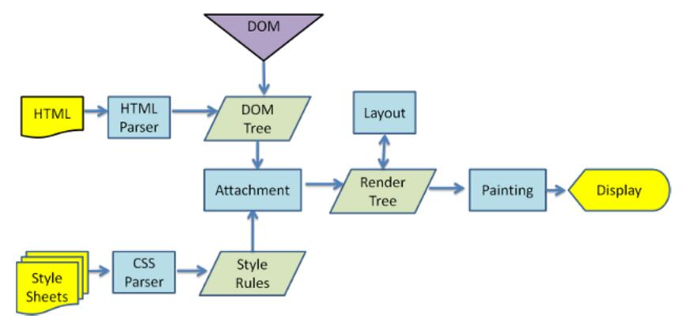
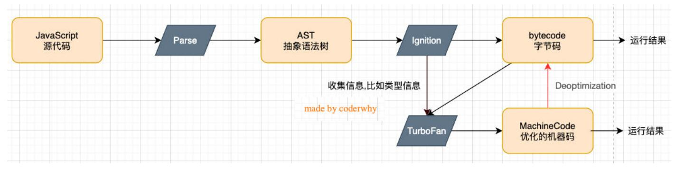

# Node.js

## 基本概念

### 浏览器内核

- Gecko：早期被 Netscape 和 Mozilla Firefox 浏览器使用;
- Webkit：苹果基于 KHTML 开发、开源的，用于 Safari，Google Chrome 之前也在使用;
- Trident：微软开发，被 IE4~IE11 浏览器使用，但是 Edge 浏览器已经转向 Blink
- Blink：是 Webkit 的一个分支，Google 开发，目前应用于 Google Chrome、Edge、Opera 等;

事实上，我们经常说的浏览器内核指的是浏览器的排版引擎：

- 排版引擎（layout engine），也称为浏览器引擎（browser engine）、页面渲染引擎（rendering engine）或样版引擎。

### 渲染引擎工作过程

### JavaScript 引擎

- 为什么需要 JavaScript 引擎呢？
  - 事实上我们编写的 JavaScript 无论你交给浏览器或者 Node 执行，最后都是需要被 CPU 执行的；
  - 但是 CPU 只认识自己的指令集，实际上是机器语言，才能被 CPU 所执行；
  - 所以我们需要 JavaScript 引擎帮助我们将 JavaScript 代码翻译成 CPU 指令来执行；
- 比较常见的 JavaScript 引擎有哪些呢？
  - SpiderMonkey：第一款 JavaScript 引擎，由 Brenda- Eich 开发（也就是 JavaScript 作者）；
  - Chakra：微软开发，用于 IE 浏览器；
  - JavaScriptCore：WebKit 中的 JavaScript 引擎，Apple 公司开发；
  - V8：Google 开发的强大 JavaScript 引擎，也帮助 Chrome 从众多浏览器中脱颖而出；

### WebKit 内核

这里我们先以 WebKit 为例，WebKit 事实上由两部分组成的：

- WebCore：负责 HTML 解析、布局、渲染等等相关的工作；
- JavaScriptCore：解析、执行 JavaScript 代码；

### V8 引擎

V8 是用 C ++编写的 Google 开源高性能 JavaScript 和 WebAssembly 引擎，它用于 Chrome 和 Node.js 等。

::: tip 提示
v8 是一个名字，并不是版本号
:::

- 它实现 ECMAScript 和 WebAssembly，并在 Windows 7 或更高版本，macOS 10.12+和使用 x64，IA-32，
  ARM 或 MIPS 处理器的 Linux 系统上运行。
- V8 可以独立运行，也可以嵌入到任何 C ++应用程序中。

### V8 引擎的原理

- V8 引擎本身的源码非常复杂，大概有超过 100w 行 C++代码，但是我们可以简单了解一下它执行 JavaScript 代码的原理：
- Parse 模块会将 JavaScript 代码转换成 AST（抽象语法树），这是因为解释器并不直接认识 JavaScript 代码；
  - 如果函数没有被调用，那么是不会被转换成 AST 的；
  - Parse 的 V8 官方文档：https://v8.dev/blog/scanner
- Ignition 是一个解释器，会将 AST 转换成 ByteCode（字节码）
  - 同时会收集 TurboFan 优化所需要的信息（比如函数参数的类型信息，有了类型才能进行真实的运算）；
  - 如果函数只调用一次，Ignition 会执行解释执行 ByteCode；
  - Ignition 的 V8 官方文档：https://v8.dev/blog/ignition-interpreter
- TurboFan 是一个编译器，可以将字节码编译为 CPU 可以直接执行的机器码；
  - 如果一个函数被多次调用，那么就会被标记为热点函数，那么就会经过 TurboFan 转换成优化的机器码，提高代码的执行性能；
  - 但是，机器码实际上也会被还原为 ByteCode，这是因为如果后续执行函数的过程中，类型发生了变化（比如 sum 函数原来执行的是 number 类型，后
    来执行变成了 string 类型），之前优化的机器码并不能正确的处理运算，就会逆向的转换成字节码；
  - TurboFan 的 V8 官方文档：https://v8.dev/blog/turbofan-jit
- 上面是 JavaScript 代码的执行过程，事实上 V8 的内存回收也是其强大的另外一个原因，不过这里暂时先不展开讨论：
  - Orinoco 模块，负责垃圾回收，将程序中不需要的内存回收；
  - Orinoco 的 V8 官方文档：https://v8.dev/blog/trash-talk

### REPL

REPL 是 Read-Eval-Print Loop 的简称，翻译为“读取-求值-输出”循环；

- REPL 是一个简单的、交互式的编程环境；
- 事实上，我们浏览器的 console 就可以看成一个 REPL。
- Node 也给我们提供了一个 REPL 环境，我们可以在其中演练简单的代码。

## 环境搭建

[下载 Node.js](https://nodejs.org/zh-cn/)

LTS 版本：相对稳定一些，推荐线上环境使用该版本；
Current 版本：最新的 Node 版本，包含很多新特性；
