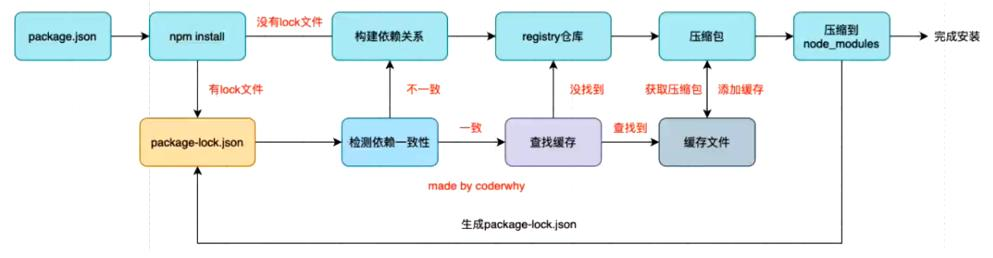

# Node.js

[Node.js 中文文档](http://nodejs.cn/api/)

## 基本概念

### 浏览器内核

- Gecko：早期被 Netscape 和 Mozilla Firefox 浏览器使用;
- Webkit：苹果基于 KHTML 开发、开源的，用于 Safari，Google Chrome 之前也在使用;
- Trident：微软开发，被 IE4~IE11 浏览器使用，但是 Edge 浏览器已经转向 Blink
- Blink：是 Webkit 的一个分支，Google 开发，目前应用于 Google Chrome、Edge、Opera 等;

事实上，我们经常说的浏览器内核指的是浏览器的排版引擎：

- 排版引擎（layout engine），也称为浏览器引擎（browser engine）、页面渲染引擎（rendering engine）或样版引擎。

### 渲染引擎工作过程


### JavaScript 引擎

- 为什么需要 JavaScript 引擎呢？
  - 事实上我们编写的 JavaScript 无论你交给浏览器或者 Node 执行，最后都是需要被 CPU 执行的；
  - 但是 CPU 只认识自己的指令集，实际上是机器语言，才能被 CPU 所执行；
  - 所以我们需要 JavaScript 引擎帮助我们将 JavaScript 代码翻译成 CPU 指令来执行；
- 比较常见的 JavaScript 引擎有哪些呢？
  - SpiderMonkey：第一款 JavaScript 引擎，由 Brenda- Eich 开发（也就是 JavaScript 作者）；
  - Chakra：微软开发，用于 IE 浏览器；
  - JavaScriptCore：WebKit 中的 JavaScript 引擎，Apple 公司开发；
  - V8：Google 开发的强大 JavaScript 引擎，也帮助 Chrome 从众多浏览器中脱颖而出；

### WebKit 内核

这里我们先以 WebKit 为例，WebKit 事实上由两部分组成的：

- WebCore：负责 HTML 解析、布局、渲染等等相关的工作；
- JavaScriptCore：解析、执行 JavaScript 代码；

### V8 引擎

V8 是用 C ++编写的 Google 开源高性能 JavaScript 和 WebAssembly 引擎，它用于 Chrome 和 Node.js 等。

::: tip 提示
v8 是一个名字，并不是版本号
:::

- 它实现 ECMAScript 和 WebAssembly，并在 Windows 7 或更高版本，macOS 10.12+和使用 x64，IA-32，
  ARM 或 MIPS 处理器的 Linux 系统上运行。
- V8 可以独立运行，也可以嵌入到任何 C ++应用程序中。


### V8 引擎的原理

- V8 引擎本身的源码非常复杂，大概有超过 100w 行 C++代码，但是我们可以简单了解一下它执行 JavaScript 代码的原理：
- Parse 模块会将 JavaScript 代码转换成 AST（抽象语法树），这是因为解释器并不直接认识 JavaScript 代码；
  - 如果函数没有被调用，那么是不会被转换成 AST 的；
  - Parse 的 V8 官方文档：https://v8.dev/blog/scanner
- Ignition 是一个解释器，会将 AST 转换成 ByteCode（字节码）
  - 同时会收集 TurboFan 优化所需要的信息（比如函数参数的类型信息，有了类型才能进行真实的运算）；
  - 如果函数只调用一次，Ignition 会执行解释执行 ByteCode；
  - Ignition 的 V8 官方文档：https://v8.dev/blog/ignition-interpreter
- TurboFan 是一个编译器，可以将字节码编译为 CPU 可以直接执行的机器码；
  - 如果一个函数被多次调用，那么就会被标记为热点函数，那么就会经过 TurboFan 转换成优化的机器码，提高代码的执行性能；
  - 但是，机器码实际上也会被还原为 ByteCode，这是因为如果后续执行函数的过程中，类型发生了变化（比如 sum 函数原来执行的是 number 类型，后
    来执行变成了 string 类型），之前优化的机器码并不能正确的处理运算，就会逆向的转换成字节码；
  - TurboFan 的 V8 官方文档：https://v8.dev/blog/turbofan-jit
- 上面是 JavaScript 代码的执行过程，事实上 V8 的内存回收也是其强大的另外一个原因，不过这里暂时先不展开讨论：
  - Orinoco 模块，负责垃圾回收，将程序中不需要的内存回收；
  - Orinoco 的 V8 官方文档：https://v8.dev/blog/trash-talk

### REPL

REPL 是 Read-Eval-Print Loop 的简称，翻译为“读取-求值-输出”循环；

- REPL 是一个简单的、交互式的编程环境；
- 事实上，我们浏览器的 console 就可以看成一个 REPL。
- Node 也给我们提供了一个 REPL 环境，我们可以在其中演练简单的代码。

## 环境搭建

### 安装 Node.js

[下载 Node.js](https://nodejs.org/zh-cn/)

LTS 版本：相对稳定一些，推荐线上环境使用该版本；
Current 版本：最新的 Node 版本，包含很多新特性；

### 配置淘宝镜像

`npm config set registry https://registry.npm.taobao.org`

## Node 程序传递参数

`process.argv`中，第一个元素为 Node 路径，第二个元素为当前程序路径

```JavaScript
console.log(process.argv);
process.argv.slice(2).forEach((item) => {
  console.log(item);
});
```

## 常见的全局对象

Node 中给我们提供了一些全局对象，方便我们进行一些操作

### 特殊的全局对象

这些全局对象实际上是模块中的变量，只是每个模块都有，看来像是全局变量，在命令行交互中是不可以使用的。

- 当前目录

  ```JavaScript
  console.log(__dirname);
  ```

- 当前文件路径

  ```JavaScript
  console.log(__filename);
  ```

### 常见的全局对象

- process

  Node 进程相关信息（Node 的运行环境、参数信息等）

  ```JavaScript
  console.log(process);
  ```

- console 对象

  ```JavaScript
  // 打印输出
  console.log();
  // 清空控制台
  console.clear();
  // 打印函数的调用栈
  console.trace();
  ```

- 定时器函数

  ```JavaScript
  setTimeout(() => {
    console.log("setTimeout");
  }, 1000);

  setInterval(() => {
    console.log("setInterval");
  }, 1000);

  setImmediate(() => {
    console.log("setImmediate");
  });

  process.nextTick(() => {
    console.log("process.nextTick");
  })
  ```

- global 对象

  global 是一个全局对象，process、console、setTimeout 等都有被放到 global 中：

  ::: tip 提示
  在 node 中，我们通过 var 定义一个变量，它只是在当前模块中有一个变量，不会放到全局中
  :::

  ```JavaScript
  console.log(global);
  ```

## 模块化

### CommonJS

CommonJS 是**一个规范**，最初提出来是在浏览器以外的地方使用，并且当时被命名为 **ServerJS**，后来为了体现它的广泛性，修改为 **CommonJS**，平时我们也会简称为 **CJS**。

- Node 是 CommonJS 在服务器端一个具有代表性的实现；
- Browserify 是 CommonJS 在浏览器中的一种实现；
- webpack 打包工具具备对 CommonJS 的支持和转换；

Node 中对 CommonJS 进行了支持和实现，让我们在开发 node 的过程中可以方便的进行模块化开发：

- 在 Node 中每一个 js 文件都是一个单独的模块；
- 这个模块中包括 CommonJS 规范的核心变量：exports、module.exports、require；
- 我们可以使用这些变量来方便的进行模块化开发；

前面我们提到过模块化的核心是导出和导入，Node 中对其进行了实现：

- exports 和 module.exports 可以负责对模块中的内容进行导出；
- require 函数可以帮助我们导入其他模块（自定义模块、系统模块、第三方库模块）中的内容；

\模块名.js

```JavaScript
const 变量名 = 值;
function 函数名() {
}

// module.exports 方式导出
module.exports = {
  变量名,
  函数名,
};

// exports 直接导出
exports.变量名 = 变量名;
exports.函数名 = 函数名;
```

\index.js

```JavaScript
const { 变量名, 函数名 } = require("./模块名");

console.log(变量名);
函数名();
```

### require 细节

require 是一个函数，可以帮助我们引入一个文件（模块）中导入的对象。

```JavaScri-t
require(X);
```

查找规则：

1. 核心模块，比如 -ath、htt-。直接返回核心模块，并且停止查找
2. 以 ./ 或 ../ 或 /（根目录）开头的。
   - 第一步：将 X 当做一个文件在对应的目录下查找；
     - 如果有后缀名，按照后缀名的格式查找对应的文件
     - 如果没有后缀名，会按照如下顺序：
       1. 直接查找文件 X
       2. 查找 X.js 文件
       3. 查找 X.json 文件
       4. 查找 X.node 文件
   - 第二步：没有找到对应的文件，将 X 作为一个目录
     - 查找目录下面的 index 文件
       1. 查找 X/index.js 文件
       2. 查找 X/index.json 文件
       3. 查找 X/index.node 文件
   - 如果没有找到，那么报错：not found
3. 直接是一个 X（没有路径），并且 X 不是一个核心模块
   从当前目录开始，查找所有目录下的`node_modules`目录

### 模块的加载过程

1. 模块在被第一次引入时，模块中的 JavaScri-t 代码会被运行一次
2. 模块被多次引入时，会缓存，最终只加载（运行）一次
   - 每个模块对象 module 都有一个属性：loaded。
   - false 表示还没有加载，为 true 表示已经加载；
3. 如果有循环引入，那么加载顺序是一种图结构
   - 图结构在遍历的过程中，有深度优先搜索（DFS, de-th first search）和广度优先搜索（BFS, breadth first search）；
   - Node 采用的是深度优先算法

### AMD 规范（了解）

AMD 主要是应用于浏览器的一种模块化规范：

- AMD 是 Asynchronous Module Definition（异步模块定义）的缩写；
- 它采用的是异步加载模块；
- 事实上 AMD 的规范还要早于 CommonJS，但是 CommonJS 目前依然在被使用，而 AMD 使用的较少了；

### CMD 规范

CMD 规范也是应用于浏览器的一种模块化规范：

- CMD 是 Common Module Definition（通用模块定义）的缩写；
- 它也采用了异步加载模块，但是它将 CommonJS 的优点吸收了过来；
- 但是目前 CMD 使用也非常少了；
- CMD 也有自己比较优秀的实现方案：[SeaJS](https://github.com/seajs/seajs)

### ES Module

ES Module 模块采用 export 和 import 关键字来实现模块化：

- export 负责将模块内的内容导出；
- import 负责从其他模块导入内容；

ES Module 和 CommonJS 的模块化有一些不同之处：

- 一方面它使用了 import 和 export 关键字；
- 另一方面它采用编译期的静态分析，并且也加入了动态引用的方式；

- index.html

```html
<!DOCTYPE html>
<html lang="en">
  <head>
    <meta charset="UTF-8" />
    <meta name="viewport" content="width=device-width, initial-scale=1.0" />
    <title>Document</title>
  </head>
  <body></body>
  <script src="./index.js" type="module"></script>
</html>
```

- /modules/模块名.js

::: tip 提示
`export{}`中的`{}`不是对象，里面放置要导出的变量引用列表。
:::

```JavaScript
const 变量名 = 值;
const 函数名 = function () {

};

// 导出方式1
export const 变量名 = 值;
export const 函数名 = function () {

};

// 导出方式2（常用）
export {
  变量名,
  函数名,
};

// 导出方式3，起别名
export {
  变量名 as 别名,
  函数名 as 别名,
};
```

- index.js

```JavaScript
// 导入方式1
import { 变量名, 函数名 } from "./modules/模块名.js";
console.log(变量名);

// 方式2：导出变量后起别名
import { 变量名 as 别名, 函数名 as 别名 } from "./modules/模块名.js";
console.log(别名);

// 方式3：* as 别名
import * as 别名 from "./modules/模块名.js";
console.log(别名.name);
```

- Export 和 Import 结合使用

  在开发和封装一个功能库时，通常我们希望将暴露的所有接口放到一个文件中；

  - 这样方便指定统一的接口规范，也方便阅读；
  - 这个时候，我们就可以使用 export 和 import 结合使用；

  ```JavaScript
  export { 变量名, 函数名 } from "./modules/模块名.js";
  ```

- default 用法

  默认导出（default export）

  - 默认导出 export 时可以不需要指定名字；
  - 在导入时不需要使用 {}，并且可以自己来指定名字；
  - 它也方便我们和现有的 CommonJS 等规范相互操作；

  ::: tip 提示
  在一个模块中，只能有一个默认导出（default export）
  :::

  ```JavaScript
  // 默认导出函数
  export default 函数名 () {

  }
  // 默认导出变量
  export default 变量名;
  ```

  ```JavaScript
  import 函数名 from "./modules/模块名.js";
  函数名();
  ```

### ES Module 加载过程

ES Module 加载 js 文件的过程是编译（解析）时加载的，并且是异步的：

- 编译时（解析）时加载，意味着 import 不能和运行时相关的内容放在一起使用：
- 比如 from 后面的路径需要动态获取；
- 比如不能将 import 放到 if 等语句的代码块中；
- 所以我们有时候也称 ES Module 是静态解析的，而不是动态或者运行时解析的；

异步的意味着：JS 引擎在遇到 import 时会去获取这个 js 文件，但是这个获取的过程是异步的，并不会阻塞主线程继续执行；

- 也就是说设置了 type=module 的代码，相当于在 script 标签上也加上了 async 属性；
- 如果我们后面有普通的 script 标签以及对应的代码，那么 ES Module 对应的 js 文件和代码不会阻塞它们的执行；

### CommonJS 和 ES Module 交互

- 结论一：通常情况下，CommonJS 不能加载 ES Module
  - 因为 CommonJS 是同步加载的，但是 ES Module 必须经过静态分析等，无法在这个时候执行 JavaScript 代码；
  - 但是这个并非绝对的，某些平台在实现的时候可以对代码进行针对性的解析，也可能会支持；
  - Node 当中是不支持的；
- 结论二：多数情况下，ES Module 可以加载 CommonJS
  - ES Module 在加载 CommonJS 时，会将其 module.exports 导出的内容作为 default 导出方式来使用；
  - 这个依然需要看具体的实现，比如 webpack 中是支持的、Node 最新的 Current 版本也是支持的；
  - 但是在最新的 LTS 版本中就不支持；

## 内置模块 Path

### 基本方法

- 取文件路径

  ```JavaScript
  path.dirname("路径");
  ```

- 取文件名（含后缀）

  ```JavaScript
  path.basename("路径");
  ```

- 取文件后缀（带.）

  ```JavaScript
  path.extname("路径");
  ```

### 拼接路径

- resolve 方法

  resolve 会判断拼接的路径字符串中，是否有以`/`或`./`或`../`开头的路径。如果有表示是一个绝对路径，会返回对应的拼接路径，如果没有，那么会和当前执行文件所在的文件夹进行路径的拼接。

  ```JavaScript
  const path = require("path");

  const filePath = path.resolve("路径", "文件名");
  ```

- join 方法

  ```JavaScript
  path.join("路径", "文件名");
  ```

### 文件描述符

文件描述符（File descriptors）：

- 在 POSIX 系统上，对于每个进程，内核都维护着一张当前打开着的文件和资源的表格。
- 每个打开的文件都分配了一个称为文件描述符的简单的数字标识符。
- 在系统层，所有文件系统操作都使用这些文件描述符来标识和跟踪每个特定的文件。
- Windows 系统使用了一个虽然不同但概念上类似的机制来跟踪资源。

```JavaScript
const fs = require("fs");

fs.open("文件路径", (err, fd) => {
  if (err) {
    console.log(err);
    return;
  }

  fs.fstat(fd, (err, info) => {
    console.log(info);
  });
});
```

## 内置模块 fs

fs (File System)，文件系统。对于任何一个为服务器端服务的语言或者框架通常都会有自己的文件系统：

- 因为服务器需要将各种数据、文件等放置到不同的地方；
- 比如用户数据可能大多数是放到数据库中；
- 比如某些配置文件或者用户资源（图片、音视频）都是以文件的形式存在于操作系统上的；

### 大多数 API 都提供三种操作方式：

- 方式一：同步操作文件：代码会被阻塞，不会继续执行；

```JavaScript
const fs = require("fs");

const info = fs.statSync("文件路径");
console.log(info);
```

- 方式二：异步回调函数操作文件：代码不会被阻塞，需要传入回调函数，当获取到结果时，回调函数被执行；

```JavaScript
const fs = require("fs");

fs.stat("文件路径", (err, stat) => {
  if (err) {
    console.log(err);
    return;
  }
  console.log(stat);
})
```

- 方式三：异步 Promise 操作文件：代码不会被阻塞，通过 fs.promises 调用方法操作，会返回一个 Promise，可以通过 then、catch 进行处理；

```JavaScript
fs.promises.stat("文件路径").then(info => {
  console.log(info);
}).catch(err => {
  console.log(err);
})
```

### 文件的读写

- 写文件

  ```JavaScript
  const fs = require("fs");

  fs.writeFile("文件路径", "文件内容", { flag: "flag选项" }, (err) => {
    console.log(err);
  });
  ```

flag 选项：

- w : 打开文件写入，默认值；
- w+ : 打开文件进行读写，如果不存在则创建文件；
- r+ : 打开文件进行读写，如果不存在那么抛出异常；
- r : 打开文件读取，读取时的默认值；
- a : 打开要写入的文件，将流放在文件末尾。如果不存在则创建文件；
- a+ : 打开文件以进行读写，将流放在文件末尾。如果不存在则创建文件

- 读文件

  ::: tip 提示
  如果不填写 encoding，返回的结果是 Buffer
  :::

  ```JavaScript
  const fs = require("fs");

  fs.readFile("文件路径", {encoding: "utf8"}, (err, data) => {
    console.log(data);
  })
  ```

### 文件夹操作

- 判断是否为文件夹

```JavaScript
const fs = require("fs");

fs.stat("文件夹路径", (err, stat) => {
  console.log(stat.isDirectory());
})
```

- 判断文件夹是否存在

```JavaScript
const fs = require("fs");

fs.existsSync("文件夹路径");
```

- 创建文件夹

```JavaScript
const fs = require("fs");

fs.mkdir("文件夹路径", err => {
  console.log(err);
})
```

- 递归创建文件夹

```JavaScript
/**
 * 创建文件夹（包括子目录）
 * @param {String} pathName 目录路径
 */
const createDirSync = (pathName) => {
  if (fs.existsSync(pathName)) {
    return true;
  } else {
    if (createDirSync(path.dirname(pathName))) {
      fs.mkdirSync(pathName);
      return true;
    }
  }
};
```

- 读取文件夹中的所有文件

```JavaScript
const fs = require("fs");

fs.readdir("文件夹路径", (err,files) => {
  console.log(files);
})
```

```JavaScript
/**
 * 枚举文件夹内的所有文件，包括子目录
 * @param {String} dirname 文件夹路径
 */
function getFiles(dirname) {
  fs.readdir(dirname, { withFileTypes: true }, (err, files) => {
    files.forEach((item) => {
      if (item.isDirectory()) {
        const filePath = path.resolve(dirname, item.name);
        getFiles(filePath);
      } else {
        console.log(path.resolve(dirname, item.name));
      }
    });
  });
}
```

- 重命名文件夹

```JavaScript
const fs = require("fs");

fs.rename("文件夹路径", "新路径", (err) => {
  console.log(err);
});
```

## 内置模块 events

Node 中的核心 API 都是基于异步事件驱动的：

- 在这个体系中，某些对象（发射器（Emitters））发出某一个事件；
- 我们可以监听这个事件（监听器 Listeners），并且传入的回调函数，这个回调函数会在监听到事件时调用；

### 基本使用

```JavaScript
const EventEmitter = require("events");

// 创建发射器
const emitter = new EventEmitter();

// 监听事件
emitter.on("事件名", (参数) => {
  console.log("监听到事件", 参数);
});

const 事件名 = (参数) => {
  console.log("监听到事件", 参数);
};
emitter.on("事件名", 事件名);

// 发射事件
emitter.emit("事件名", "参数值");

// 关闭事件
emitter.off("事件名", 事件名);
```

### 常见的属性

- 获取 EventEmitter 对象注册的事件

  ```JavaScript
  console.log(emitter.eventNames());
  ```

- 获取 EventEmitter 对象某一个事件名称中监听器的个数

  ```JavaScript
  console.log(emitter.listenerCount("事件名"));
  ```

- 获取 EventEmitter 对象某个事件监听器上所有的监听器

  ```JavaScript
  console.log(emitter.listeners("事件名"));
  ```

## NPM 包管理工具

### 项目配置文件常见属性

**必须填写的属性：name、version**

- name 是项目的名称；
- version 是当前项目的版本号；
- description 是描述信息，很多时候是作为项目的基本描述；
- author 是作者相关信息（发布时用到）；
- license 是开源协议（发布时用到）；

**private 属性：**

- private 属性记录当前的项目是否是私有的；
- 当值为 true 时，npm 是不能发布它的，这是防止私有项目或模块发布出去的方式；

**main 属性：**

- 设置程序的入口。

**scripts 属性**

::: tip 提示
npm start 和 npm run start 的区别：

- 它们是等价的；
- 对于常用的 start、 test、stop、restart 可以省略掉 run 直接通过 npm start 等方式运行；

:::

- scripts 属性用于配置一些脚本命令，以键值对的形式存在；
- 配置后我们可以通过 npm run 命令的 key 来执行这个命令；

**dependencies 属性**

- dependencies 属性是指定无论开发环境还是生成环境都需要依赖的包；
- 通常是我们项目实际开发用到的一些库模块；
- 与之对应的是 devDependencies；

**devDependencies 属性**

- 一些包在生成环境是不需要的，比如 webpack、babel 等；
- 这个时候我们会通过 npm install webpack --save-dev，将它安装到 devDependencies 属性中；

### 版本规范

semver 版本规范是 X.Y.Z：

- X 主版本号（major）：当你做了不兼容的 API 修改（可能不兼容之前的- ）；
- Y 次版本号（minor）：当你做了向下兼容的功能性新增（新功能增加，但- 容之前的版本）；
- Z 修订号（patch）：当你做了向下兼容的问题修正（没有新功能，修复了之前版本的 bug）；

::: tip 提示
`^x.y.z`：表示 x 是保持不变的，y 和 z 永远安装最新的版本；  
`~x.y.z`：表示 x 和 y 保持不变的，z 永远安装最新的版本；
:::

### npm install 命令

::: tip 提示
通常使用 npm 全局安装的包都是一些工具包：yarn、webpack 等；
并不是类似于 axios、express、koa 等库文件；
全局安装了之后并不能让我们在所有的项目中使用 axios 等库；
:::

- 全局安装 ： `npm install 包名 -g`
- 局部安装 ： `npm install 包名`

### npm install 原理



### npm 其他命令

- 卸载依赖: `npm unstall 包名`
- 强制重新 build: `npm rebuild`
- 清除缓存: `npm cache clean`

## Commander

Commander 是一个帮助快速开发 Nodejs 命令行工具的 package

### 安装

`npm install commander --save`

### 解析终端命令

::: tip 提示
此行代码需要放置最后
:::

```JavaScript
const program = require("commander");

program.parse(process.argv);
```

### 查看版本号

```JavaScript
program.version(require("./package.json").version);
```

### 自定义 Option

```JavaScript
// 无参
program.option("-命令行缩写 --命令行", "命令行描述");
// 有参
program.option("-命令行缩写 --命令行 <参数名>", "命令行描述");
```

### 监听 Option

```JavaScript
program.on("--命令行", function () {

});
```

### 自定义命令

```JavaScript
program
  .command("命令行 <参数名> [其他参数...]")
  .description("命令行描述")
  .action((参数名,其他参数)=>{

  });
```

## 事件循环和异步 IO

### 什么是事件循环

- 事件循环可以理解成我们编写的 JavaScript 和浏览器或者 Node 之间的一个桥梁。
- 浏览器的事件循环是一个我们编写的 JavaScript 代码和浏览器 API 调用(setTimeout/AJAX/监听事件等)的一个桥梁,桥梁之间他们通过回调函数进行沟通。
- Node 的事件循环是一个我们编写的 JavaScript 代码和系统调用（file system、network 等）之间的一个桥梁, 桥梁之间他们通过回调函数进行沟通的.

### 进程和线程

线程和进程是操作系统中的两个概念：

- 进程（process）：计算机已经运行的程序；
  - 可以认为，启动一个应用程序，就会默认启动一个进程（也可能是多个进程）
- 线程（thread）：操作系统能够运行运算调度的最小单位；
  - 每一个进程中，都会启动一个线程用来执行程序中的代码，这个线程被称之为主线程

### 浏览器和 JavaScript

目前多数的浏览器其实都是多进程的，当我们打开一个 tab 页面时就会开启一个新的进程，这是为了防止一个页面卡死而造成所有页面无法响应，整个浏览器需要强制退出；

- 每个进程中又有很多的线程，其中包括执行 JavaScript 代码的线程；

但是 JavaScript 的代码执行是在一个单独的线程中执行的：

- 这就意味着 JavaScript 的代码，在同一个时刻只能做一件事；
- 如果这件事是非常耗时的，就意味着当前的线程就会被阻塞；

### 宏任务和微任务

事件循环中并非只维护着一个队列，事实上是有两个队列：

- 宏任务队列（macrotask queue）：ajax、setTimeout、setInterval、DOM 监听、UI Rendering 等
- 微任务队列（microtask queue）：Promise 的 then 回调、 Mutation Observer API、queueMicrotask()等

事件循环对于两个队列的优先级：

1. main script 中的代码优先执行（编写的顶层 script 代码）；
2. 在执行任何一个宏任务之前（不是队列，是一个宏任务），都会先查看微任务队列中是否有任务需要执行
   - 也就是**宏任务执行之前，必须保证微任务队列是空的**；
   - 如果不为空，那么久优先执行微任务队列中的任务（回调）；

## 阻塞 IO 和非阻塞 IO

如果我们希望在程序中对一个文件进行操作，那么我们就需要打开这个文件：通过**文件描述符**。

- 我们思考：JavaScript 可以直接对一个文件进行操作吗？
- 看起来是可以的，但是事实上我们任何程序中的文件操作都是需要进行**系统调用**（操作系统的文件系统）；
- 事实上对文件的操作，是一个操作系统的 IO 操作（输入、输出）；

操作系统为我们提供了**阻塞式调用**和**非阻塞式调用**：

- 阻塞式调用： 调用结果返回之前，当前线程处于阻塞态（阻塞态 CPU 是不会分配时间片的），调用线程只有在得到调用结果之后才会继续执行。
- 非阻塞式调用： 调用执行之后，当前线程不会停止执行，只需要过一段时间来检查一下有没有结果返回即可。

所以我们开发中的很多**耗时操作**，都可以基于这样的 非阻塞式调用：

- 比如网络请求本身使用了 **Socket 通信**，而 Socket 本身提供了 select 模型，可以进行非阻塞方式的工作；
- 比如文件读写的 **IO 操作**，我们可以使用操作系统提供的基于事件的回调机制；

### 非阻塞 IO 的问题

但是非阻塞 IO 也会存在一定的问题：我们并没有获取到需要读取（我们以读取为例）的结果

- 那么就意味着为了可以知道是否读取到了**完整的数据**，我们需要频繁的去确定读取到的数据是否是完整的；
- 这个过程我们称之为**轮训操作**；

那么这个轮训的工作由谁来完成呢？

- 如果我们的主线程频繁的去进行轮训的工作，那么必然会大大降低性能；
- 并且开发中我们可能不只是一个文件的读写，可能是多个文件；
- 而且可能是多个功能：网络的 IO、数据库的 IO、子进程调用；

libuv 提供了一个**线程池**（Thread Pool）：

- 线程池会负责所有相关的操作，并且会通过轮训等方式等待结果；
- 当获取到结果时，就可以将对应的回调放到事件循环（某一个事件队列）中；
- 事件循环就可以负责接管后续的回调工作，告知 JavaScript 应用程序执行对应的回调函数；

### 阻塞和非阻塞，同步和异步的区别？

阻塞和非阻塞是对于被调用者来说的；

- 在我们这里就是**系统调用**，操作系统为我们提供了阻塞调用和非阻塞调用；

同步和异步是对于调用者来说的；

- 在我们这里就是自己的程序；
- 如果我们在**发起调用之后，不会进行其他任何的操作，只是等待结果**，这个过程就称之为同步调用；
- 如果我们再**发起调用之后，并不会等待结果，继续完成其他的工作**，等到有回调时再去执行，这个过程就是异步调用；

Libuv 采用的就是非阻塞异步 IO 的调用方式；

### Node 事件循环的阶段

事件循环像是一个桥梁，是连接着应用程序的 JavaScript 和系统调用之间的通道：

- 无论是我们的文件 IO、数据库、网络 IO、定时器、子进程，在完成对应的操作后，都会将对应的结果和回调函数放到事件循环（任务队列）中；
- 事件循环会不断的从任务队列中取出对应的事件（回调函数）来执行；

但是一次完整的事件循环 Tick 分成很多个阶段：

- **定时器（Timers）**：本阶段执行已经被 setTimeout() 和 setInterval() 的调度回调函数。
- **待定回调（Pending Callback）**：对某些系统操作（如 TCP 错误类型）执行回调，比如 TCP 连接时接收到 ECONNREFUSED。
- **idle, prepare**：仅系统内部使用。
- **轮询（Poll）**：检索新的 I/O 事件；执行与 I/O 相关的回调；
- **检测（Check）**：setImmediate() 回调函数在这里执行。
- **关闭的回调函数**：一些关闭的回调函数，如：socket.on('close', ...)。

### Node 的微任务和宏任务

我们会发现从一次事件循环的 Tick 来说，Node 的事件循环更复杂，它也分为微任务和宏任务：

- 宏任务（macrotask）：setTimeout、setInterval、IO 事件、setImmediate、close 事件；
- 微任务（microtask）：Promise 的 then 回调、process.nextTick、queueMicrotask；

但是，Node 中的事件循环不只是 微任务队列和 宏任务队列：

- 微任务队列：
  - next tick queue：process.nextTick；
  - other queue：Promise 的 then 回调、queueMicrotask；
- 宏任务队列：
  - timer queue：setTimeout、setInterval；
  - poll queue：IO 事件；
  - check queue：setImmediate；
  - close queue：close 事件；
