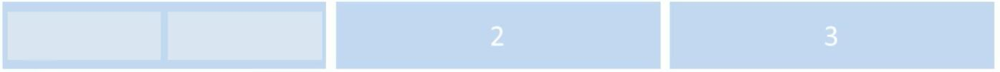
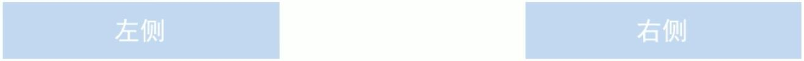
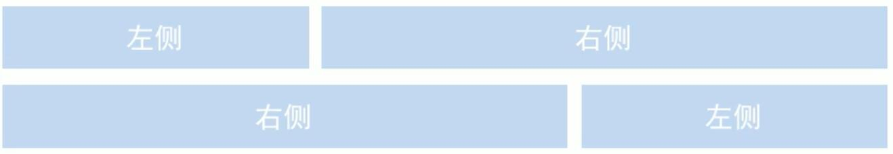

# Bootstrap

[Bootstrap 中文文档(https://v3.bootcss.com/)

## 简介

Bootstrap 来自 Twitter（推特），是目前最受欢迎的前端框架。Bootstrap 是基于 HTML、CSS 和 JavaScript 的，它简洁灵活，**使得 Web 开发更加快捷**。

框架 ∶ 顾名思义就是一套架构，它有一套比较完整的网页功能解决方案，而且控制权在框架本身，有预制样式库、组件和插件。使用者要拨照框架所规定的某种规范进行开发"

### 优点

- 标住化的 html+css 编码规范
- 提供了一套简洁、直观、强悍的组件
- 有自己的生态圈，不断的更新迭代
- 让开发更简单，提高了开发的效率

## 响应式开发

### 响应式开发原理

使用媒体查询针对不同宽度的设备进行布局和样式的设置，从而适配不同设备的目的。

| 设备划分                 | 尺寸区间           |
| ------------------------ | ------------------ |
| 超小屏幕（手机）         | <768px             |
| 小屏设备（平板）         | >= 768px ~ < 992px |
| 中等屏幕（桌面显示器）   | >= 992px~ < 1200px |
| 宽屏设备（大桌面显示器） | >= 1200px          |

### 响应式布局容器

响应式需要一个父级做为布局容器，来配合子级元素来实现变化效果。  
原理就是在不同屏幕下，通过媒体查询来改变这个布局容器的大小，再改变里面子元素的排列方式和大小，从而实现不同屏幕下，看到不同的页面布饲和样式变化。

**平时我们的响应式尺寸划分：**

- 超小屏幕（手机，小于 768px）：设置宽度为 100%
- 小屏幕（平板，大于等于 768px）∶ 设置宽度为 750px
- 中等屏幕（桌面显示器，大于等于 992px）：宽度设置为 970px
- 大屏幕（大桌面显示器，大于等于 1200px）：宽度设置为 1170px

但是我们也可以根据实际情况自己定义划分

## 布局容器

Bootstrap 需要为页面内容和栅格系统包裹一个 `.container` 容器，Bootstarp 预先定义好了这个类，叫`.container`，它提供了两个作此用处的类。

### container 类

响应式布局的容器固定宽度：

- 大屏（ >=1200px）宽度定为 1170px
- 中屏（>=992px）宽度定为 970px
- 小屏（ >=768px）宽度定为 750px
- 超小屏（100%）

### container-fluid 类

流式布局容器 百分百宽度

- 对占据全部视口( viewport )的容器
- 适合于单独做移动端开发

## 栅格系统

栅格系统英文为“gridsystems”,也有人翻译为“网格系统”，它是指将页面布局划分为等宽的列，然后通过列数的定义来模块化页面布局。

Bootstrap 提供了一套响应式、移动设备优先的流式栅格系统，随着屏幕或视口(viewport )尺寸的增加，系统会自动分为最多 12 列。  
Bootstrap 里面 container 宽度是固定的，但是不同屏幕下，container 的宽度不同，我们再把 container 划分为 12 等份

### 栅格选项参数

栅格系统用于通过一系列的行( row)与列(column )的组合来创建页面布局，你的内容就可以放入这些创建好的布局中。

::: tip 提示

- 当中屏幕和大屏幕的布局一致时。可以将列定义为`col-md-`，md 是大于等于 970 以上的
- 一般先布局 md 以上的 PC 端布局，最后根据实际需求在修改小屏幕和超小屏幕的特殊布局样式

:::

|                        | 超小屏幕 手机 \(<768px\) | 小屏幕 平板 \(≥768px\) | 中等屏幕 桌面显示器 \(≥992px\) | 大屏幕 大桌面显示器 \(≥1200px\) |
| ---------------------- | ------------------------ | ---------------------- | ------------------------------ | ------------------------------- |
| 栅格系统行为           | 总是水平排列             | 开始是堆叠在一起的     | 当大于这些阈值时               | 将变为水平排列 C                |  |  |
| \.\.container 最大宽度 | None （自动）            | 750px                  | 970px                          | 1170px                          |
| 类前缀                 | \.col\-xs\-              | \.col\-sm\-            | \.col\-md\-                    | \.col\-lg\-                     |
| 列(column)数           | 12                       |                        |                                |                                 |

- **行( row）必须放到 container 布局容器里面**
- **实现列的平均划分需要给列添加类前缀**
- xs-extra small：超小; sm-small：小; md-medium：中等; lg-large：大;
- 每一列默认有左右 15 像素的 padding
- 列 (column) 大于 12，多余的“列( column )”所在的元素将被作为一个整体另起一行排列
- 可以同时为一列指定多个设备的类名，以便划分不同份数例如 class="col-md-4col-sm-6"

::: tip 提示
如果孩子的份数相加等于 12 则孩子能占满整个的 container 的宽度
如果孩子的份数相加小于 12 则占不满整个的 container 的宽度，会空白
如果孩子的份数相加大于 12 则多出的列会另起一行显示
:::

```html
<div class="container">
  <!-- 基本使用 -->
  <div class="row">
    <div class="col-lg-3">1</div>
    <div class="col-lg-3">2</div>
    <div class="col-lg-3">3</div>
    <div class="col-lg-3">4</div>
  </div>
  <!-- 适应设备 -->
  <div class="row">
    <div class="col-lg-3 col-md-4 col-sm-6 col-xs-12">1</div>
    <div class="col-lg-3 col-md-4 col-sm-6 col-xs-12">2</div>
    <div class="col-lg-3 col-md-4 col-sm-6 col-xs-12">3</div>
    <div class="col-lg-3 col-md-4 col-sm-6 col-xs-12">4</div>
  </div>
</div>
```

### 列嵌套

栅格系统内置的栅格系统将内容再次嵌套。简单理解就是一个列内再分成若干份小列。我们可以通过添加一个新的.row 元素和一系列 `.col-sm-*` 元素到已经存在的 `.col-sm-*` 元素内。



::: tip 提示
列嵌套时最好加 1 个行 row，可以取消父元素的 padding 值，且高度自动和父级一致
:::

```html
<div class="col-md-4">
  <div class="row">
    <div class="col-md-6">小列</div>
    <div class="col-md-6">小列</div>
  </div>
</div>
```

### 列偏移

使用`.col-md-offset-*`类可以将列向右侧偏移。这些类实际是通过使用\*选择器为当前元素增加了左侧的边距( margin )



- 基本使用

```html
<div class="row">
  <div class="col-md-4">左侧</div>
  <div class="col-md-4 col-md-offset-4">右侧</div>
</div>
```

- 居中对齐

偏移量 = (12 - 盒子份数) ÷ 2

```html
<div class="row">
  <div class="col-md-盒子份数 col-md-offset-偏移量">中间</div>
</div>
```

### 列排序

通过使用 `.col-md-push-*` 和 `.col-md-pull-*` 类就可以很容易的改变列( column）的顺序。



```html
<div class="row">
  <div class="col-md-4 col-md-push-8">左侧</div>
  <div class="col-md-8 col-md-pull-4">右侧</div>
</div>
```

### 响应式工具

为了加快对移动设备友好的页面开发工作，利用媒体查询功能，并使用这些工具类可以方便的针对不同设备展示或隐藏页面内容。

|                   | 超小屏幕 手机 \(<768px\) | 小屏幕 平板 \(≥768px\) | 中等屏幕 桌面 \(≥992px\) | 大屏幕 桌面 \(≥1200px\) |
| ----------------- | ------------------------ | ---------------------- | ------------------------ | ----------------------- |
| \.visible\-xs\-\* | 可见                     | 隐藏                   | 隐藏                     | 隐藏                    |
| \.visible\-sm\-\* | 隐藏                     | 可见                   | 隐藏                     | 隐藏                    |
| \.visible\-md\-\* | 隐藏                     | 隐藏                   | 可见                     | 隐藏                    |
| \.visible\-lg\-\* | 隐藏                     | 隐藏                   | 隐藏                     | 可见                    |
| \.hidden\-xs      | 隐藏                     | 可见                   | 可见                     | 可见                    |
| \.hidden\-sm      | 可见                     | 隐藏                   | 可见                     | 可见                    |
| \.hidden\-md      | 可见                     | 可见                   | 隐藏                     | 可见                    |
| \.hidden\-lg      | 可见                     | 可见                   | 可见                     | 隐藏                    |

```html
<div class="row">
  <!-- 超大屏幕下自动显示 -->
  <div class="col-xs-3 visible-lg">1</div>
  <div class="col-xs-3">2</div>
  <!-- 超小屏幕下自动隐藏 -->
  <div class="col-xs-3 hidden-xs">3</div>
  <div class="col-xs-3">4</div>
</div>
```
