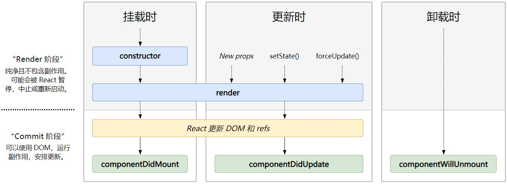

# React

React 用于构建用户界面的 JavaScript 库

## Visual Studio Code 插件

- ES7 React/Redux/GraphQL/React-Native snippets : 快速生成 React 代码段
- Reactjs code snippets : 快速生成 React 代码段
- Auto Import : 自动导入
- Path Intellisense : 路径补全

### 增加代码提示

Visual Studio Code 默认不支持在 JavaScript 中使用缩写（如直接写 div 自动补全为 div 标签）

settings.json

```json
{
  "emmet.includeLanguages": {
    "javascript": "javascriptreact"
  }
}
```

### 浏览器插件

- react-developer-tools

## 脚手架

**脚手架让项目从搭建到开发,再到部署，整个流程变得快速和便捷**

编程中提到的脚手架 (Scaffold) , 其实是一种工具，帮我们可以快速生成项目的工程化结构，并且已经将我们所需的工程环境配置好

- 每个项目作出完成的效果不同，但是它们的基本工程化结构是相似的。既然相似，就没有必要每次都从零开始搭建，完全可以使用一些工具，帮助我们生产基本的工程化模板
- 不同的项目，在这个模板的基础之上进行项目开发或者进行一些配置的简单修改即可
- 这样也可以间接保证项目的基本机构一致性，方便后期的维护

### 依赖

1. 安装 Node.js：[Node.js 官网](https://nodejs.org/zh-cn/)
2. 安装 WebPack：`npm install webpack -g`

### 安装

安装 React 脚手架：`npm install -g create-react-app`

### 创建项目

创建项目：`create-react-app 项目名称`

::: warning 注意
项目名称不能包含大写字母
:::

**目录结构划分**

创建 `\src\assets\img` : 存放图片  
创建 `\src\assets\font` : 存放字体  
创建 `\src\assets\css` : 存放 css

创建 `\src\common` : 存放公共的数据等  
创建 `\src\components` : 存放公共的组件  
创建 `\src\pages` : 存放页面  
创建 `\src\router` : 存放路由  
创建 `\src\services` : 存放网络请求相关信息  
创建`\src\store` : 存放 redux 信息  
创建 `\src\utils` : 存放工具

**配置别名**

[craco 配置别名](./craco.md#配置别名)

### 启动项目

启动项目：`npm start`

### 编译项目

编译项目：`npm run build`

### 目录结构

```
项目名
├─ README.md // readme说明文档
├─ package.json // 对整个应用程序的描述：包括应用名称、版本号、一些依赖包、以及项目的启动、打包等等（node管理项目必备文件）
├─ public
│    ├─ favicon.ico // 应用程序顶部的icon图标
│    ├─ index.html // 应用的index.html入口文件
│    ├─ logo192.png // 被在manifest.json中使用
│    ├─ logo512.png // 被在manifest.json中使用
│    ├─ manifest.json // 和Web app配置相关
│    └─ robots.txt // 指定搜索引擎可以或者无法爬取哪些文件
├─ src
│    ├─ App.css // App组件相关的样式
│    ├─ App.js // App组件的代码文件
│    ├─ App.test.js // App组件的测试代码文件
│    ├─ index.css // 全局的样式文件
│    ├─ index.js // 整个应用程序的入口文件
│    ├─ logo.svg // 刚才启动项目，所看到的React图标
│    ├─ serviceWorker.js // 默认帮助我们写好的注册PWA相关的代码
│    └─ setupTests.js // 测试初始化文件
├─package-lock.json // 记录本地真实安装版本
└─.gitignore // 记录git版本控制的排除文件
```

## 基本概念

### Babel

Babel，又名 Babeljs。是目前前端使用非常广泛的编辑器、转移器。比如当下很多浏览器并不支持 ES6 的语法，但是确实 ES6 的语法非常的简洁和方便，我们开发时希望使用它。那么编写源码时我们就可以使用 ES6 来编写，之后通过 Babel 工具，将 ES6 转成大多数浏览器都支持的 ES5 的语法

### PWA

PWA 全称 Progressive Web App，即渐进式 WEB 应用。  
一个 PWA 应用首先是一个网页, 可以通过 Web 技术编写出一个网页应用. 随后添加上 App Manifest 和 Service Worker 来实现 PWA 的安装和离线等功能； 这种 Web 存在的形式，我们也称之为是 Web App；

PWA 解决了哪些问题呢？

- 可以添加至主屏幕，点击主屏幕图标可以实现启动动画以及隐藏地址栏；
- 实现离线缓存功能，即使用户手机没有网络，依然可以使用一些离线功能；
- 实现了消息推送；
- 等等一系列类似于 Native App 相关的功能；

## JSX

JSX 是一种 JavaScript 的语法扩 展( eXtension) , 也在很多地方称之为 JavaScript XML，因为看起就是一段 XML 语法。  
它用于描述我们的 UI 界面,并且其完成可以和 JavaScript 融合在一起使用。  
它不同于 Vue 中的模块语法，你不需要专门学习模块语法中的一些指令（比如 v-for、v-if、 v-else、v-bind）

```JSX
const element = <h2>Hello World</h2>
```

### JXS 书写规范

- JSX 的顶层只能有一个根元素，所以我们很多时候会在外层包裹一个 div 原生（或者使用后面我们学习的 Fragment）
- 为了方便阅读,我们通常在 jsx 的外层包裹一个小括号() ,这样可以方便阅读,并且 jsx 可以进行换行书写
- JSX 中的标签可以是单标签,也可以是双标签。注意：**如果是单标签，必须以/>结尾**

### 语法

- 注释

```jsx
{
  /* 注释 */
}
```

- 嵌入数据

::: tip 提示
对象不能作为 jsx 的子类，无法输出 Object 对象
:::

```jsx
<h2>{this.state.变量名}</h2>
```

- 嵌入表达式

```jsx
{/* 运算符表达式*/}
<h2>{变量1 + " " + 变量2}</h2>
<h2>{20 * 50}</h2>

{/* 函数调用 */}
<h2>{this.函数名()}</h2>
```

- 内嵌表达式

```jsx
{
  `字符串，${变量}`;
}
```

- 逻辑与算符

如果条件成立则渲染某一个组件，否则不显示

```jsx
{
  条件 && <h2>渲染内容</h2>;
}
```

- 三元表达式

```jsx
<h2>{变量 ? true : false}</h2>
```

- 绑定属性

```jsx
const { title, imgUrl, link } = this.state

<h2 title={title}>我是标题</h2>

<a href={link}>百度一下</a>
```

- 绑定 class

::: tip 提示
jsx 中`class`为关键字，不能直接使用，需要使用`className`
:::

```jsx
<div className="box title">div元素</div>
<div className={"box title " + (active ? "active" : "")}>div元素</div>
{/* 传入数组 */}
<h2 className={["title", (isActive ? "active" : "")].join(" ")}></h2>
```

- 绑定 Style

```jsx
<div style={{color: "red", fontSize: "50px"}}>绑定Style属性</div>

<h2 style={{ display: isLogin ? 'block' : "none" }}>绑定Style属性</h2>
```

- 绑定事件

```jsx
<button onClick={this.函数名}>按钮</button>;

{
  /* 函数内访问this对象 */
}

{
  /*（推荐） 直接传入一个箭头函数，在箭头函数中调用需要执行的函数 */
}
<button onClick={(e) => this.函数名()}>按钮</button>;

{
  /* 使用bind绑定this对象 */
}
<button onClick={this.函数名.bind(this)}>按钮</button>;
```

::: tip 提示
函数内访问 this 对象默认为 undefine，因为按钮的事件函数并不是我们主动调用，而是当 button 发生改变时，React 内部调用，当它内部调用时，并不知道要如何绑定正确的 this

解决方法：

- （推荐）在 jsx 中直接传入一个箭头函数，在箭头函数中调用需要执行的函数
- 定义函数时，使用箭头函数
- 在构造方法中，`this.函数名 = this.函数名.bind(this)` 绑定 this 对象
- 绑定函数时增加`.bind(this)`绑定 this 对象
  :::

- 事件对象

```JavaScript
函数名(event) {
  console.log(event);
}
```

### JSX 的本质

jsx 仅仅只是 React.createElement(component, props, ..children)函数的语法糖。所有的 jsx 最终都会被转换成 React.createElement 函数调用

jsx ->createElement 函数 -> ReactElement（对象树）->ReactDom.render

### 为什么要用虚拟 DOM

- 很难跟踪状态发生的改变：原有的开发模式，我们很难跟踪到状态发生的改变，不方便针对我们应用程序进行调试
- 操作真实 DOM 性能较低：传统的开发模式会进行频繁的 DOM 操作，而这一的做法性能非常的低

## CSS

React 官方并没有给出在 React 中统一的样式风格：

- 由此，从普通的 css，到 css modules，再到 css in js，有几十种不同的解决方案，上百个不同的库
- 大家一致在寻找最好的或者说最适合自己的 CSS 方案，但是到目前为止也没有统一的方案

::: tip 提示
样式内引用图片需要使用 `url(${require("/路径")})`
:::

### 内嵌样式

```js
<h2 style={{ fontSize: "50px", color: "#aaa" }}>标题 </h2>
```

内联样式的优点：

1. 内联样式，样式之间不会有冲突
2. 可以动态获取当前 state 中的状态

内联样式的缺点：

1. 写法上都需要使用驼峰标识
2. 某些样式没有提示
3. 大量的样式，代码混乱
4. 某些样式无法编写（比如伪类/伪元素）

### 普通 css

\style.css

```css
.组件名 .类名 {
  color: red;
}
```

```js
import React, { PureComponent } from "react";
import "./style.css";

export default class 组件名 extends PureComponent {
  render() {
    return (
      <div className="组件名">
        <h2 className="类名">我是Home标题</h2>
      </div>
    );
  }
}
```

这样的编写方式和普通的网页开发中编写方式是一致的：

- 如果我们按照普通的网页标准去编写，那么也不会有太大的问题
- 但是组件化开发中我们总是希望组件是一个独立的模块，即便是样式也只是在自己内部生效，不会相互影响
- 但是普通的 css 都属于全局的 css，样式之间会相互影响

### CSS Modules

CSS Modules 并不是 React 特有的解决方案，而是所有使用了类似于 webpack 配置的环境下都可以使用的

React 的脚手架已经内置了 css modules 的配置：

- .css/.less/.scss 等样式文件都修改成 .module.css/.module.less/.module.scss 等之后就可以引用并且进行使用

\style.module.css

```css
.类名 {
  属性: 值;
}
```

\index.js

```js
import style from "./style.module.css";

<h2 className={style.类名}>标题</h2>;
```

CSS Modules 的缺陷：

- 引用的类名，不能使用连接符 如（.home-title），在 JavaScript 中是不识别的
- 所有的 className 都必须使用 `{style.className}` 的形式来编写
- **不方便动态来修改某些样式，依然需要使用内联样式的方式**

CSS Modules 确实解决了局部作用域的问题，也是很多人喜欢在 React 中使用的一种方案

### CSS in JS

"CSS-in-JS" 是指一 种模式，其中 CSS 由 JavaScript 生成而不是在外部文件中定义

::: warning 注意
此功能并不是 React 的一部分，而是由第三方库提供。React 对样式如何定义并没有明确态度
:::

- 安装依赖

npm: `npm install styled-components --save`

- 安装插件

vscode-styled-components

- 使用

::: tip 提示
styled-components 支持类似 CSS 预处理器一样的特性：

- 支持子代选择器或后代选择器，并且直接编写样式；
- 可以通过 & 符号获取当前元素；
- 支持伪类选择器、伪元素等；
  :::

新建 \style.js

```js
import styled from "styled-components";

export const Wrapper = styled.div`
  /* CSS样式（支持嵌套样式） */
`;

export const 样式名 = styled.div`
  /* CSS样式（支持嵌套样式） */
`;
```

\index.js

```js
import React, { PureComponent } from "react";
import { Wrapper, 样式名 } from "./style";

class App extends PureComponent {
  render() {
    return (
      <Wrapper>
        <样式名>
          <h2>标题</h2>
        </样式名>
      </Wrapper>
    );
  }
}

export default App;
```

- 动态设置 CSS 样式

\index.js

```js
class App extends PureComponent {
  constructor(props) {
    super(props);
    this.state = {
      属性: "值",
    };
  }

  render() {
    return (
      <div>
        <样式名 属性={this.state.属性} />
      </div>
    );
  }
}
```

\style.js

```js
const 样式名 = styled.标签名`
  /* CSS样式 */
  属性: ${(props) => props.属性};
`;
```

- 动态设置属性

```js
const 样式名 = styled.标签名.attrs({
  属性: "值",
  自定义属性: "值",
})`
  /* CSS样式 */
  属性: ${(props) => props.自定义属性};
`;
```

- 继承样式

\style.js

```js
const 父样式 = styled.标签名`
  /* CSS样式 */
`;

const 子样式 = styled(父样式)`
  /* CSS样式 */
`;
```

- 主题样式

全局定制自己的主题，通过 Provider 进行共享

```js
import { ThemeProvider } from "styled-components";

<ThemeProvider theme={{ 主题属性1: "值", 主题属性2: "值" }}>
  <组件名></组件名>
</ThemeProvider>;
```

```js
const 样式名 = styled.标签名`
  属性: ${(props) => props.theme.主题属性1};
  属性: ${(props) => props.theme.主题属性2};
`;
```

## 组件

::: tip 提示

- 不能直接使用`this.state.变量名`操作变量，界面不会发生任何变化。需要使用`this.setState({变量名: 值})`方法来操作变量
- 所有 React 组件都必须像纯函数一样保护它们的 props 不被更改
- `export default` 导出后 需要 `import 组件名 from "/路径"` 导入，**不需要增加花括号**
  :::

### 类组件

::: warning 注意

- 组件的名称**必须是大写字符开头**（否则会被作为 HTMT 元素解析）
- 类组件需要继承自 React.PureComponent
- 类组件必须实现 render 函数
  :::

Visual Studio Code 快速创建类组件：`rpc`->回车

```js
import React, { PureComponent } from "react";

export default class 组件名 extends PureComponent {
  constructor(props) {
    super(props);
    //数据对象
    this.state = {};
  }
  render() {
    return <div></div>;
  }
  componentDidMount() {
    // 执行 请求网络、DOM操作、订阅 等操作
  }
}
```

### 函数式组件

Visual Studio Code 快速创建类组件：`rmc`->回车

::: warning 注意
组件的名称**必须是大写字符开头**（否则会被作为 HTMT 元素解析）
:::

```js
function memo(函数式组件名() {
  return (
    <div>

  </div>
  );
})
```

函数式组件特点：

1. 没有 this 对象
2. 没有内部的状态（state），不能定义变量
3. 没有生命周期。也会被更新并挂载，但是没有生命周期函数

### render 函数返回值

render 函数可以返回：

- jsx : 渲染为 DOM 节点
- 数组、fragments : 使得 render 方法可以返回多个元素
- Portals : 可以渲染子节，点到不同的 DOM 子树中
- 字符串、数值 : 在 DOM 中会被渲染为文本节点
- 布尔类型、null : 什么都不渲染

### 父传子

- 类组件

```js
<组件名 参数1="值" 参数2={值}></组件名>
```

使用：

::: tip 提示
如不需要数据对象可以省略`constructor()`构造方法
:::

```js
class 组件名 extends PureComponent {
  constructor(props) {
    super(props);
  }

  render() {
    const { 参数1, 参数2 } = this.props;

    return (
      <div>
        <h2>{参数1}</h2>
        <h2>{参数2}</h2>
      </div>
    );
  }
}
```

- 函数组件

```js
function 组件名(props) {
  const { 参数1, 参数2 } = props;

  return (
    <div>
      <h2>{参数1}</h2>
      <h2>{参数2}</h2>
    </div>
  );
}
```

使用：

```js
<组件名 参数1="值" 参数2={值}></组件名>
```

### 子传父

```js
class 子组件名 extends PureComponent {
  render() {
    return <button onClick={(e) => this.事件名()}></button>;
  }

  事件名() {
    // 调用父组件方法
    this.props.事件名(参数);
  }
}

export default class 父组件名 extends PureComponent {
  render() {
    return (
      <div>
        <组件名 事件名={this.事件名.bind(this)}></组件名>

        {/* 箭头函数写法 */}
        <组件名 事件名={(e) => this.事件名(index)}></组件名>
      </div>
    );
  }

  事件名(参数名) {
    console.log(参数名);
  }

  // 箭头函数写法
  事件名(index) {}
}
```

### 属性验证

限制传参的数据类型

::: tip 提示
属性验证库被移至`prop-types`，使用前需要导入此库
:::

```js
import PropTypes from "prop-types";

function 组件名(props) {
  const { 参数1, 参数2 } = props;

  return <div></div>;
}

组件名.propTypes = {
  //（默认）可选参数
  参数1: PropTypes.数据类型,
  // 必传参数
  参数2: PropTypes.数据类型.isRequired,
};
```

### 默认值

```js
组件名.defaultProps = {
  参数1: 值,
  参数2: 值,
};
```

### Class fields 写法

```js
class ChildCpn2 extends PureComponent {
  // 属性验证
  static propTypes = {};

  // 默认值
  static defaultProps = {};

  render() {
    return <div></div>;
  }
}
```

### 跨组件传参

- 类组件

```js
const Context名 = React.createContext({
  //设置默认值
  变量1: "",
  变量2: 0,
});

class 组件名 extends PureComponent {
  constructor(props) {
    super(props);
    this.state = {
      变量名: 值,
    };
  }
  render() {
    return (
      <div>
        <Context名.Provider value={this.state}>
          <传参组件名></传参组件名>
        </Context名.Provider>
      </div>
    );
  }
}

class 传参组件名 extends PureComponent {
  render() {
    return (
      <div>
        <h2>{this.context.变量名}</h2>
      </div>
    );
  }
}

传参组件名.contextType = Context名;
```

- 函数组件

```js
const Context名 = React.createContext({
  //设置默认值
  变量名: 值,
});

class App extends PureComponent {
  constructor(props) {
    super(props);
    this.state = {
      变量名: 值,
    };
  }
  render() {
    return (
      <div>
        <Context名.Provider value={this.state}>
          <传参组件名></传参组件名>
        </Context名.Provider>
      </div>
    );
  }
}

function 传参组件名() {
  return (
    <Context名.Consumer>
      {(value) => {
        return (
          <div>
            <h2>{value.变量名}</h2>
          </div>
        );
      }}
    </Context名.Consumer>
  );
}
```

### 全局事件传递

- 安装依赖 ：`npm install events`

- 发射事件
  ```js
  import { EventEmitter } from "events";
  ```

// 事件总线：event bus
const eventBus = new EventEmitter();

// 发射事件
eventBus.emit("事件名", 参数 1, 参数 2)

````

* 监听事件

``` js
class 组件名 extends PureComponent {
  componentDidMount() {
    // 增加事件监听
    eventBus.addListener("事件名", this.监听事件函数)
  }

  componentWillUnmount() {
    // 取消事件监听
    eventBus.removeListener("事件名", this.监听事件函数)
  }

  监听事件函数(参数1,参数2) {

  }
}
````

### Portals 使用

某些情况下，我们希望渲染的内容独立于父组件，甚至是独立于当前挂载到的 DOM 元素中（默认都是挂载到 id 为 root 的 DOM 元素上的）

### fragments

在之前的开发中，我们总是在一个组件中返回内容时包裹一个 div 元素。  
但我们又希望可以不渲染这样一个 div 应该使用 Fragment，Fragment 允许将子列表分组，而无需向 DOM 添加额外节点

```js
<Fragment>
  {/* 组件内容 */}
  <h2></h2>
  <p></p>
</Fragment>
```

短语法：

```js
<>
  {/* 组件内容 */}
  <h2></h2>
  <p></p>
</>
```

::: tip 提示
短语法不支持增加属性（如 key 等）
:::

### StrictMode

StrictMode（严格模式） 是一个用来突出显示应用程序中潜在问题的工具：

- 与 Fragment 一样，StrictMode 不会渲染任何可见的 UI
- 它为其后代元素触发额外的检查和警告
- 严格模式检查仅在开发模式下运行;它们不会影响生产构建

StrictMode 会检测以下：

1. 识别不安全的生命周期
2. 使用过时的 ref API （字符串方式）
3. 检查意外的副作用
   - 开启 StrictMode 后，这个组件的 constructor 会被调用两次
   - 这是严格模式下故意进行的操作，让你来查看在这里写的一些逻辑代码被调用多次时，是否会产生一些副作用
   - 在生产环境中，是不会被调用两次的
4. 使用废弃的 findDOMNode 方法
   - 在之前的 React API 中，可以通过 findDOMNode 来获取 DOM。已不推荐使用
5. 检测过时的 context API
   - 早期的 Context 是通过 static 属性声明 Context 对象属性，通过 getChildContext 返回 Context 对象等方式来使用 Context。已不推荐使用

## 高阶组件

高阶组件 (Higher-Order Components) 简称为 HOC。是参数为组件，返回值为新组件的函数。

1. 高阶组件本身不是一个组件，而是一个函数
2. 这个函数的参数是一个组件，返回值也是一 个组件

::: tip 提示
高阶组件并不是 React API 的一部分，它是基于 React 的组合特性而形成的设计模式
:::

### 定义高阶函数

```js
function higherOrderComponent(WrapperComponent) {
  return class extends PureComponent {
    render() {
      return <WrapperComponent {...this.props}></WrapperComponent>;
    }
  };
}
```

### 使用

```js
const 高阶组件名 = higherOrderComponent(组件)

<高阶组件名></高阶组件名>
```

### 高阶组件的意义

我们会发现利用高阶组件可以针对某些 React 代码进行更加优雅的处理

其实早期的 React 有提供组件之间的一种复用方式是 mixin，目前已经不再建议使用：

- Mixin 可能会相互依赖，相互耦合，不利于代码维护
- 不同的 Mixin 中的方法可能会相互冲突
- Mixin 非常多时，组件是可以感知到的，甚至还要为其做相关处理，这样会给代码造成滚雪球式的复杂性

当然, HOC 也有自己的一些缺陷：

- HOC 需要在原组件上进行包裹或者嵌套,如果大量使用 HOC，将会产生非常多的嵌套，这让调试变得非常困难;
- HOC 可以劫持 props，在不遵守约定的情况下也可能造成冲突

Hooks 的出现，是开创性的,它解决了很多 React 之前的存在的问题

- 比如 this 指向问题、比如 hoc 的嵌套复杂度问题等等;

::: tip 提示
高阶组件一般应用于拦截
:::

## 插槽

在开发中，我们抽取了一个组件，但是为了让这个组件具备更强的通用性，我们不能将组件中的内容限制为固定的 div、span 等等这些元素，我们应该让使用者可以决定某一块区域到底存放什么内容。

举栗：假如我们定制一个通用的导航组件 - NavBar

- 这个组件分成三块区域：左边 - 中间 - 右边，每块区域的内容是不固定
- 左边区域可能显示一个菜单图标，也可能显示一个返回按钮，可能什么都不显示
- 中间区域可能显示一个搜索框，也可能是一个列表，也可能是一个标题，等等
- 右边可能是一个文字，也可能是一个图标，也可能什么都不显示

::: tip 提示
React 中，没有插槽的概念，需要由我们自己去实现
:::

### 匿名插槽

匿名插槽是根据下标来显示插槽内容

```js
class 组件名 extends PureComponent {
  render() {
    return (
      <div>
        <div>{this.props.children[0]}</div>
        <div>{this.props.children[1]}</div>
      </div>
    );
  }
}
```

使用：

```js
<组件名>
  <h2>插槽1</h2>
  <h2>插槽2</h2>
</组件名>
```

### 具名插槽

具名插槽需要指定插槽名

```js
class 组件名 extends PureComponent {
  render() {
    const { 插槽1, 插槽2 } = this.props;
    return (
      <div>
        <div>{插槽1}</div>
        <div>{插槽2}</div>
      </div>
    );
  }
}
```

使用：

```js
<组件名 插槽1={<h2>插槽1</h2>} 插槽2={<h2>插槽2</h2>}></组件名>
```

## 生命周期

很多的事物都有从创建到销毁的整个过程，这个过程称之为是**生命周期**

[](https://projects.wojtekmaj.pl/react-lifecycle-methods-diagram/)

### 生命周期函数

- constructor

  `constructor(props)`

  如果不初始化 state 或不进行方法绑定，则不需要为 React 组件实现构造函数。

  constructor 中通常只做两件事情：

  1. 通过给 this.state 赋值对象来初始化内部的 state
  2. 为事件绑定实例（this）

- componentDidMount

  `componentDidMount()`

  componentDidMount() 会在组件挂载后（插入 DOM 树中）立即调用

  依赖于 DOM 的操作可以在这里进行，在此处发送网络请求就最好的地方（官方建议）
  可以在此处添加一些订阅（会在 componentWillUnmount 取消订阅）

- componentDidUpdate

  `componentDidUpdate(prevProps, prevState, snapshot)`

  componentDidUpdate() 会在更新后会被立即调用，首次渲染不会执行此方法。

  当组件更新后，可以在此处对 DOM 进行操作；
  如果对更新前后的 props 进行了比较，也可以选择在此处进行网络请求（例如：当 props 未发生变化时，则不会执行网络请求）

  ```js
  componentDidUpdate(prevProps) {
    // 典型用法（不要忘记比较 props）：
    if (this.props.userID !== prevProps.userID) {
      this.fetchData(this.props.userID);
    }
  }
  ```

- componentWillUnmount

  componentWillUnmount() 会在组件卸载及销毁之前直接调用。
  在此方法中执行必要的清理操作（例如：清除 timer，取消网络请求或清除在 componentDidMount() 中创建的订阅等）

### 不常用生命周期

- getDerivedStateFromProps：state 的值在任何时候都依赖于 props 时使用；该方法返回一个对象来更新 state
- getSnapshotBeforeUpdate：在 React 更新 DOM 之前回调的一个函数，可以获取 DOM 更新前的一些信息（比如说滚动位置）
- shouldComponentUpdate：该生命周期函数很常用，但是我们等待讲性能优化时再来详细讲解

## setState

### 为什么使用 setState

开发中我们并不能直接通过修改 state 的值来让界面发生更新，因为我们修改了 state 之后，希望 React 根据最新的 State 来重新渲染界面，但是这种方式的修改 React 并不知道数据发生了变化。  
React 并没有实现类似于 Vue2 中的 0bject.defineProperty 或者 Vue3 中的 Proxy 的方式来监听数据的变化。我们必须通过 setState 来告知 React 数据已经发生了变化

### 为什么设计成异步更新

setState 是异步更新，并不能在执行完 setState 后立马拿到最新的 state 结果。

setState 设计为异步，可以显著的提升性能

- 如果每次调用 setState 都进行一次更新，那么意味着 render 函数会被频繁调用，界面重新渲染，这样效率是很低的
  - 最好的办法应该是获取到多个更新，之后进行批量更新
- 如果同步更新了 state，但是还没有执行 render 函数，那么 state 和 props 不能保持同步。
  - state 和 props 不能保持一致性，会在开发中产生很多的问题

### setState 是不可变的数据

setState 使用时，需要保证赋的值是一个新的值

### 基本使用

```js
this.setState({
  // 字符串
  变量: "值"
  // 数值
  变量: this.state.变量 + 1
  // 数组
  变量: [...this.state.变量,值]
})
```

```js
// 改变数组内Object的值
const Object = [...this.state.变量];
Object[index].键 = 值;
this.setState({
  friends: Object,
});
```

### 获取异步更新后的数据

- 通过回调函数

```js
this.setState(
  {
    变量: 值,
  },
  () => {
    console.log(this.state.变量);
  }
);
```

- 通过生命周期函数

```js
componentDidUpdate() {
  console.log(this.state.变量);
}
```

### setState 变为同步更新

- 放入定时器

```js
this.setState({
  变量: 值,
})
console.log(this.state.变量);
}, 0);
```

- 通过原生 JavaScript

```js
componentDidMount() {
  document.getElementById("button1").onclick = () => {
    this.setState({
      变量: 值,
    })
    console.log(this.state.变量);
  }
}
```

### setState 的数据合并

setState 方法会通过 assign 进行数据合并，所以不会出现“丟数据”的情况，也不需要手动编写 assign 方法防止数据丢失

### 多个 setState 合并

当执行多个同一 setState 时，React 会将多个 state 进行合并

```js
this.setState({
  count: this.state.count + 1,
});
this.setState({
  count: this.state.count + 1,
});
this.setState({
  count: this.state.count + 1,
});

// count默认值为0，当执行以上代码后，count值为1
```

解决方案：

```js
this.setState((prevState) => {
  return {
    变量: prevState.变量 + 1,
  };
});
```

## 性能优化

### React 更新机制

React 在 props 或 state 发生改变时，会调用 React 的 render 方法，会创建一颗不同的树。

React 需要基于这两颗不同的树之间的差别来判断如何有效的更新 UI：

- 如果一棵树参考另外一棵树进行完全比较更新，那么即使是最先进的算法，该算法的复杂程度为 O(n 3)，其中 n 是树中元素的数量；
- [diff tree 算法文献](https://grfia.dlsi.ua.es/ml/algorithms/references/editsurvey_bille.pdf)
- 如果在 React 中使用了该算法，那么展示 1000 个元素所需要执行的计算量将在十亿的量级范围；
- 这个开销太过昂贵了，React 的更新性能会变得非常低效；

于是，React 对这个算法进行了优化，将其优化成了 O(n)，如何优化的呢？

- 同层节点之间相互比较，不会垮节点比较；
- 不同类型的节点，产生不同的树结构；
- 开发中，可以通过 key 来指定哪些节点在不同的渲染下保持稳定；

### Keys 的优化

遍历列表时，会提示一个警告，让我们加入一个 key 属性

```js
{
  this.state.变量.map((item, index) => {
    return <li key={index}>{item}</li>;
  });
}
```

key 的注意事项：

- key 应该是唯一的；
- key 不要使用随机数（随机数在下一次 render 时，会重新生成一个数字）；
- 使用 index 作为 key，对性能是没有优化的；

### SCU 的优化

`PureComponent` 和 `memo` 会对 props 和 state 进行浅层比较，然后进行差异更新

- PureComponent （适用于类组件）

```js
class 组件名 extends PureComponent {
  render() {
    return <div></div>;
  }
}
```

- memo （适用于函数组件）

```js
import React, { PureComponent, memo } from "react";

const 组件名 = memo(function 组件名() {
  return <div></div>;
});
```

```js
<组件名></组件名>
```

## ref

### 获取 ref

::: tip 提示
当获取组件的 ref 时，可以通过 `this.Ref名.current.方法名()`调用它内部的方法
:::

- 对象方式（推荐）

::: tip 提示
需要导入`createRef`
:::

```js
import React, { PureComponent, createRef } from "react";

class 组件名 extends PureComponent {
  constructor(props) {
    super(props);

    this.Ref名 = createRef();
  }
  render() {
    return (
      <div>
        <h2 ref={this.titleRef}>Hello World</h2>
      </div>
    );
  }
  changeText() {
    console.log(this.Ref名.current);
  }
}
```

- 函数方式

```js
class 组件名 extends PureComponent {
  constructor(props) {
    super(props);

    this.Ref名 = null;
  }
  render() {
    return (
      <div>
        <h2 ref={(arg) => (this.Ref名 = arg)}>Hello World</h2>
      </div>
    );
  }
  changeText() {
    console.log(this.Ref名);
  }
}
```

- 字符串方式（不推荐 ，后期可能会删除）

```js
class 组件名 extends PureComponent {
  render() {
    return (
      <div>
        <h2 ref="Ref名">Hello World</h2>
      </div>
    );
  }
  changeText() {
    console.log(this.refs.Ref名);
  }
}
```

### ref 的类型

- 当 ref 属性用于 HTML 元素时,构造函数中使用 React.createRef() 创建的 ref 接收底层 DOM 元素作为其 current 属性
- 当 ref 属性用于自定义 class 组件时，ref 对象接收组件的挂载实例作为其 current 属性
- **不能在函数组件上使用 ref 属性**，因为他们没有实例

### ref 的转发

父组件向子组件传递 Ref

```js
import React, { PureComponent, createRef, forwardRef } from "react";

// 高阶组件
const Profile = forwardRef(function(props, ref) {
  return <h2 ref={ref}>Profile</h2>;
});

export default class App extends PureComponent {
  constructor(props) {
    super(props);

    this.profileRef = createRef();
  }

  render() {
    return (
      <div>
        <Profile ref={this.profileRef}></Profile>

        <button onClick={(e) => this.printRef()}>打印ref</button>
      </div>
    );
  }
  printRef() {
    console.log(this.profileRef.current);
  }
}
```

## 受控组件和非受控组件

### 受控组件

<!-- 在React中, HTML表单的处理方式和普通的DOM元素不太一样：表单元素通常会保存在一 些内部的state -->

在 HTML 中，表单元素（如`<input>`、`<textarea>` 和 `<select>` ）之类的表单元素通常自己维护 state，并根据用户输入进行更新

而在 React 中，可变状态(mutable state) 通常保存在组件的 state 属性中，并且只能通过使用 setState() 来更新

    * 我们将两者结合起来，使React的state成为 "唯一数据源”
    * 渲染表单的React组件还控制着用户输入过程中表单发生的操作
    * 被React以这种方式控制取值的表单输入元素就叫做“受控组件”

- 基本格式

```js
class 组件名 extends PureComponent {
  constructor(props) {
    super(props);

    this.state = {
      变量名: "",
    };
  }

  render() {
    return (
      <div>
        <input
          type="text"
          name="变量名"
          onChange={(e) => this.handleChange(e)}
          value={this.state.变量名}
        />
        <input type="submit" value="提交" />
      </div>
    );
  }

  handleChange(event) {
    this.setState({
      // ES6语法：计算属性名
      [event.target.name]: event.target.value,
    });
  }

  handleSubmit(event) {
    // 阻止默认事件
    event.preventDefault();
    console.log(this.state.username);
  }
}
```

- input 的使用

```js
class App extends PureComponent {
  constructor() {
    super();
    this.state = {
      username: "",
    };
  }
  render() {
    return (
      <div>
        <form onSubmit={(e) => this.handleSubmit(e)}>
          <label htmlFor="">
            用户：
            <input
              id="username"
              type="text"
              onChange={(e) => this.handleChange(e)}
              value={this.state.username}
            />
          </label>
          <input type="submit" value="提交" />
        </form>
      </div>
    );
  }
  handleSubmit(event) {
    event.preventDefault();
    console.log(this.state.username);
  }
  handleChange(event) {
    this.setState({
      // ES6语法：计算属性名
      [event.target.name]: event.target.value,
    });
  }
}
```

- select 的使用

```js
class App extends PureComponent {
  constructor() {
    super();
    this.state = {
      username: "",
      fruits: "orange",
    };
  }
  render() {
    return (
      <div>
        <form onSubmit={(e) => this.handleSubmit(e)}>
          <select
            name="fruits"
            onChange={(e) => this.handleChange(e)}
            value={this.state.fruits}
          >
            <option value="apple">苹果</option>
            <option value="banana">香蕉</option>
            <option value="orange">橘子</option>
          </select>
          <input type="submit" value="提交" />
        </form>
      </div>
    );
  }
  handleSubmit(event) {
    event.preventDefault();
    console.log(this.state.fruits);
  }
  handleChange(event) {
    this.setState({
      // ES6语法：计算属性名
      [event.target.name]: event.target.value,
    });
  }
}
```

### 非受控组件

React 推荐大多数情况下使用受控组件来处理表单数据：

- 一个受控组件中,表单数据是由 React 组件来管理的;
- 另一种替代方案是使用非受控组件，这时表单数据将交由 DOM 节点来处理

::: details 点击查看代码

```js
import React, { PureComponent, createRef } from "react";

export default class App extends PureComponent {
  constructor() {
    super();

    this.usernameRef = createRef();

    this.state = {
      username: "",
    };
  }

  render() {
    return (
      <div>
        <form onSubmit={(e) => this.handleSubmit(e)}>
          <label htmlFor="">
            用户： <input id="username" type="text" ref={this.usernameRef} />
          </label>
          <input type="submit" value="提交" />
        </form>
      </div>
    );
  }
  handleSubmit(event) {
    event.preventDefault();
    console.log(this.usernameRef.current.value);
  }
}
```

:::
