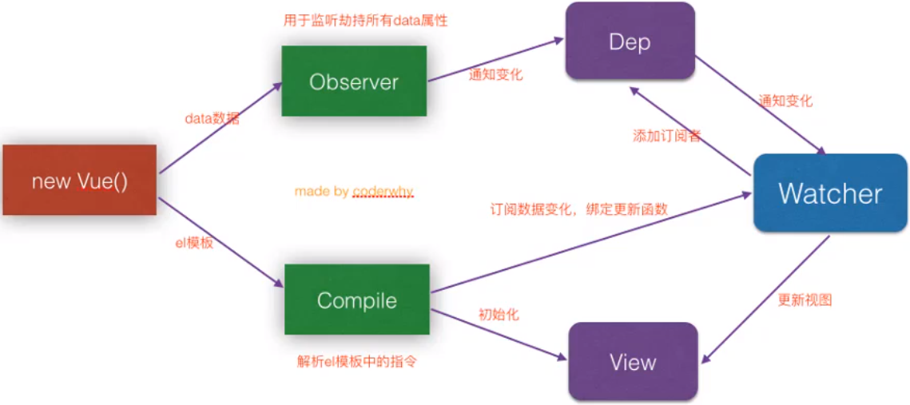

# Vue 笔记

## 基本概念

### 后端渲染 后端路由

- 后端渲染：由后端处理将渲染好的 HTML 页面并发送给客户端
- 后端路由：由后端处理 URL 和页面之间的映射关系

### 前后端分离

- 前后端分离：后端只负责提供数据
- 前端渲染：浏览器中显示的网页中的大部分内容,都是由前端写的 js 代码在浏览器中执行,最终渲染出来的网页

### 单页面富应用（SPA）

单页面富应用（SPA）整个页面只有一个 HTML，所有页面都在里面（依次隐藏显示）
前端路由：URL 与 HTML 页面间的映射关系

### 命令式编程和函数式编程

- 命令式编程：一步一步命令
- 函数式编程：先拿到数据，然后再处理

### Vue 响应式原理

1. app.message 修改数据，Vue 是如何监听 message 数据的改变

- object.defineProperty -> 监听对象属性的改变

2. 当数据发生改变，Vue 是如何知道要通知哪些人，界面发生刷新



## Visual Studio Code 插件

- Vue

### 浏览器插件

- vuejs-devtools

## 脚手架

**脚手架让项目从搭建到开发,再到部署，整个流程变得快速和便捷**

编程中提到的脚手架 (Scaffold) , 其实是一种工具，帮我们可以快速生成项目的工程化结构，并且已经将我们所需的工程环境配置好

- 每个项目作出完成的效果不同，但是它们的基本工程化结构是相似的。既然相似，就没有必要每次都从零开始搭建，完全可以使用一些工具，帮助我们生产基本的工程化模板
- 不同的项目，在这个模板的基础之上进行项目开发或者进行一些配置的简单修改即可
- 这样也可以间接保证项目的基本机构一致性，方便后期的维护

### 依赖

1. 安装 Node.js：[Node.js 官网](https://nodejs.org/zh-cn/)
2. 安装 WebPack：`npm install webpack -g`

### 安装

安装 Vue 脚手架：`npm install @vue/cli -g`

### 创建项目

- 可视化创建项目： `vue ui`
- 命令行创建项目：`vue create 项目名称`

  - Router:路由
  - Unit Tests:单元测试
  - Linter / Formatter:Eslint 代码规范检测
  - 推荐选择 Runtime-only（性能更好，所使用的代码量更少）
  - 推荐选择`dist-sass`，`node-sass`编译缓慢

### 启动项目

启动项目：`npm run serve`

### 编译项目

编译项目：`npm run build`

### 项目结构

- `node_modules`: 依赖文件目录
- `.gitignore`: 记录 git 版本控制的排除文件
- `package.json`: 记录各个依赖的版本（`^`表示可小版本迭代更新）
- `package-lock.json`: 记录本地真实安装版本

### 关闭 Eslint 代码规范检测

\config\index.js

```js
useEslint: false;
```

### 配置目录别名

新建文件 `项目目录\vue.config.js`

```js
module.exports = {
  configureWebpack: {
    resolve: {
      alias: {
        assets: "@/assets",
        components: "@/components",
        views: "@/views",
      },
    },
  },
};
```

::: tip 提示
不用配置`router`和`store`，因为可以全局访问
:::

### 解决 build 后打开空白问题

新建 vue.config.js，内容：

```js
module.exports = {
  publicPath: "./",
};
```

### 解决 build 后路由跳转 404

index.js  
取消 history

```js
const router = new VueRouter({
  //mode: 'history',
});
```

## 基本语法

### v-for

v-for 为循环，后接表达式：变量 in 列表

```HTML
<ul>
  <li v-for="item in textlist">{{item}}</li>
</ul>
```

绑定 key 用于更高效的更新虚拟 DOM 渲染
注意：key 不能重复，不能用 index

```HTML
<ul>
  <li v-for="item in textlist" :key="item">{{item}}</li>
</ul>
<!--在遍历的过程中获取索引值-->
<ul>
  <li v-for="(item,index) in textlist">{{index+1}}:{{item}}</li>
</ul>
<!--获取key和value 格式：(value,key)-->
<ul>
  <li v-for="(value,key) in info">{{key}}:{{value}}</li>
</ul>
<!--获取key和value 格式：(value,key)-->
<ul>
  <li v-for="(value,key,index) in info">{{key}}:{{value}},{{index}}</li>
</ul>
```

### @click (v-on)

事件绑定，后接表达式：命令  
获取 event 事件对象：\$eveut

```HTML
<button @click="事件方法()">按钮</button>
<button v-on:click="事件方法()">按钮</button>
```

#### prevent 修饰符

prevent 修饰符，用于阻止默认程序事件

```HTML
<form>
  <input type="submit" value="提交" @click.prevent="btnClick()">
</form>
```

### @keyup

监听键盘的按键

```HTML
<input type="txt" @keyup="keyup()">
<input type="txt" @keyup.enter="keyup()">
```

### v-model

双向绑定数据，后接双向绑定的变量

```HTML
<input type="text" v-model="message">
```

### v-bind

#### 动态绑定属性

v-bind 用于动态绑定属性，例如图片等
（双大括号无效）

简写:

```HTML
<a :href="url2">v-bind简写测试</a>
```

普通写法：

```HTML
<a v-bind:href="url2">v-bind测试</a>
```

### 动态绑定样式

```HTML
<h2 :style="{属性: '值',属性: 值}"></h2>
<h2 :style="{fontSize: '50px',color: color}"></h2>
```

::: tip 提示
属性值注意增加单引号，否则会解析为变量
:::

### 动态绑定 class

后接表达式：{属性名 : 属性值}

```HTML
<!-- 传入对象 -->
<h2 v-bind:class="{类名 : 布尔值}"></h2>
<!-- 传入数组 -->
<h2 v-bind:class="[类名1,类名2]"></h2>
<!-- 对象、数组混用 -->
<h2 v-bind:class="[{类名 : 布尔值},类名]"></h2>
<!--传入函数 -->
<h2 v-bind:class="getclass()"></h2>
```

```js
getclass() {
  return {
    类名1: 布尔值,
    类名2: 布尔值,
  }
}
```

### v-html

v-html 为解析 HTML，后接 html 字符串

```HTML
<h1 v-html="url"></h1>
```

### v-once

v-once 为只渲染一次，不随数据的改变而改变

```HTML
<h1 v-once>{{message}}</h1>
```

### v-pre

v-pre 为不解析，原封不动的显示出来

```HTML
<h1 v-pre>{{message}}</h1>
```

### v-if

用于控制显现/隐藏，true 为显现，false 为隐藏

```HTML
<h2 v-if="true">{{message}}</h2>
<!--v-else与v-if的值相反，当v-if为false时v-else则显示-->
<h2 v-else>{{message}}</h2>
```

::: tip 提示
此方法是完全隐藏，不显示在 dom 中，适合切换频率低的环境
:::

### v-show

v-show 用于控制显现/隐藏，true 为显现，false 为隐藏

```HTML
<h2 v-show="true">{{message}}</h2>
```

::: tip 提示
只是给元素增加 display:none，适合切换频率高的环境
:::

### v-load

v-load 用于监听图片是否加载完成

```HTML

```

```js
export default {
  methods: {
    事件名称(){

    },
  }
},
```

### 过滤器

```HTML
{{变量名 | 过滤器名}}
```

```javaScript
export default {
  filters: {
    过滤器名(value){
      return value;
    }
  },
}
```

### nextTick 函数

nextTick 函数是待所有 DOM 组件创建完成后执行的回调函数，此时\$ref 等可以直接使用

```JavaScript
export default {
  created() {
  this.$nextTick(()=>{

  })
  }
}
```

## 组件

::: tip 提示
`<style scoped></style>`中的 scoped 表示编写的样式是**局部有效**
:::

### 创建组件

.Vue

```HTML
<template>
  <div>

  </div>
</template>

<style scoped>
</style>

<script>
  export default {
    name: '',
    //传参：父传子，写法：["形参1"[,"形参2"]]
    props: {

    },
    created(){

    },
    mounted(){

    },
    data(){
      return {

      }
    },
    methods: {

    },
    mixins: [],
    components: {

    },
  }
</script>
```

::: tip 提示
`<style scoped></style>` 中的 scoped 表示作用域，不予其他 CSS 样式相冲突
:::

### 注册组件

```js
import 组件名称 from '@/components/组件路径名称'

export default {
components: {
  组件名称,
},
```

### 使用组件

```HTML
<组件名称></组件名称>
```

### 组件传参

- 父传子

  ```JS
  export default {
    //传参：父传子，写法：["形参1"[,"形参2"]]
    props: ["参数1", "参数2"],
    //限制数据类型传参
      props: {
      参数1: Array,
      参数2: String,
      },
    /*
    支持验证以下类型：
    String
    Number
    Boolean
    Array
    Object
    Date
    Function
    Symbol
    */
  }
  ```

  ```HTML
  <组件 参数1="" [参数2=""]...></组件>
  ```

- 子传父

  ```JS
  export default {
    template: "#cpn",
    methods: {
      btnClick([参数]){
        //发射事件：自定义事件
        this.$emit("事件名称" [,参数])
      }
    },
  }
  ```

  ```HTML
  <组件 @事件名称="事件方法()"></组件>
  ```

::: tip 提示
如提示`$emit`不是一个函数则将父函数写为箭头函数
:::

### 组件事件

```HTML
<组件 @click.native="事件方法()"></组件>
```

::: tip 提示
native 修饰符用于监听组件根元素的原生组件
:::

## 混入

混入是对重复代码进行封装，与组件类似。但是混入后的组件可之间访问变量（相当于合并代码）

### 声明

mixin.js

```JavaScript
import 组件名称 from 'components/组件名称'

export const 混入名称 = {
  created(){

  },
  mounted(){

  },
  data() {
    return {

    }
  },
  methods:{

  },
  components: {
    组件名称,
  }
}
```

### 使用

```HTML
<组件名称></组件名称>
```

```JavaScript
import { 混入名称 } from 'common/mixin'

export default {
  //混入
  mixins: [混入名称],
}
```

## 插槽

在开发中，我们抽取了一个组件，但是为了让这个组件具备更强的通用性，我们不能将组件中的内容限制为固定的 div、span 等等这些元素，我们应该让使用者可以决定某一块区域到底存放什么内容。

举栗：假如我们定制一个通用的导航组件 - NavBar

- 这个组件分成三块区域：左边 - 中间 - 右边，每块区域的内容是不固定
- 左边区域可能显示一个菜单图标，也可能显示一个返回按钮，可能什么都不显示
- 中间区域可能显示一个搜索框，也可能是一个列表，也可能是一个标题，等等
- 右边可能是一个文字，也可能是一个图标，也可能什么都不显示

```HTML
<template>
<div>
  <slot name="插槽名称"><span>插槽</span></slot>
</div>
</template>
```

```HTML
<组件>
  <template v-slot:插槽名称>
    <h2>这是left插槽</h2>
  </template>
</组件>
```

## 绑定元素

```HTML
<div ref="元素标识"></div>
```

```js
thsi.$ref.元素标识;
```

::: tip 提示
ref 如果是绑定在组件中的,那么通过 this.$refs.refname获取到的是一个组件对象
ref如果是绑定在普通的元素中,那么通过this.$refs.refname 获取到的是一个元素对象
:::

## 防抖函数（节流）

作用是将频繁执行的函数减缓次数，理想情况下只执行一次

```js
debounce(func,delay){
  let timer = null;
  return function(...args){
    if(timer) clearTimeout(timer)
    timer = setTimeout(()=>{
      func.apply(this,args)
    }, delay)
  }
}
```

使用防抖函数:

```js
const 防抖函数名称 = this.debounce(需要进行防抖处理的函数名称, 200);
防抖函数名称();
```

::: tip 提示
需要进行防抖处理的函数名称“不能加入()，否则会识别为函数的返回值
:::

## 常用组件使用实例

### 单选框

```HTML
<input type="radio" id="male" name="sev" value="男" v-model="sex">男
<input type="radio" id="female" name="sev" value="女" v-model="sex">女
<br>
<h2>{{sex}}</h2>
```

### 多选框

```HTML
<!--label标签作用：点击文字也能触发检查框-->
<label><input type="checkbox" id="agree" v-model="isagerr">同意协议</label>
<button :disabled="!isagerr">下一步</button>

<input type="checkbox" value="测试选项1" v-model="totalcheckbox">测试选项1
<input type="checkbox" value="测试选项2" v-model="totalcheckbox">测试选项2

<label v-for="item in totealselect">
<input type="checkbox" :value="item" v-model="totalcheckbox">{{item}}
</label>
```

### 下拉选择框

```HTML
<select v-model="selectvalue">
  <option>测试选项1</option>
  <option>测试选项2</option>
</select>
```

## HTML-Vue 模板

::: details 点击查看代码

```HTML
<!DOCTYPE html>
<html lang="zh-CN">
  <head>
    <meta charset="UTF-8">
    <meta name="viewport" content="width=device-width, initial-scale=1.0">
    <meta http-equiv="X-UA-Compatible" content="ie=edge">
    <title>Vue</title>
  </head>
  <body>
    <div id="app">
      <h1>{{message}}</h1>
    </div>
    <script src="https://cdn.jsdelivr.net/npm/vue"></script>
    <script>
    app = new Vue({
      //声明要绑定的id
      el: '#app',
      //页面加载完毕后执行的方法（渲染前）
      created(){

      },
      //页面加载完毕后执行的方法（渲染后）
      mounted(){

      },
      //数据对象
      data: {

      },
      //计算属性：属性名称(){} （调用时不需要加小括号）
      computed: {

      },
      //定义方法：方法名称(){}
      //当前对象内需要加this
      methods: {

      },
    })
    </script>
  </body>
</html>
```

:::
