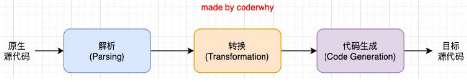
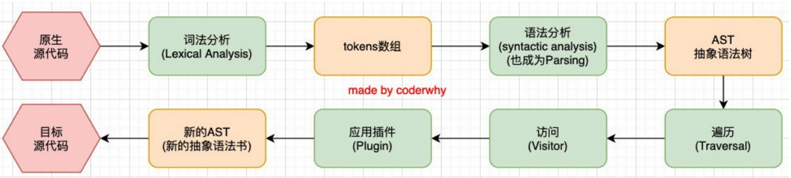

# babel

## 基本概念

### Babel 是什么？

- Babel 是一个工具链，主要用于旧浏览器或者环境中将 ECMAScript 2015+代码转换为向后兼容版本的 JavaScript；
- 包括：语法转换、源代码转换等；

### Babel 底层原理

- Babel 的执行阶段

  

- 这只是一个简化版的编译器工具流程，在每个阶段又会有自己具体的工作

  

## 安装

babel 本身可以作为一个独立的工具（和 postcss 一样），不和 webpack 等构建工具配置来单独使用。

如果我们希望在命令行尝试使用 babel，需要安装如下库：

- @babel/core：babel 的核心代码，必须安装；
- @babel/cli：可以让我们在命令行使用 babel；

`npm install @babel/core @babel/cli -D`

## 使用

### 命令行

使用 babel 来处理我们的源代码：`npx babel src --out-dir dist`

- src：是源文件的目录；
- --out-dir：指定要输出的文件夹 dist；

### 结合 Webpack

1. 安装 babel-loader: `npm install @babel/core babel-loader -D`
2. 使用 babel

   - Webpack 配置方式

     webpack.config.js

     ```JavaScript
     module.exports = {
       module: {
         rules: [
           {
             test: /\.js$/,
             use: {
               loader: "babel-loader",
               options: {
                 // Babel预设
                 presets: ["@babel/preset-env"],
                 // Babel插件
                 plugins: ["Babel插件名"],
               },
             },
           },
         ],
       },
     };
     ```

   - 独立文件配置方式

     新建 babel.config.js

     ```JavaScript
     module.exports = {
       // Babel预设
       presets: ["@babel/preset-env"],
       // Babel插件
       plugins: ["Babel插件名",],
     };
     ```

## 插件

### 箭头函数转换

1. 安装: `npm install @babel/plugin-transform-arrow-functions -D`
2. 使用: `npx babel src --out-dir dist --plugins=@babel/plugin-transform-arrow-functions`

### 块级作用域

1. 安装: `npm install @babel/plugin-transform-block-scoping -D`
2. 使用: `npx babel src --out-dir dist --plugins=@babel/plugin-transform-block-scoping`

## 预设

如果要转换的内容过多，一个个设置是比较麻烦的，我们可以使用预设（preset）

1. 安装：`npm install @babel/preset-env -D`
2. 使用: `npx babel src --out-dir dist --presets=@babel/preset-env`
