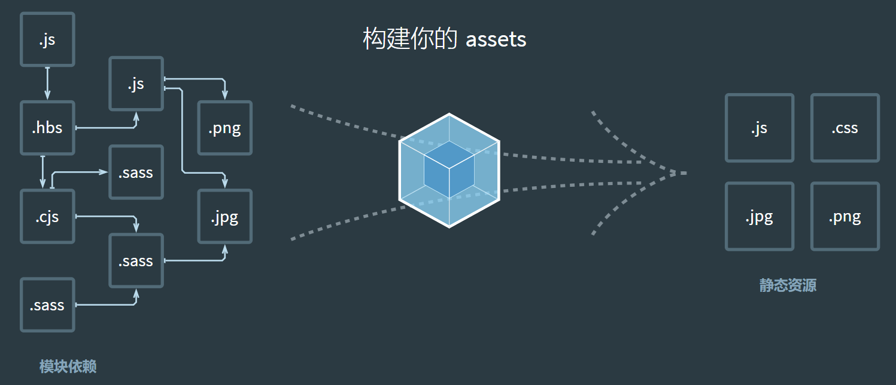

# Webpack

webpack 是一个静态的模块化打包工具，为现代的 JavaScript 应用程序；

- 打包 bundler：webpack 可以将帮助我们进行打包，所以它是一个打包工具
- 静态的 static：这样表述的原因是我们最终可以将代码打包成最终的静态资源（部署到静态服务器）；
- 模块化 module：webpack 默认支持各种模块化开发，ES Module、CommonJS、AMD 等；
- 现代的 modern：我们前端说过，正是因为现代前端开发面临各种各样的问题，才催生了 webpack 的出现和发展



## 环境搭建

1. 安装 [Node.js](https://nodejs.org/zh-cn/)
2. 配置淘宝镜像: `npm config set registry https://registry.npm.taobao.org`
3. 安装 Webpack、webpack-cli: `npm install webpack webpack-cli -g`

## Webpack 配置

### Mode 配置

Mode 配置选项，可以告知 webpack 使用响应模式的内置优化：

- 默认值是 production（什么都不设置的情况下）；
- 可选值有：`none` | `development` | `production`

| 选项        | 描述                                                                                                                                                                                                                          |
| ----------- | ----------------------------------------------------------------------------------------------------------------------------------------------------------------------------------------------------------------------------- |
| development | 会将 DefinePlugin 中 process.env.NODE_ENV 的值设置为 development. 为模块和 chunk 启用有效的名。                                                                                                                               |
| production  | 会将 DefinePlugin 中 process.env.NODE_ENV 的值设置为 production。为模块和 chunk 启用确定性的混淆名称，FlagDependencyUsagePlugin，FlagIncludedChunksPlugin，ModuleConcatenationPlugin，NoEmitOnErrorsPlugin 和 TerserPlugin 。 |
| none        | 不使用任何默认优化选项                                                                                                                                                                                                        |

webpack.config.js

```js
module.exports = {
  // 设置模式
  mode: "development",
  // 设置source-map，建立js映射文件，方便调试对面和错误
  devtool: "source-map",
};
```

### 配置扩展名

extensions 是解析到文件时自动添加扩展名：

- 默认值是 ['.wasm', '.mjs', '.js', '.json']；
- 所以如果我们代码中想要添加加载 .vue 或者 jsx 或者 ts 等文件时，我们必须自己写上扩展名；

webpack.config.js

```js
module.exports = {
  extensions: [".wasm", ".mjs", ".js", ".json"],
};
```

### 配置别名

webpack.config.js

```js
const path = require("path");

module.exports = {
  "@": path.resolve(__dirname, "./src"),
};
```

### 分离配置

1. 安装 webpack-merge: `npm install webpack-merge -D`
2. 配置文件

   - 公共配置

     新建`\config\webpack.comm.config.js`

     ```js
     module.exports = {};
     ```

   - 开发配置

     新建`\config\webpack.dev.config.js`

     ```js
     const { merge } = require("webpack-merge");
     const commonConfig = require("./webpack.comm.config");

     module.exports = merge(commonConfig, {
       mode: "development",
     });
     ```

   - 部署配置

     新建`\config\webpack.prod.config.js`

     ```js
     const { merge } = require("webpack-merge");
     const commonConfig = require("./webpack.comm.config");

     module.exports = merge(commonConfig, {
       mode: "production",
     });
     ```

3. 修改配置

   pagkage.json

   ```json
   {
     "scripts": {
       "server": "webpack server --config ./config/webpack.dev.config.js",
       "build": "webpack --config ./config/webpack.prod.config.js"
     }
   }
   ```

## 打包资源

### 基本使用

1. 初始化项目: `npm init -y`
2. 安装开发依赖: `npm install webpack webpack-cli -D`
3. 在 package.json 中创建 scripts 脚本: `"build": "webpack"`，执行脚本`npm run build`即可打包

### 配置文件

新建`webpack.config.js`文件

```js
const path = require("path");

module.exports = {
  entry: "./src/入口文件名.js",
  output: {
    path: path.resolve(__dirname, "./编译目录名"),
    filename: "js/打包文件名.js",
  },
};
```

### 打包 CSS

1. 安装样式加载器: `npm install css-loader style-loader -D`
2. 配置加载器

   - 配置方式(推荐)

     webpack.config.js

     ```JavaScript
     module.exports = {
       module: {
         rules: [
           {
             test: /\.css$/,
             use: ["style-loader", "css-loader"],
           },
         ],
       },
     }
     ```

   - 内联方式

     内联方式使用较少，因为不方便管理；

     ```JavaScript
     import "css-loader!../CSS路径";
     ```

### 打包图片

file-loader 的作用就是帮助我们处理 import/require(方式引入的一个文件资源,并且会将它放到我们输出的文件夹中;

1. 安装加载器: `npm install file-loader -D`
2. 配置加载器

   webpack.config.js

   ```JavaScript
   module.exports = {
     module: {
       rules: [
         {
           test: /\.(jp?g|png|bmp|gif|svg)$/,
           use: [
             {
               loader: "file-loader",
               options: {
                 // 自定义图片路径
                 outputPath: "img",
                 // 自定义图片名(默认为 [hash].[ext])
                 name: "[name]-[hash].[ext]",
               },
             },
           ],
         },
       ],
     },
   };
   ```

   | placeholder     | 说明                                                                              |
   | --------------- | --------------------------------------------------------------------------------- |
   | [ext]           | 处理文件的扩展名                                                                  |
   | [name]          | 处理文件的名称                                                                    |
   | [hash]          | 文件的内容，使用 MD4 的散列函数处理，生成的一个 128 位的 hash 值（32 个十六进制） |
   | [contentHash]   | 在 file-loader 中和[hash]结果是一致的                                             |
   | [`hash:<length>`] | 截图 hash 的长度（默认 32 个字符）                                                |
   | [path]          | 文件相对于 webpack 配置文件的路径                                                 |

3. 引用图片

   - CSS

     ```CSS
     .类名 {
       background-image: url(../img/图片名);
     }
     ```

   - JavaScript

     ::: tip 提示
     在 JavaScript 中需要将图片视为一个模块来加载，否则图片不会被打包。
     :::

     ```JavaScript
     import 图片名 from "../img/图片名";

     const imgEl = document.createElement("img");
     imgEl.src = 图片名;
     document.body.appendChild(imgEl);
     ```

### url-loader

url-loader 和 file-loader 的工作方式是相似的，但是可以将较小的文件，转成**base64 的 URI**，同时也拥有 file-loader 的功能。

1. 安装 url-loader: `npm install url-loader -D`
2. 配置加载器

   webpack.config.js

   ```JavaScript
   module.exports = {
     module: {
       rules: [
         {
           test: /\.(jp?g|png|bmp|gif|svg)$/,
           use: [
             {
               loader: "url-loader",
               options: {
                 // 自定义图片路径
                 outputPath: "img",
                 // 自定义图片名(默认为[hash].[ext])
                 name: "[name]-[hash].[ext]",
                 // 小于100KB则执行base64打包，大于则直接打包图片
                 limit: 100 * 1024,
               },
             },
           ],
         },
       ],
     },
   };
   ```

### 打包字体

1. 安装加载器: `npm install file-loader -D`
2. 配置加载器

   webpack.config.js

   ```JavaScript
   module.exports = {
     module: {
       rules: [
         {
           test: /\.(eot|ttf|woff2?)$/,
           use: {
             loader: "file-loader",
             options: {
               // outputPath: "font",
               name: "font/[hash].[ext]",
             },
           },
         },
       ],
     },
   };
   ```

## 资源模块类型(asset module type)

- 在 webpack5 之前，加载这些资源需要使用一些 loader，比如 raw-loader 、url-loader、file-loader；
- 在 webpack5 开始，可以直接使用资源模块类型（asset module type），来替代上面的这些 loader；

资源模块类型(asset module type)通过添加 4 种新的模块类型，来替换所有这些 loader：

- asset/resource 发送一个单独的文件并导出 URL。之前通过使用 file-loader 实现；
- asset/inline 导出一个资源的 data URI。之前通过使用 url-loader 实现；
- asset/source 导出资源的源代码。之前通过使用 raw-loader 实现；
- asset 在导出一个 data URI 和发送一个单独的文件之间自动选择。之前通过使用 url-loader，并且配置资源体积限制实现；

### 打包图片

- 基本使用

  webpack.config.js

  ```JavaScript
  module.exports = {
    module: {
      rules: [
        {
          test: /\.(jp?g|png|bmp|gif|svg)$/,
          type: "asset/resource",
        },
      ],
    },
  };
  ```

- 配置使用

  webpack.config.js

  ```JavaScript
  module.exports = {
    module: {
      rules: [
        {
          test: /\.(jp?g|png|bmp|gif|svg)$/,
          type: "asset",
          generator: {
            filename: "img/[hash][ext]",
          },
          parser: {
            dataUrlCondition: {
              // 小于100KB则执行base64打包，大于则直接打包图片
              maxSize: 100 * 1024,
            },
          },
        },
      ],
    },
  };
  ```

### 打包字体

webpack.config.js

```JavaScript
module.exports = {
  module: {
    rules: [
      {
        test: /\.(eot|ttf|woff2?)$/,
        type: "asset/resource",
        generator: {
          filename: "font/[hash][ext]",
        },
      },
    ],
  },
};
```

## 插件

- Loader 是用于**特定的模块类型**进行转换；
- Plugin 可以用于**执行更加广泛的任务**，比如打包优化、资源管理、环境变量注入等；

### CleanWebpackPlugin

每次修改了一些配置，重新打包时，都需要手动删除 dist 文件夹：

- 可以借助于一个插件来帮助完成，这个插件就是 CleanWebpackPlugin；

1. 安装插件: `npm install clean-webpack-plugin -D`
2. 使用插件

   webpack.config.js

   ```JavaScript
   const { CleanWebpackPlugin } = require("clean-webpack-plugin");

   module.exports = {
     plugins: [new CleanWebpackPlugin()],
   };
   ```

### HtmlWebpackPlugin

最终打包的 dist 文件夹中是没有 index.html 文件，在进行项目部署的时，必然也是需要有对应的入口文件 index.html；

1. 安装插件: `npm install html-webpack-plugin -D`
2. 使用插件

   - 基本使用

     webpack.config.js

     ```JavaScript
     const { CleanWebpackPlugin } = require("clean-webpack-plugin");

     module.exports = {
       plugins: [new HtmlWebpackPlugin()],
     };
     ```

   - 自定义 HTML 模板

   1. 新建 \public\index.html

   ```html
   <!DOCTYPE html>
   <html lang="">
     <head>
       <meta charset="utf-8" />
       <meta http-equiv="X-UA-Compatible" content="IE=edge" />
       <meta name="viewport" content="width=device-width,initial-scale=1.0" />
       <link rel="icon" href="<%= BASE_URL %>favicon.ico" />
       <title>
         <%= htmlWebpackPlugin.options.title %>
       </title>
     </head>

     <body>
       <noscript>
         <strong
           >We're sorry but <%= htmlWebpackPlugin.options.title %> doesn't work
           properly without JavaScript enabled. Please enable it to
           continue.</strong
         >
       </noscript>
       <div id="app"></div>
       <!-- built files will be auto injected -->
     </body>
   </html>
   ```

   2. 配置插件

   webpack.config.js

   ```JavaScript
   const { CleanWebpackPlugin } = require("clean-webpack-plugin");
   const { DefinePlugin } = require("webpack");

   module.exports = {
     plugins: [
       new HtmlWebpackPlugin({
         template: "./public/index.html",
         title: "网页标题",
       }),
       new DefinePlugin({
         BASE_URL: "'./'",
       }),
     ],
   };
   ```

### CopyWebpackPlugin

将一些文件放到 public 的目录下，那么这个目录会被复制到 dist 文件夹中。

- 这个复制的功能，我们可以使用 CopyWebpackPlugin 来完成；

1. 安装插件: `npm install copy-webpack-plugin -D`
2. 使用插件

   ```JavaScript
   const CopyWebpackPlugin = require("copy-webpack-plugin");

   module.exports = {
     plugins: [
       new CopyWebpackPlugin({
         patterns: [
           {
             from: "public",
             globOptions: {
               ignore: ["**/index.html"],
             },
           },
         ],
       }),
     ],
   };
   ```

## 搭建本地服务器

### 为什么要搭建本地服务器？

目前开发的代码，需要手动编译并打开 index.html 查看效果，本地服务器可以实现当**文件发生变化**时，可以**自动的完成** 编译 和 展示；

### Webpack watch

在该模式下，webpack 依赖图中的所有文件，只要有一个发生了更新，那么代码将被重新编译；

::: tip 提示
Webpack watch 可以监听到文件的变化，但是它本身并没有自动刷新浏览器的功能
:::

- Webpack 配置

  webpack.config.js

  ```JavaScript
  module.exports = {
    watch: true,
  };
  ```

- 命令行配置

  package.json

  ```Json
  {
    "scripts": {
      "build": "webpack --watch"
    },
  }
  ```

### webpack-dev-server

::: tip 提示
webpack-dev-server 在编译之后**不会写入到任何输出文件**，而是将 bundle 文件**保留在内存中**，提高开发效率
:::

1. 安装: `npm install webpack-dev-server -D`
2. 配置:

   - package.json

   ```Json
   {
     "scripts": {
       "server": "webpack server",
       "build": "webpack"
     },
   }
   ```

   - webpack.config.js

     ```JavaScript
     module.exports = {
       target: "web",
       devServer: {
         // 设置主机地址
         host:"0.0.0.0",
         // 设置端口
         port: 8080,
         // 是否打开浏览器
         open: true,
         // 配置备用目录，当 Webpack 资源不存在时请求 contentBase 目录的资源
         contentBase: "./public",
         // 配置模块热替换，应用程序运行过程中，替换、添加、删除模块，而无需重新刷新整个页面
         hot: true,
         // 是否为静态文件开启gzip compression
         compress: false,
         // 设置代理(常用解决跨域)
         proxy: {
           "/代理路径": {
             target: "http://代理地址",
             pathRewrite: {
               "^/代理路径": "",
             },
             // 设置是否接受在HTTPS上运行且证书无效的后端服务器
             secure: false,
           },
         },
       },
     }
     ```

3. 指定模块模块热替换(不常用)

   ```JavaScript
   if (module.hot) {
     module.hot.accept("./模块路径");
   }
   ```
